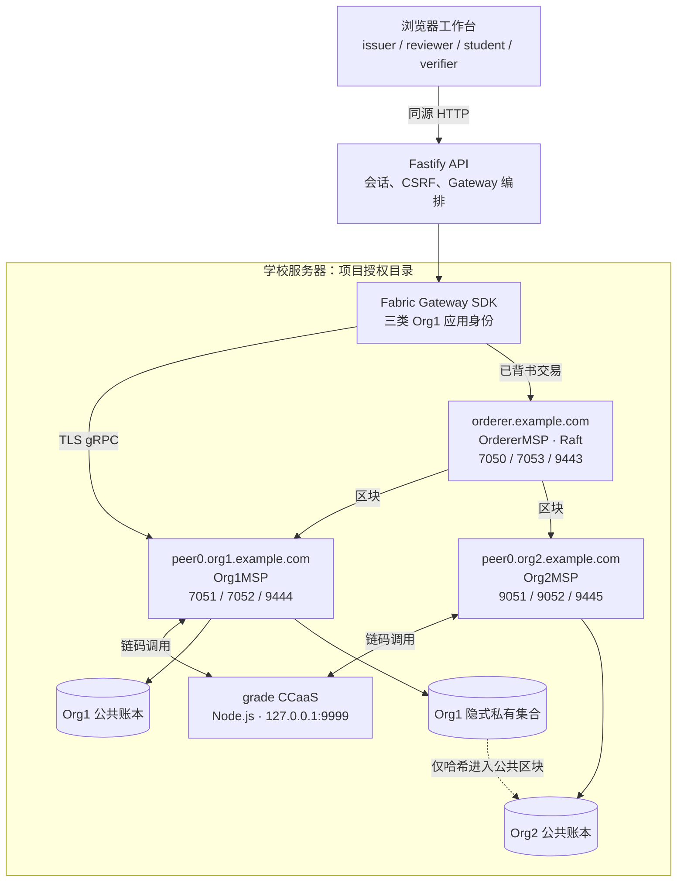
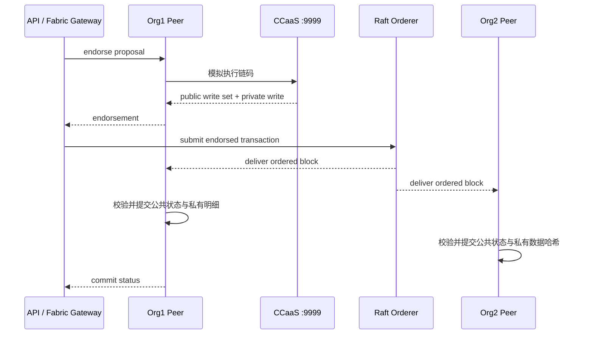

# ChainGrade Fabric 网络结构与代码原理

项目名称：ChainGrade——隐私保护型可信成绩凭证管理平台

项目仓库：<https://github.com/ytq0198/Echoes-of-the-Chain>

小组：第 4 组

组长：魏子安（3240101782）

组员：强璞（3240102045）、阳震（3240105586）

文档日期：2026 年 9 月 13 日
用途：课程答辩中的 Fabric 网络结构、部署代码、交易原理与网络边界专项说明

---

## 1. 核心结论

ChainGrade 最终环境实际运行 Hyperledger Fabric 2.5.16，包括一个 Raft Orderer、Org1 和 Org2 各一个 Peer、一个 Node.js Chaincode-as-a-Service（CCaaS）进程，以及 issuer、reviewer、student 三类具有证书属性的应用身份。

网络层完成五件事：

1. MSP 和 X.509 证书区分组织与业务角色；
2. `chaingrade` 通道维护两个 Peer 的公共账本副本；
3. `grade` 链码统一执行权限、状态机和原子读写；
4. Org1 隐式私有集合保存成绩明文，Org2 只得到公共状态和私有数据哈希；
5. Orderer 对已背书交易排序并形成区块，使两个 Peer 最终提交一致的公共状态。

当前网络能证明多 Peer 账本复制、链码背书、排序提交、证书权限、私有数据和故障恢复流程。它仍是课程实验拓扑：单 Orderer 不具备写入高可用；三个业务角色都属于 Org1；背书策略为 `OR`，没有要求每笔业务交易必须由 Org1 和 Org2 同时背书。

## 2. 网络总体拓扑



图 1 展示最终运行拓扑。Gateway 默认从 Org1 Peer 进入；Orderer 只排序；两个 Peer 都提交公共区块；只有 Org1 Peer 保存 Org1 隐式集合中的成绩详情。

### 2.1 节点与端口

| 进程或对象 | MSP/身份 | 端口或位置 | 保存的数据 | 核心职责 |
| --- | --- | --- | --- | --- |
| Orderer | `OrdererMSP` | 7050 排序；7053 管理；9443 运维 | 区块、Raft WAL/快照 | 排序、成块、向 Peer 提供区块；不执行成绩链码 |
| Org1 Peer | `Org1MSP` | 7051 gRPC；7052 Peer 链码服务；9444 运维 | 公共账本、世界状态、Org1 私有详情 | 提案模拟、链码调用、背书、区块验证与提交 |
| Org2 Peer | `Org2MSP` | 9051 gRPC；9052 Peer 链码服务；9445 运维 | 公共账本、世界状态、Org1 私有数据哈希 | 验证公共区块、保存第二份账本、参与链码生命周期 |
| grade CCaaS | 当前 package ID | 127.0.0.1:9999 | 不作为账本权威存储 | 执行 TypeScript 链码逻辑，返回模拟结果 |
| Gateway SDK | Org1 应用身份 | API 进程内 | 角色连接缓存 | 建立 TLS 连接、签署提案、等待提交状态 |
| 通道 | `chaingrade` | 通道配置块 | 通道账本与链码定义 | 隔离本项目交易和成员配置 |
| 链码定义 | `grade` 0.9 sequence 1 | 通道内提交 | 名称、版本、序号、背书策略 | 使 Peer 认可同一个链码定义 |

### 2.2 组织、节点和用户的区别

| 概念 | 本项目实例 | 含义 |
| --- | --- | --- |
| 组织 | `Org1MSP`、`Org2MSP`、`OrdererMSP` | 网络治理和证书信任边界 |
| 节点 | Org1 Peer、Org2 Peer、Orderer | 实际运行的 Fabric 进程 |
| 应用用户 | issuer、reviewer、student | 使用客户端证书签署链码提案的业务身份 |

三个登录账号不是三个 Peer。浏览器账号先建立 API 会话；API 再依据会话角色选择对应的 Fabric 客户端证书。三类客户端证书都属于 `Org1MSP`，并连接 Org1 Peer。

## 3. 固定版本和目录边界

### 3.1 固定版本

版本来自 `infra/fabric/versions.env`：

| 组件 | 固定值 |
| --- | --- |
| Hyperledger Fabric | 2.5.16 LTS |
| Fabric CA | 1.5.17 |
| fabric-samples | commit `05edea01d4cf24dd4087bd3750c36e690dc4d6ff` |
| jq | 1.7.1 |
| 通道 | `chaingrade` |
| 链码 | `grade` |

`infra/fabric/bootstrap.sh` 面向 Linux x86_64，按固定版本下载二进制和 samples 快照。下载先写入 `.part` 文件，成功后再移动，避免网络中断留下被误认为完整的压缩包。

### 3.2 目录边界

| 路径 | 内容 | 是否进入 Git/提交包 |
| --- | --- | --- |
| `.tools/fabric-samples` | Fabric 二进制、配置、test-network、MSP/TLS 材料 | 否 |
| `.tools/chaincode-stage` | Docker 路径的链码隔离打包目录 | 否 |
| `.runtime/native-fabric/data` | Peer/Orderer 账本、WAL 和快照 | 否 |
| `.runtime/native-fabric/channel` | 原生运行的通道块 | 否 |
| `.runtime/native-fabric/pids` | 受管进程 PID | 否 |
| `.runtime/native-fabric/logs` | Peer、Orderer 和链码日志 | 否 |
| `infra/fabric`、`infra/fabric-native` | 可复现脚本和版本配置 | 是 |

源码和部署逻辑可以公开审阅，生成的私钥、证书、账本和日志不能进入仓库。

## 4. 两条网络启动路径

两条路径使用同一个业务链码和相同 Fabric 语义，不是课程版和竞赛版两套网络。

### 4.1 标准 Docker/test-network 路径

入口：`infra/fabric/network.sh`

```bash
./infra/fabric/bootstrap.sh
./infra/fabric/pull-images.sh
./infra/fabric/network.sh up
./infra/fabric/network.sh deploy
./infra/fabric/network.sh status
```

`network.sh up` 调用官方 test-network：

```bash
./network.sh up createChannel -ca -s leveldb \
  -c chaingrade -i 2.5.16 -cai 1.5.17
```

- `createChannel`：创建网络后继续生成并加入通道；
- `-ca`：使用 Fabric CA 生成和登记身份；
- `-s leveldb`：Peer 世界状态使用 LevelDB；
- `-c chaingrade`：通道名称；
- `-i`、`-cai`：固定 Fabric 和 CA 镜像版本。

随后 `enroll-identities.sh` 登记应用身份。`deploy` 把必要链码文件复制到 `.tools/chaincode-stage`，避免 pnpm 符号链接进入 Fabric 隔离构建环境，再调用官方 `deployCC`。

### 4.2 原生 Fabric 路径

入口：

- `infra/fabric-native/preflight.sh`
- `infra/fabric-native/native-network.sh`
- `infra/fabric-native/deploy-chaincode.sh`

```bash
./infra/fabric-native/preflight.sh
./infra/fabric-native/native-network.sh up
./infra/fabric-native/deploy-chaincode.sh deploy
./infra/fabric-native/ledger-info.sh
```

这是服务器 Docker 存储故障后的替代方案，直接启动官方 `orderer` 和 `peer` 二进制，仍执行 MSP/TLS、背书、Raft 排序、区块提交、MVCC 和私有数据规则。变化的是进程管理方式，不是区块链协议，不能称为“模拟链”。

### 4.3 原生预检

`preflight.sh` 检查：

1. `peer`、`orderer`、`osnadmin`、`configtxgen` 是否可执行；
2. 通道材料和两 Peer/Orderer TLS 证书是否存在；
3. 7050、7051、7052、7053、9051、9052、9443、9444、9445、9999 端口是否冲突；
4. 项目磁盘是否至少还有 10 GiB；
5. TLS 证书是否至少再有效 24 小时。

## 5. 通道创建代码

### 5.1 生成通道块

`native-network.sh` 的 `prepare_channel_block()`：

1. 已有 `chaingrade.block` 时复用；
2. 把 test-network 中的容器主机名改为 `localhost`；
3. 执行：

```bash
configtxgen \
  -profile ChannelUsingRaft \
  -outputBlock .runtime/native-fabric/channel/chaingrade.block \
  -channelID chaingrade
```

通道块包含成员组织、策略、排序服务和能力配置。Peer 启动不代表已经拥有通道，必须显式加入。

### 5.2 Orderer 加入通道

Orderer 开启 channel participation API，通过管理端口 7053 执行 `osnadmin channel join`。脚本先 `channel list`，已加入时不重复操作。

### 5.3 两个 Peer 加入通道

`join_peer()` 为各组织设置管理员 MSP、Peer 地址和 TLS 根证书，再执行：

```bash
peer channel join -b chaingrade.block
```

Org1 使用 7051，Org2 使用 9051。脚本先查询 `peer channel list`，只有未加入时才执行。

### 5.4 启动顺序

```text
预检
 → 准备通道块
 → 启动 Orderer 并加入通道
 → 启动 Org1 Peer
 → 启动 Org2 Peer
 → 两个 Peer 分别加入通道
 → 输出进程状态
```

最后的 `status` 只证明受管 PID 存在，仍需 `ledger-info.sh` 和业务探针判断网络真正恢复。

## 6. MSP、TLS 与应用身份

### 6.1 MSP 与 TLS 的区别

MSP 定义组织信任哪些 CA、如何验证成员身份；TLS 保护 gRPC 连接并验证通信节点。两者都使用证书，但 MSP 证书用于交易身份和签名，TLS 证书用于传输层。

### 6.2 三类身份

`infra/fabric/enroll-identities.sh` 在 Org1 CA 中登记：

| 身份 | 证书属性 | 链码用途 |
| --- | --- | --- |
| issuer | `app.role=issuer` | 创建成绩草稿和修订草稿 |
| reviewer | `app.role=reviewer` | 批准、驳回、撤销、处理申诉 |
| student | `app.role=student`、`subject.hash=<hash>` | 查询本人私有成绩、申诉和披露授权 |

属性通过 `:ecert` 写入登记证书。链码的 `assertRole()` 读取 `app.role`，学生查询还比较证书 `subject.hash` 与记录 `subjectHash`。

### 6.3 独立复核的准确含义

issuer 与 reviewer 是两张不同证书、两个不同角色；链码保存提交者身份摘要，并禁止相同身份批准自己的草稿。因此当前实现的是独立应用身份复核。

二者都属于 `Org1MSP`，所以不是跨组织复核。生产化若要求学院和教务处分属不同主体，应把 reviewer 放到独立 MSP，并重做背书、私有数据和 Gateway 路由。

## 7. Peer 和 Orderer 启动代码

### 7.1 Orderer

`start_orderer()` 配置：

- `127.0.0.1:7050` 排序端口；
- `OrdererMSP` 本地身份；
- TLS 和管理端 TLS；
- `127.0.0.1:7053` 管理端；
- `127.0.0.1:9443` 运维端；
- channel participation 模式；
- `.runtime/native-fabric/data/orderer` 下的账本、WAL 和快照。

Orderer 不执行 `grade` 链码，也不理解成绩业务，只负责对交易排序并组成区块。

### 7.2 Peer

`start_peer(org, msp, peer_port, chaincode_port, operations_port)` 参数化启动两个 Peer：

```bash
start_peer 1 Org1MSP 7051 7052 9444
start_peer 2 Org2MSP 9051 9052 9445
```

它配置 Peer ID、MSP、gRPC、TLS、文件系统、快照、运维端和 CCaaS external builder。Peer 负责提案模拟、链码调用、背书、区块验证、MVCC 冲突判断和状态提交。

## 8. CCaaS 链码生命周期

### 8.1 为什么采用 CCaaS

传统模式通常由 Peer 通过容器运行时启动链码。Docker 故障后，项目使用 CCaaS，把链码作为独立 Node.js 服务运行，Peer 根据 package 中的 `connection.json` 连接它。

```text
CHAINCODE_NAME=grade
CHAINCODE_VERSION=0.9
CHAINCODE_SEQUENCE=1
CHAINCODE_LABEL=grade_0.9_native
CHAINCODE_ADDRESS=127.0.0.1:9999
```

### 8.2 包结构与稳定 package ID

```text
grade_0.9_native.tgz
├── metadata.json       type=ccaas
└── code.tar.gz
    └── connection.json address=127.0.0.1:9999
```

脚本固定文件顺序、UTC 1970 时间、owner 和 group，使相同内容得到稳定 package ID。

### 8.3 生命周期


图 2 展示首次部署顺序。安装 package、组织批准 definition 和提交 definition 是三个不同阶段。

`deploy-chaincode.sh` 先计算 package ID，再在 Org1/Org2 安装，编译 TypeScript 并启动 `fabric-chaincode-node server`，随后两组织分别批准，最后提交并查询链码定义。首次使用 `deploy`；账本重启后用 `start`，只恢复已定义的 CCaaS。

### 8.4 当前边界

两个 Peer 在同一服务器上连接同一个 `127.0.0.1:9999` 链码进程，适合课程实验但存在单点。生产环境应为不同 Peer/组织部署独立 CCaaS，并启用 Peer 到链码服务的 TLS；当前 `tls_required=false` 只适用于本机回环。

## 9. Gateway 配置与连接

### 9.1 默认配置

`apps/api/src/ledger/fabric-config.ts` 默认：

```text
channelName      = chaingrade
chaincodeName    = grade
mspId            = Org1MSP
peerEndpoint     = localhost:7051
peerHostAlias    = peer0.org1.example.com
identityMspPaths = issuer / reviewer / student 三套 MSP
```

### 9.2 按角色创建连接

`FabricCredentialLedger.contractFor(actor)`：

1. 从角色连接缓存查找；
2. 创建 TLS gRPC client；
3. 从该 actor MSP 的 `signcerts` 读取证书；
4. 从 `keystore` 读取私钥并创建 signer；
5. 建立 Gateway；
6. 进入 `chaingrade`，取得 `grade` contract；
7. 按角色缓存连接。

API 实际连接 `localhost:7051`，但 Peer TLS 证书签给 `peer0.org1.example.com`，因此代码设置 gRPC TLS 主机别名。它没有跳过证书验证，TLS 根证书仍来自 Org1 Peer。

### 9.3 分层超时

| 阶段 | 超时 |
| --- | ---: |
| evaluate 查询 | 5 秒 |
| endorse 背书 | 30 秒 |
| submit 提交 | 10 秒 |
| commit status | 60 秒 |

分层超时用于区分查询变慢、背书失败、排序提交失败和最终状态超时。

## 10. 一笔写交易如何穿过网络

### 10.1 完整时序



图 3 展示写交易的真实路径。关键结论是：**链码先在背书 Peer 上模拟执行，Orderer 只排序，不运行链码；区块到达 Peer 后还要再次校验，成功提交后 API 才返回成功。**

### 10.2 第一步：API 做入口校验

浏览器不会直接持有 Fabric 私钥。用户登录后，API 根据会话角色选择 issuer、reviewer 或 student 的 Fabric 身份，再调用 `FabricCredentialLedger`。API 负责 HTTP 参数、会话、CSRF、文件格式和错误码映射；链码仍会再次检查证书属性和业务状态，避免仅靠前端或 API 授权。

这形成两道边界：

| 边界 | 主要责任 | 不能替代什么 |
| --- | --- | --- |
| Web/API | 会话、CSRF、输入格式、友好错误 | 不能替代链上角色与状态校验 |
| Fabric/链码 | 证书属性、状态机、账本读写 | 不负责浏览器交互和页面体验 |

### 10.3 第二步：背书 Peer 模拟执行

Gateway 将 proposal 发送给满足背书策略的 Peer。Peer 调用 CCaaS 链码，链码读取当前世界状态并形成读集、写集；此时写入尚未最终生效。

模拟阶段会产生：

- 读取了哪些 key 及其版本；
- 计划写入哪些公共 key/value；
- 计划向私有集合写入哪些数据；
- 链码返回值或错误；
- Peer 对模拟结果的背书签名。

如果角色不符、状态迁移非法、ID 冲突或批次内部存在错误，链码在这个阶段直接拒绝，交易不会进入排序服务。

### 10.4 第三步：Orderer 排序成块

Gateway 收集到满足策略的背书后，将交易提交给 Orderer。当前实验网络只有一个 Raft Orderer。它负责：

1. 接收已经背书的交易；
2. 确定全局顺序；
3. 打包成区块；
4. 将区块分发给通道中的 Peer。

Orderer 不判断“这个学生是否能查看成绩”，也不执行 `ApproveCredential`。业务规则已经编码在链码中，最终有效性由 Peer 在提交区块时验证。

### 10.5 第四步：Peer 校验并提交

两个 Peer 收到相同区块后，分别校验：

- 背书是否满足策略；
- 读集版本是否仍然有效，即 MVCC 冲突检查；
- 通道和链码定义是否匹配；
- 私有数据哈希与收到的私有数据是否一致。

通过校验的交易更新世界状态；未通过的交易仍出现在区块中，但标记为 invalid，不更新世界状态。API 等待 commit status，因此 HTTP 成功不是“Orderer 已收到”，而是目标 Peer 已报告提交结果。

## 11. 查询与写入不是同一条路径

| 项目 | `evaluateTransaction` 查询 | `submitTransaction` 写入 |
| --- | --- | --- |
| 是否运行链码 | 是，在目标 Peer 模拟 | 是，先在背书 Peer 模拟 |
| 是否进入 Orderer | 否 | 是 |
| 是否形成新区块 | 否 | 是 |
| 是否改变世界状态 | 否 | 校验有效后改变 |
| 典型调用 | 查询公开凭证、学生查询私有明细 | 创建、复核、撤销、修订、申诉 |
| 主要失败点 | Peer/CCaaS 不可达、无权限、数据不存在 | 背书、排序、MVCC、提交状态超时 |

因此“查询成功”只能证明 Peer、链码和当前账本可读，不能单独证明 Orderer 可写。故障恢复验收同时执行读和写，正是为了覆盖两条不同路径。

## 12. 背书策略的真实含义

### 12.1 当前策略

部署脚本使用：

```text
OR('Org1MSP.peer','Org2MSP.peer')
```

它表示一次交易只需 Org1 或 Org2 中任一组织的 Peer 背书即可满足链码级策略，**不是必须两组织共同签名**。

### 12.2 为什么不要把背书称为“独立复核”

项目中有两种容易混淆的“同意”：

| 概念 | 主体 | 解决的问题 | 当前实现 |
| --- | --- | --- | --- |
| Fabric 背书 | Peer 节点 | 某次链码模拟结果是否得到组织认可 | `OR(Org1, Org2)` |
| 业务复核 | reviewer 用户身份 | 教师创建的成绩是否可由另一角色批准 | `app.role=reviewer` + 状态机 |

issuer 和 reviewer 虽使用不同证书、不同角色属性，但当前都属于 `Org1MSP`。所以项目实现的是**独立应用身份复核**，不是跨组织治理。答辩时应明确这一点，避免把角色分离夸大为两机构共识。

### 12.3 为什么通常由 Org1 背书

成绩明细进入 Org1 隐式私有集合。API 默认连接 `peer0.org1.example.com:7051`，Org1 Peer 能在模拟时访问相应私有数据，因此它是当前业务交易的主要背书节点。Org2 参与公共账本复制、链码生命周期和一致性验证，但 API 没有实现自动切换到 Org2。

若生产环境要求“签发机构和审计机构必须共同认可”，可把策略改为 `AND('Org1MSP.peer','Org2MSP.peer')`，或对关键凭证使用 state-based endorsement；但前提是重新设计私有集合成员、各组织链码服务与运维流程。

## 13. 私有数据如何在网络中流动

### 13.1 为什么裸哈希不够

成绩常落在 0–100 或少量等级中，取值空间低。若只把 `SHA256(score)` 放到公共账本，攻击者可以枚举所有可能分数进行比对。因此项目为明细加入随机盐，以 canonical JSON 形成稳定序列，再计算公开承诺 `detailHash`。

### 13.2 公共状态与私有明细

| 数据 | 公共账本 Org1/Org2 | Org1 私有集合 | 作用 |
| --- | --- | --- | --- |
| credentialId、issuer、状态、版本关系 | 保存 | 可引用 | 可验证生命周期与索引 |
| `detailHash` | 保存 | 可重算 | 锚定私有明细 |
| course、score、subject 详情、salt | 不保存明文 | 保存 | 授权后查询与完整性验证 |
| 私有数据哈希 | 两 Peer 的区块中可验证 | 与明细对应 | 证明集合写入与公共交易绑定 |

### 13.3 为什么 Org2 能保持同一账本，却看不到成绩

Fabric 私有数据机制将“区块中的交易和私有数据哈希”与“只分发给集合成员的明文”分开。Org2 接收相同区块，因而其区块高度和 block hash 可与 Org1 一致；但它没有 Org1 隐式集合的明文副本。

这不是“Org2 没有这笔交易”，而是：

> Org2 知道某次有效交易提交了某个私有值的承诺，但不能从账本直接读取成绩明文。

### 13.4 transient 数据的作用

敏感参数应通过 Fabric transient map 进入链码，而不是长期出现在公共链码参数和交易 payload 中。链码把明细写入私有集合，同时把承诺、状态和必要索引写入公共状态。公开查询返回公共对象；学生私有查询在验证主体绑定后读取私有集合。

### 13.5 学生身份绑定

学生证书包含：

```text
app.role=student
subject.hash=<学生主体哈希>
```

私有查询时，链码读取证书属性 `subject.hash`，与目标凭证主体哈希比较。通过比较才能返回私有明细。这意味着授权依据来自经 CA 签发的身份属性，而不是浏览器请求中可以任意修改的 studentId。

## 14. 关键业务交易如何映射到网络

### 14.1 创建成绩草稿

1. issuer 登录，API 选择 issuer MSP；
2. 链码验证 `app.role=issuer`；
3. 检查 credentialId 不存在；
4. 将公开对象写为 `PENDING_REVIEW`；
5. 将含随机盐的成绩明细写入私有集合；
6. 写交易经过背书、排序和两 Peer 提交。

结果不是立即生效的成绩，而是一条待独立复核的草稿。

### 14.2 reviewer 批准

1. reviewer MSP 发起 `ApproveCredential`；
2. 链码验证 `app.role=reviewer`；
3. 验证状态必须为 `PENDING_REVIEW`；
4. 防止同一应用身份绕过职责分离；
5. 将状态更新为 `ACTIVE` 并保留链上历史。

这里的“独立”由不同证书和属性实现，而不是由前端下拉框实现。

### 14.3 原子批量签发

`CreateCredentialBatch` 在**一次 Fabric transaction** 内处理整批记录。链码先完成所有记录的格式、权限、重复 ID 和业务条件校验，再形成写集。只要有一个 ID 已存在，整个模拟失败，不会向 Orderer 提交部分成功的写集。

前端逐行预检和链上原子提交承担不同职责：

- 前端预检：尽早指出第几行格式错误；
- 链上交易：保证整批全部成功或全部失败。

验收证据是冲突批次返回 HTTP 409，随后查询原本合法的新 ID 仍为 404，证明没有“成功一半”。

### 14.4 修订与申诉

申诉接受只把申诉状态置为 `RESOLVED_ACCEPTED`，不会直接修改成绩。教师仍需创建新版本，reviewer 再独立批准：

```text
旧凭证 ACTIVE -> SUPERSEDED
新凭证 PENDING_REVIEW -> ACTIVE
新凭证.previousCredentialId -> 旧凭证 ID
```

因此 reviewer 不能利用“接受申诉”绕过签发过程直接改分。不可篡改保留的是历史事实和迁移记录，不是禁止现实世界纠错。

### 14.5 学生查询

学生查询走 `evaluateTransaction`：链码校验证书角色和 `subject.hash`，从 Org1 私有集合取明细，重算承诺并返回。查询不经过 Orderer，也不会产生“某学生查看过一次”的新区块；若需要审计访问行为，应另行设计访问日志交易。

## 15. 账本一致性如何证明

### 15.1 检查脚本

`infra/fabric-native/ledger-info.sh` 分别切换到 Org1 和 Org2 的管理员上下文，对两个 Peer 执行：

```bash
peer channel getinfo -c chaingrade
```

脚本比较完整 JSON 中的：

- `height`；
- `currentBlockHash`；
- `previousBlockHash`。

只有三项完全一致才输出一致。仅比较高度是不够的：两个分叉账本可能恰好具有相同高度，而区块哈希不同。

### 15.2 当前能证明什么

一致性检查证明在检查时刻：

1. 两 Peer 已接收相同数量的区块；
2. 最新区块内容和前一区块链接一致；
3. 故障节点恢复后已追平通道账本。

它不能单独证明：

- 每个业务字段都符合现实事实；
- Org2 拥有 Org1 私有集合明文；
- 单 Orderer 已具备高可用；
- 任意未来故障都能在同样时间恢复。

## 16. 故障恢复与网络韧性

### 16.1 为什么不能只检查进程

`ps` 显示 RUNNING 只能证明进程尚未退出，不能证明：

- Peer 能执行链码；
- CCaaS 能响应；
- Orderer 能接收写入；
- 两 Peer 已追平；
- API 的证书和 TLS 配置正确。

因此项目把稳定恢复定义为：**连续 3 次读写成功，并通过两 Peer 账本一致性检查。**

### 16.2 三类注入故障

| 故障对象 | 影响路径 | 恢复时间 | 为什么该时间有意义 |
| --- | --- | ---: | --- |
| Org2 Peer | 区块复制与双 Peer 一致性 | 14.030 s | 节点重启并追平账本后才算恢复 |
| CCaaS | 查询模拟与写交易背书 | 16.870 s | 仅进程拉起不够，需链码调用连续成功 |
| 单 Orderer | 写交易排序与出块 | 22.482 s | 读可能仍成功，必须写入恢复才算通过 |

以上数字来自项目故障注入证据，仅描述本实验服务器、当前配置和当次实验，不应推广为生产 SLA。

### 16.3 为什么 Orderer 故障时可能“能查不能写”

查询直接在 Peer 上 evaluate，不经过 Orderer。只要 Peer 和 CCaaS 正常，公共或授权私有查询仍可能成功；写交易则无法完成排序和出块。这一差异也是答辩中判断网络路径是否理解正确的重要问题。

### 16.4 Docker 故障与原生运行绕行

项目保留官方 Docker test-network 作为标准路径，但曾遇到 Docker 存储/守护进程故障。为避免课程成果完全依赖 Docker，新增原生运行路径，直接使用同版本官方 Fabric 二进制和相同密码材料启动 Peer、Orderer 与 CCaaS。

绕行没有改变：

- 通道 `chaingrade`；
- 两组织 MSP；
- 链码定义与背书策略；
- 应用身份；
- 账本语义。

它改变的是进程承载方式。此设计提高了实验可恢复性，但也意味着单机上仍存在共享硬件、网络和文件系统故障域。

## 17. 网络设计的“主张—机制—证据”

| 主张 | 实现机制 | 可核查证据 | 证据边界 |
| --- | --- | --- | --- |
| 不是内存模拟链 | API 使用 Fabric Gateway；Peer/Orderer 为官方二进制 | `fabric-config.ts`、`native-network.sh`、启动探针 | 不代表生产级部署 |
| 多副本公共账本一致 | Org1/Org2 同属 `chaingrade` 通道 | `ledger-info.sh` 比较高度和双哈希 | 是检查时刻的一致性 |
| 角色不能只由前端伪造 | CA ecert 写入 `app.role`，链码再次校验 | `enroll-identities.sh` 与链码属性检查 | 三角色仍属于同一 Org1MSP |
| 成绩明文不进公共账本 | salted canonical hash + 私有集合 | 公共查询、学生私有查询、集合写入代码 | 非零知识证明；授权者仍可见明文 |
| 批次不会部分成功 | 单 Fabric transaction 预验证整批 | 409 后新 ID 查询为 404 | 只覆盖已执行的测试情形 |
| 故障后恢复可操作 | 读写探针 + 双 Peer 一致性 | 14.030/16.870/22.482 s | 单机、单轮配置结果 |

## 18. 网络部分源码导读顺序

答辩现场不应从几百行脚本第一行开始讲。建议用以下 6 个片段串成一条因果链，每段只展示 5–10 行：

1. `infra/fabric-native/native-network.sh`：端口、MSP 和启动参数；
2. `infra/fabric/enroll-identities.sh`：三个证书属性；
3. `infra/fabric-native/deploy-chaincode.sh`：CCaaS package、两组织 approve、commit；
4. `apps/api/src/ledger/fabric-config.ts`：Gateway 连接与角色 MSP 映射；
5. `apps/api/src/ledger/fabric-ledger.ts`：`contractFor(actor)` 与 evaluate/submit；
6. `infra/fabric-native/ledger-info.sh`：双 Peer 高度与哈希比较。

### 18.1 推荐的两分钟讲法

> 系统底层是 Fabric 2.5.16。网络由 Org1、Org2 两个 Peer 和一个 Raft Orderer 组成，通道是 chaingrade。API 不保存一把通用私钥，而是按 issuer、reviewer、student 选择三套带属性的 MSP。写请求先由 Org1 Peer 调用 9999 端口的 CCaaS 模拟，取得背书后交给 Orderer 排序，再由两个 Peer 校验和提交。公共凭证及 detailHash 在两组织账本上保持一致，成绩明细只进入 Org1 私有集合。Org2 因此可以验证区块和私有数据哈希，但看不到明文。我们用 ledger-info 同时比较两个 Peer 的高度、当前块哈希和前块哈希，并在故障恢复中要求连续三次读写成功，所以验证的不只是“进程启动”，而是完整交易路径恢复。

## 19. 老师可能追问的网络问题

### Q1：这是你们自己模拟的区块链吗？

不是。Peer、Orderer、CA、Gateway 和链码生命周期均使用 Hyperledger Fabric 2.5.x 官方组件；原生模式只是不用 Docker 承载进程，并未改成内存账本。

### Q2：为什么只有一个 Orderer？

课程实验优先验证身份、隐私、状态机和恢复路径，单 Orderer 降低部署成本。但它是明确的写入单点，不应声称具备生产级共识高可用。生产应部署至少 3 个分散故障域的 Raft consenter。

### Q3：两个 Peer 是否等于两条链？

不是。它们是同一通道 `chaingrade` 的两个账本副本，接收同一排序服务产生的区块，并独立校验和提交。

### Q4：为什么 Org2 看不到成绩还能验证交易？

Org2 持有公共交易、状态和私有数据哈希。它能验证区块链和承诺一致性，但私有明文只分发给集合成员 Org1。

### Q5：Org2 是独立 reviewer 吗？

不是。当前 reviewer 是 Org1MSP 下带 `app.role=reviewer` 的独立应用证书。Org2 是第二账本组织和生命周期参与方。项目没有把两者混为一谈。

### Q6：issuer 和 reviewer 都在 Org1，职责分离还有意义吗？

有应用级意义：两者私钥、证书和角色属性不同，链码按调用者身份限制状态迁移。但其治理强度低于跨机构复核；若要抵抗 Org1 管理域整体失陷，应把 reviewer 迁入独立 MSP 并升级背书与集合策略。

### Q7：`OR(Org1, Org2)` 是否意味着两边都同意？

不是。OR 表示任一组织背书即可。两边都需要应使用 AND 或更细粒度的 state-based endorsement。

### Q8：Orderer 会执行链码吗？

不会。链码在背书 Peer 侧模拟执行；Orderer 只排序和打包；Peer 收块后再次验证并提交。

### Q9：为什么交易背书成功仍可能最终失败？

背书是基于模拟时刻的读版本。如果在排序和提交前同一 key 被其他有效交易修改，MVCC 校验可能把后到交易标记为 invalid。

### Q10：invalid 交易会从区块中消失吗？

不会。它仍在不可变区块中并带无效标记，但不会更新世界状态。

### Q11：学生查询为什么不产生区块？

查询使用 evaluate，只在 Peer 上执行并返回结果，不提交给 Orderer，因此不会改变账本或新增区块。

### Q12：Orderer 停了为什么页面有时还能查询？

因为查询路径不依赖 Orderer；写入必须经过排序，所以会失败或超时。故障验收需要同时测读写。

### Q13：API 为什么只连 Org1 Peer？

当前私有明细属于 Org1 隐式集合，且课程部署简化为单 Gateway 入口。它没有自动 Peer failover，这是当前限制之一。

### Q14：Peer TLS 主机名和 localhost 不一致会怎样？

API 连接 `localhost:7051`，但通过 `peerHostAlias=peer0.org1.example.com` 完成证书主机名校验，TLS 根仍来自 Org1 Peer。直接忽略 TLS 校验会削弱安全性，项目没有这样做。

### Q15：CCaaS 和传统链码容器有什么区别？

CCaaS 将链码作为外部服务运行，Peer 依据 connection profile 连接 `127.0.0.1:9999`。生命周期仍需要 package、install、approve 和 commit，只是执行进程由项目脚本管理。

### Q16：为什么两个 Peer 共用一个 CCaaS 是风险？

该进程失效会同时影响两 Peer 的链码执行，不能形成独立执行冗余。课程环境节省资源，生产环境应每组织独立部署并启用 TLS。

### Q17：如何证明不是只启动了进程？

预检验证二进制、配置、证书、端口和依赖；运行后还执行真实 Gateway 读写、链码探针以及双 Peer 账本高度和哈希比较。

### Q18：为什么一致性要比较三个字段？

高度只表示块数；当前块哈希证明最新内容相同；前块哈希进一步验证链式连接。三者相同比单看高度更有说服力。

### Q19：私有数据哈希能恢复明文吗？

设计目标是不让低熵成绩被裸哈希枚举，所以哈希输入包含随机盐和规范化详情。它不是加密解密机制，也不是零知识证明；有权限的 Org1 仍能读取私有明文。

### Q20：随机盐放在哪里？

盐随成绩详情进入私有集合，用于重算公开 `detailHash`；公共账本只保存承诺，避免把枚举所需信息同时公开。

### Q21：批量创建为什么能保证原子性？

整批由一个 `CreateCredentialBatch` 交易处理。模拟阶段任何一项失败就不产生可提交的部分写集；最终成功时整批写集作为同一交易提交。

### Q22：申诉接受为什么不直接改成绩？

若 reviewer 能在接受申诉时直接改分，就绕过 issuer 签发和二次复核。当前设计只允许后续修订，旧版本变为 SUPERSEDED，新版本重新经历 PENDING_REVIEW 到 ACTIVE。

### Q23：网络故障恢复数据说明了什么？

在当前单机实验条件下，Org2 Peer、CCaaS、Orderer 分别在 14.030、16.870、22.482 秒达到稳定恢复判据。它说明恢复脚本和验证流程可用，不等于生产 SLA。

### Q24：为什么原生模式是合理绕行而不是“另做一套假系统”？

它仍使用相同版本的官方 `peer`、`orderer`、`configtxgen`、相同 MSP、通道和链码包；变化仅是进程不由 Docker 容器承载。

### Q25：如何升级到生产级网络？

至少包括：3 或 5 个跨故障域 Raft Orderer、每组织独立 Peer/CCaaS、独立 reviewer MSP、Gateway 多 Peer 发现与切换、TLS 全链路、HSM/KMS 私钥、备份恢复演练、监控告警以及按业务对象设置更严格背书策略。

## 20. 当前限制与下一步网络演进

| 当前限制 | 风险 | 建议改进 | 可验收标准 |
| --- | --- | --- | --- |
| 单 Raft Orderer | 停机期间不能写 | 3 节点 Raft 跨故障域 | 任一 Orderer 停机仍可连续提交 |
| API 只连 Org1 Peer | Org1 Peer 故障时入口中断 | Gateway discovery / 多端点切换 | 注入单 Peer 故障后请求自动恢复 |
| 两 Peer 共用 CCaaS | 链码执行单点 | 每组织独立实例并启用 TLS | 单实例下线时满足策略的交易仍成功 |
| reviewer 属于 Org1MSP | 管理域隔离有限 | 建立独立审核组织 MSP | issuer 单组织不能独立激活凭证 |
| 单机部署 | 共享主机故障域 | 多主机/虚拟机分布部署 | 主机级故障不破坏多数派和读服务 |
| 软件文件私钥 | 主机泄露风险 | HSM/KMS 与轮换机制 | 私钥不可导出且轮换不中断服务 |

这些是从现有结构直接推导出的工程路线，不应在当前答辩中描述为已经实现。

## 21. 复现检查清单

### 21.1 启动前

- Fabric/Fabric CA 版本与固定版本一致；
- `fabric-samples` commit 正确；
- 7050、7051、7052、7053、9051、9052、9443–9445、9999 未被冲突占用；
- MSP 的 `signcerts`、`keystore`、`cacerts` 完整；
- Node.js 链码依赖与 API 依赖已安装；
- 仅在授权目录和 `.runtime` 下操作数据。

### 21.2 启动后

- Orderer、Org1 Peer、Org2 Peer、CCaaS 进程存在；
- `peer channel getinfo -c chaingrade` 两侧成功；
- `querycommitted` 返回 `grade` 0.9 sequence 1；
- API health 显示真实 Fabric ledger；
- issuer 能创建草稿，reviewer 能批准；
- student 只能读取与证书主体绑定的私有成绩；
- 两 Peer 的 height/currentBlockHash/previousBlockHash 相同。

## 22. 事实与源码索引

| 主题 | 主要事实来源 |
| --- | --- |
| 标准 Docker 网络 | `infra/fabric/network.sh` |
| 原生 Peer/Orderer 启停、端口 | `infra/fabric-native/native-network.sh` |
| 启动前检查 | `infra/fabric-native/preflight.sh` |
| CCaaS package 与生命周期 | `infra/fabric-native/deploy-chaincode.sh` |
| 三角色证书属性 | `infra/fabric/enroll-identities.sh` |
| Gateway 默认配置 | `apps/api/src/ledger/fabric-config.ts` |
| 按身份建立 Gateway、调用交易 | `apps/api/src/ledger/fabric-ledger.ts` |
| 双 Peer 一致性 | `infra/fabric-native/ledger-info.sh` |
| 性能和故障恢复数据 | `reports/22_iteration_14_benchmark_reliability.md` |
| 项目最终口径 | `deliverables/course/ChainGrade_最终实验报告.md` |

## 23. 结论

ChainGrade 的网络不是把一个 REST 服务换成“区块链接口”，而是把可信边界拆成五层：

1. CA/MSP 说明调用者是谁、具有什么角色；
2. Peer 与链码执行权限、状态机和隐私规则；
3. 背书策略约束模拟结果由哪个组织认可；
4. Orderer 为写交易确定全局顺序并形成区块；
5. 多 Peer 独立校验、保存公共账本，并按集合权限保存私有明细。

现有证据支持“真实 Fabric 网络、两 Peer 公共账本一致、角色身份进入链码、成绩明细与公共承诺分离、故障后可按可操作标准恢复”这些结论。同时，单 Orderer、单 Gateway、共享 CCaaS 和同组织 reviewer 仍是明确边界。把已实现能力和下一阶段目标分开陈述，比笼统声称“去中心化、高可用”更准确，也更能体现项目对 Fabric 网络原理的理解。
