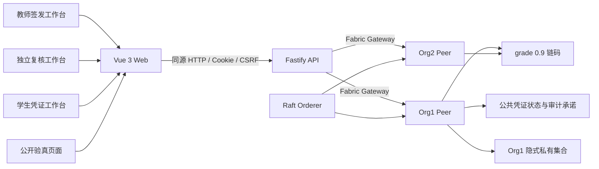
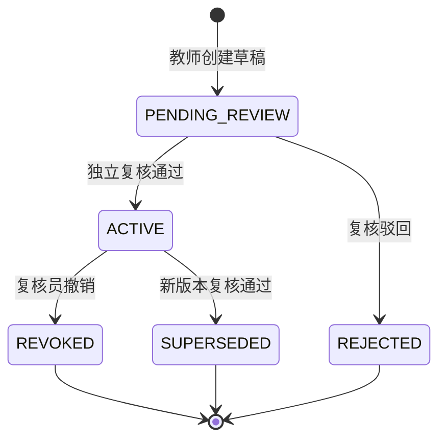
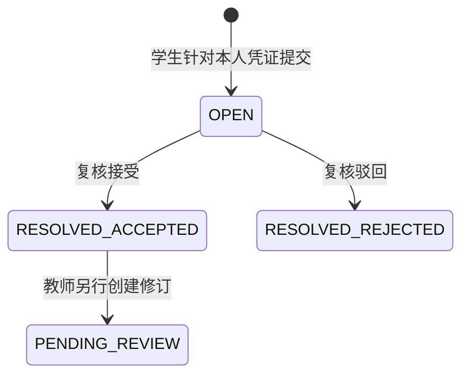
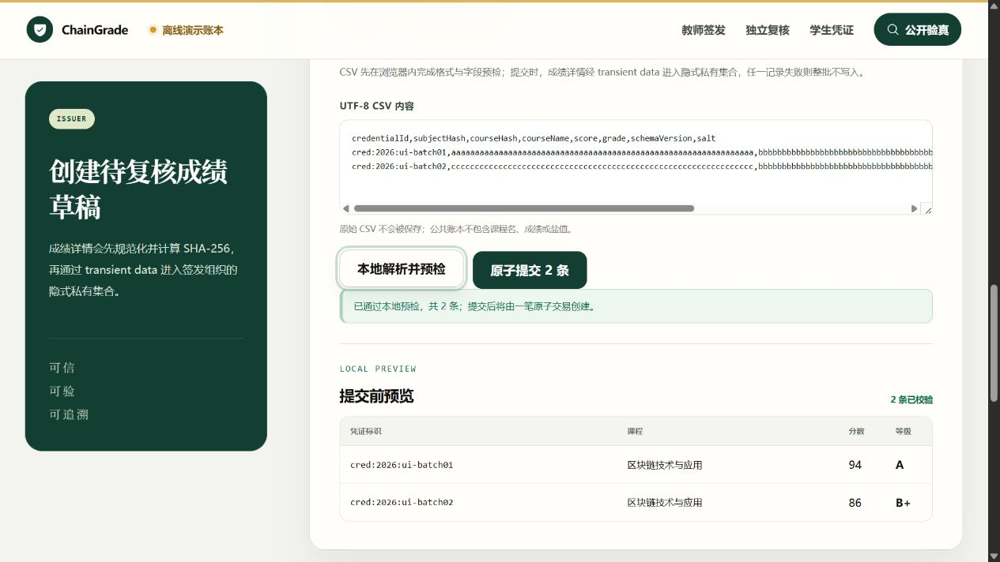
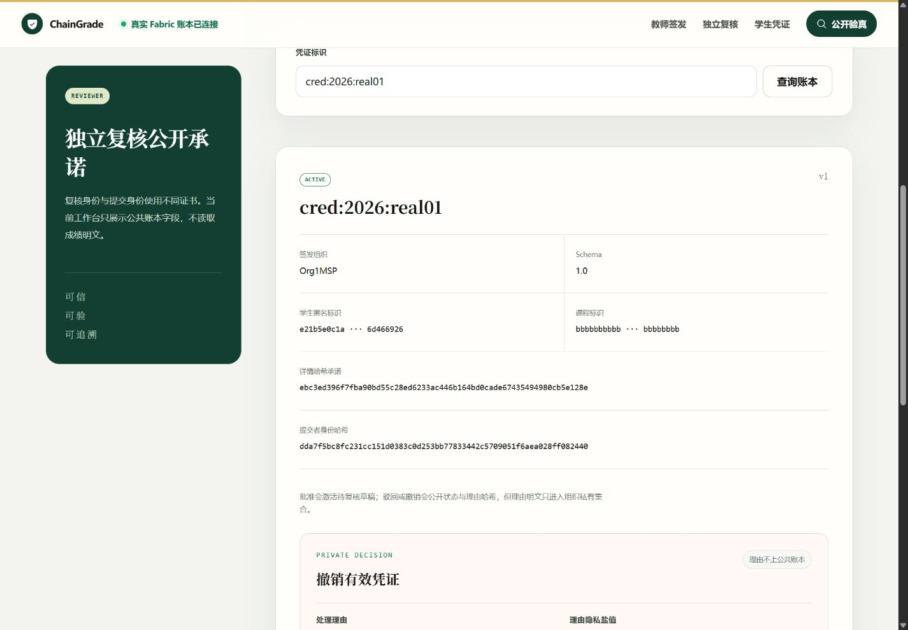
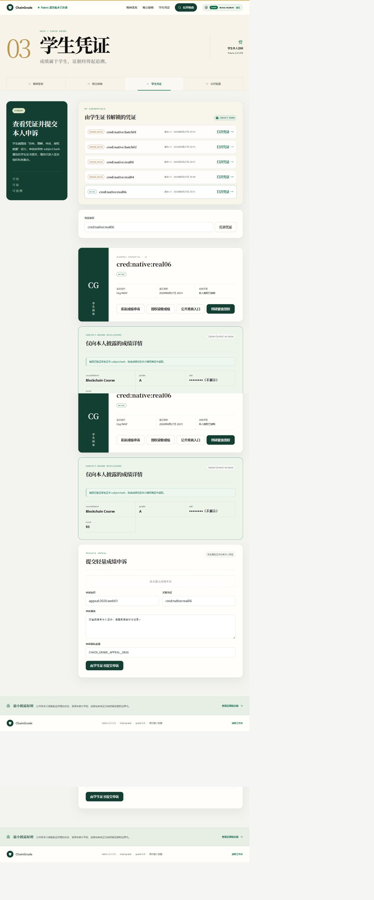
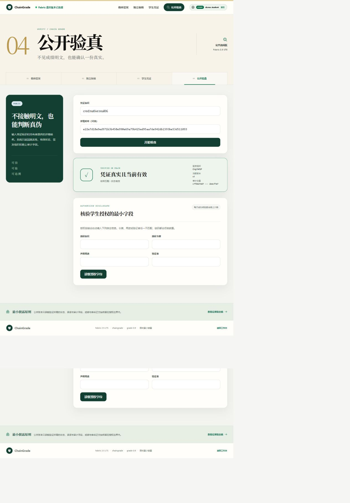
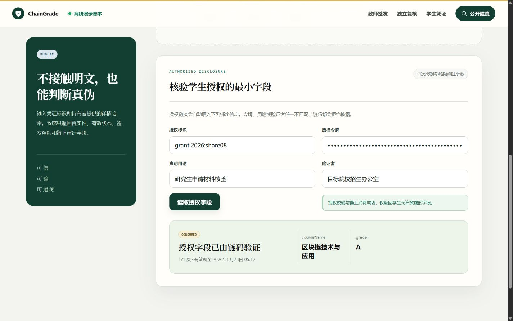
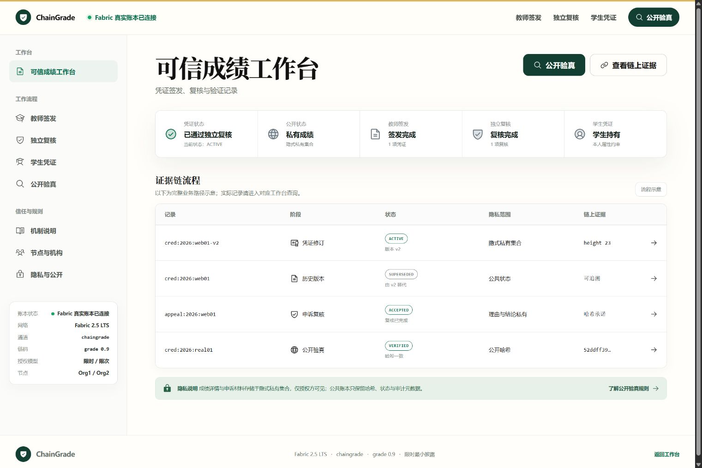
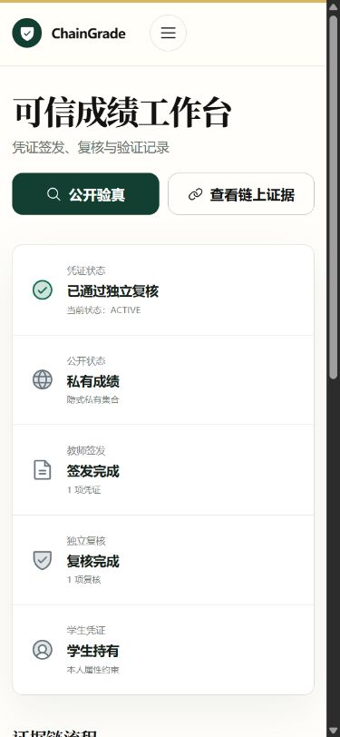

<div class="cover" style="break-after:page;font-family:方正公文仿宋;width:100%;height:100%;border:none;margin:0 auto;text-align:center;">
    <div style="width:60%;margin:0 auto;height:0;padding-bottom:10%;">
        <br>
        
    </div>
    <br><br><br><br><br>
    <div style="width:60%;margin:0 auto;height:0;padding-bottom:40%;">
        
    </div>
    <br><br><br><br><br><br><br><br>
    <span style="font-family:华文黑体Bold,华文黑体,黑体;text-align:center;font-size:20pt;margin:10pt auto;line-height:30pt;">ChainGrade——隐私保护型可信成绩凭证管理平台</span>
    <p style="text-align:center;font-size:14pt;margin:0 auto;">区块链技术应用实践课程大作业实验报告</p>
    <br><br>
    <table style="border:none;text-align:center;width:72%;font-family:仿宋,华文仿宋;font-size:14px;margin:0 auto;">
    <tbody style="font-family:方正公文仿宋,华文仿宋;font-size:12pt;">
        <tr style="font-weight:normal;"><td style="width:20%;text-align:right;border:none;">题　　目</td><td style="width:2%;border:none;">：</td><td style="width:40%;font-weight:normal;border:none;border-bottom:1px solid;text-align:center;font-family:华文仿宋;">ChainGrade</td></tr>
        <tr style="font-weight:normal;"><td style="width:20%;text-align:right;border:none;">课程名称</td><td style="width:2%;border:none;">：</td><td style="width:40%;font-weight:normal;border:none;border-bottom:1px solid;text-align:center;font-family:华文仿宋;">区块链技术应用实践</td></tr>
        <tr style="font-weight:normal;"><td style="width:20%;text-align:right;border:none;">姓　　名</td><td style="width:2%;border:none;">：</td><td style="width:40%;font-weight:normal;border:none;border-bottom:1px solid;text-align:center;font-family:华文仿宋;">魏子安</td></tr>
        <tr style="font-weight:normal;"><td style="width:20%;text-align:right;border:none;">学　　号</td><td style="width:2%;border:none;">：</td><td style="width:40%;font-weight:normal;border:none;border-bottom:1px solid;text-align:center;font-family:华文仿宋;">3240101782</td></tr>
        <tr style="font-weight:normal;"><td style="width:20%;text-align:right;border:none;">组　　别</td><td style="width:2%;border:none;">：</td><td style="width:40%;font-weight:normal;border:none;border-bottom:1px solid;text-align:center;font-family:华文仿宋;">魏子安、强璞、阳震</td></tr>
        <tr style="font-weight:normal;"><td style="width:20%;text-align:right;border:none;">专　　业</td><td style="width:2%;border:none;">：</td><td style="width:40%;font-weight:normal;border:none;border-bottom:1px solid;text-align:center;font-family:华文仿宋;">计算机科学与技术</td></tr>
        <tr style="font-weight:normal;"><td style="width:20%;text-align:right;border:none;">日　　期</td><td style="width:2%;border:none;">：</td><td style="width:40%;font-weight:normal;border:none;border-bottom:1px solid;text-align:center;font-family:华文仿宋;">2026 年 8 月 28 日</td></tr>
    </tbody>
    </table>
</div>

# 摘要

本实验围绕“学生成绩信息存证与查询”课程题目，设计并实现 ChainGrade 隐私保护型可信成绩凭证管理平台。系统没有将成绩明文直接写入公共账本，而是由 Hyperledger Fabric 公共状态保存凭证标识、状态、版本与加盐详情承诺，由隐式私有数据集合保存课程名称、分数、等级、盐值以及申诉详情；同时以教师签发、院系独立复核、学生持有、外部验真和修订/申诉状态机约束成绩生命周期。工程采用 Vue 3、Fastify、Fabric Gateway 与 TypeScript 链码构成浏览器可操作的完整应用，并在同一项目中服务课程答辩与后续竞赛完善。

最终验收中，系统实现 25 个链码公开方法和 25 条 HTTP 路由；shared Schema/CSV、链码与 API 共 52 项自动测试全部通过，链码语句覆盖率为 85.91%，分支覆盖率为 75.38%。真实 Fabric 环境由 Org1、Org2 两个 Peer 共同维护，最终账本高度均为 12，当前区块哈希与前序区块哈希一致。CSV 冲突批次返回 HTTP 409，批内新记录随后查询为 404，验证了批量交易没有部分写入；前后端从停止状态重新构建并启动至健康状态耗时 12.50 秒。上述结果证明了课程实验环境内的功能闭环、批量原子性、双节点一致性和可恢复性，但不等同于生产级高可用、跨校联盟互认或零知识成绩证明。

**关键词：** Hyperledger Fabric；成绩凭证；隐私保护；私有数据集合；修订与申诉；有限披露

# 目录

[TOC]

## 1. 团队负责内容与最终结果

### 1.1 团队分工

本项目由三名成员共同完成，分工按主责划分，不以模块作为个人私有代码。链码状态、API 契约和关键界面均要求另一名成员参与评审。

| 成员           | 主要负责内容                                                      | 可核验成果                                                     |
| -------------- | ----------------------------------------------------------------- | -------------------------------------------------------------- |
| 魏子安（组长） | 总体架构、Fabric 网络、链码状态机、服务器部署、系统集成、项目管理 | 架构与隐私边界、原生 Fabric 恢复、链码部署、备份恢复、阶段整合 |
| 强璞           | Web 前端、交互设计、视觉系统、角色工作台、二维码与浏览器验收      | 四角色响应式界面、桌面/移动适配、二维码验真、UI 截图与错误状态 |
| 阳震           | Fastify API、Fabric Gateway、认证授权、自动测试和测试数据         | API 路由、会话/CSRF、Gateway 映射、链码/API 测试与测试记录     |

最终贡献比例需要三名成员依据 Git 提交、设计评审、测试、部署值守、文档和答辩准备共同确认，本报告不代替小组成员填写未经确认的比例。

### 1.2 最终实现结果

ChainGrade 已经从“成绩上链”参考题发展为一个可在浏览器使用的完整成绩凭证系统。教师可以单条录入或用 CSV 批量导入成绩；院系复核员独立批准、驳回或撤销；学生只能查看自己的私有成绩，可以发起申诉、查看修订版本并创建有限披露授权；外部验证者可以在不知道成绩明文的情况下检查凭证状态和详情承诺。

截至最终验收，实测结果如下。

| 指标                         |                                       最终结果 |
| ---------------------------- | ---------------------------------------------: |
| Fabric 版本                  |                                     2.5.16 LTS |
| 运行组织                     |                       Org1、Org2，共 2 个 Peer |
| 通道 / 链码                  |          `chaingrade` / `grade 0.9 sequence 1` |
| 链码公开交易/查询方法        |                                          25 个 |
| HTTP 路由                    |                                          25 个 |
| 代码、测试与运维规模         |                         49 个文件，约 8,802 行 |
| 自动测试                     |                                   52 / 52 通过 |
| 链码语句 / 行覆盖率          |                                85.91% / 85.98% |
| 链码分支 / 函数覆盖率        |                                75.38% / 95.52% |
| Web 生产构建                 |                           1,610 个模块转换成功 |
| 当前双 Peer 账本高度         |                              12 / 12，哈希一致 |
| API/Web 停止后重新构建并启动 |                                       12.50 秒 |
| UI 验收                      |  1536×1024、1440×900、1280×720、390×844 均通过 |
| 浏览器错误                   | console warning/error 为 0，检查页面无横向溢出 |

这些数字只描述已经运行或测试过的部分。项目没有把 BBS+、零知识范围证明、跨校联盟互认或生产级高可用写成已完成功能。

按 TypeScript、Vue、CSS、Shell 和 MJS 文件统计，8,802 行的构成如下。这里包含自动测试和运维脚本，不用代码行数代替完成质量。

| 区域                | 文件数 |  行数 |
| ------------------- | -----: | ----: |
| Web                 |      4 | 3,075 |
| API（含测试）       |     20 | 2,437 |
| Chaincode（含测试） |      6 | 1,709 |
| Shared Schema / CSV |      5 |   476 |
| Fabric 与交付运维   |     14 | 1,105 |
| 合计                |     49 | 8,802 |

## 2. 选题背景与问题定义

课程参考题是“围绕学生成绩信息存证与查询实现一个成绩管理应用”。如果只把学生姓名、课程和成绩写入区块链，再做一个查询页面，虽然形式上符合题目，但会产生三个实际问题。

第一，成绩是低熵敏感数据。常见成绩只有 0–100 或少量等级，直接公开哈希也可能被枚举；直接写明文则会让通道内所有有权限读取公共账本的节点永久获得学生成绩。

第二，“上链”不能自动保证数据真实。教师录入错误或内部人员越权时，错误数据同样可以不可篡改地保存。可信性必须来自身份、职责分离、状态转换规则和审计记录，而不是来自“使用了区块链”这一事实本身。

第三，真实成绩会发生更正、撤销和申诉。若只允许覆盖原记录，就无法解释历史；若完全不允许更正，又不符合教务管理。系统需要保留旧版本，同时让外部验证者明确知道哪个版本当前有效。

因此，本项目把问题定义为：在不公开成绩明文的前提下，让成绩经历“教师签发—院系独立复核—学生持有—外部验真—修订或申诉”的可追溯流程。

## 3. 为什么采用当前方案

### 3.1 为什么选择 Hyperledger Fabric

项目没有选择公链或发行 Token，因为成绩管理参与方是学校、院系和验证机构，身份与权限边界明确。Fabric 的 MSP 身份、证书属性、通道、背书和私有数据集合与这一场景直接对应：

- MSP 说明调用者属于哪个组织；
- `app.role` 和 `subject.hash` 属性区分教师、复核员和学生本人；
- 公共账本保存需要共同核验的状态；
- 隐式私有集合把成绩明文限制在签发组织内；
- 链码在所有 Peer 上执行同一状态机，防止 API 绕过规则直接改状态。

使用 Fabric 的原因不是追求“去中心化”口号，而是让多个职责主体共同维护一份不能由单个数据库管理员静默覆盖的状态历史。

### 3.2 为什么采用 B/S 架构

课程要求浏览器预览，实际学生和验证者也不应安装区块链节点或钱包软件。因此系统使用 Vue 3 Web、Fastify API 和 Fabric Gateway：浏览器负责表单、状态呈现和本地 CSV 预检；API 负责会话、业务编排和错误翻译；Gateway 使用受控证书连接 Peer；链码负责最终权限与状态规则。

### 3.3 为什么只维护一个项目

课程答辩和竞赛提交使用同一仓库、同一套链码、API、Web 和账本。课程侧强调完整成绩管理和界面，竞赛侧强调隐私、安全和工程证据，但没有建立“课程版”和“竞赛版”两个产品。这样可以避免两套代码的数据模型、截图和结论互相矛盾。

## 4. 系统总体架构

### 4.1 实际运行结构



课程与恢复环境实际使用一个 Raft orderer、两个 Peer 和一个 Node.js Chaincode-as-a-Service 进程。单 orderer 足以完成课程实验和功能证明，但不是高可用生产拓扑，本报告不把它称为生产集群。

### 4.2 各组件职责

| 组件           | 选择形式                | 负责内容                                           | 不负责的内容                       |
| -------------- | ----------------------- | -------------------------------------------------- | ---------------------------------- |
| Vue 3 Web      | 单页响应式应用          | 四角色任务流、表单预检、状态与错误展示、二维码     | 不保存 Fabric 私钥，不决定最终权限 |
| Fastify API    | TypeScript HTTP 服务    | 会话、CSRF、Schema 校验、Gateway 调用、HTTP 错误码 | 不直接覆盖链上状态                 |
| Fabric Gateway | 三类应用证书            | 将终端角色映射到受控 Fabric 身份                   | 不把浏览器口令当作 Fabric 私钥     |
| grade 链码     | TypeScript 合约         | 状态机、角色约束、公共/私有写入、索引、承诺校验    | 不保存真实姓名和明文学号           |
| 隐式私有集合   | `_implicit_org_<MSPID>` | 成绩、盐值等组织私有详情                           | 不向全通道广播明文                 |
| 运维脚本       | Bash、固定版本工具      | 网络、链码、备份、恢复、预检和演示启停             | 不修改服务器共享 Docker 目录       |

## 5. 数据与隐私设计

### 5.1 公共账本保存什么

公开凭证只包含随机凭证标识、学生匿名哈希、课程哈希、详情承诺、签发组织、Schema 版本、当前状态、版本号、前序凭证、交易时间和操作者身份摘要。外部验证者需要这些字段判断“记录是否存在、由谁签发、当前是否有效、提交的详情是否匹配”。

### 5.2 私有集合保存什么

课程名称、分数、等级、承诺盐值、学生映射和申诉/决定详情保存在签发组织的隐式私有集合。学生读取私有成绩时，链码会比较证书中的 `subject.hash` 与凭证主体哈希；只在二者一致时返回详情。

| 数据                | 公共账本 | 私有集合/受控端      | 原因                           |
| ------------------- | -------- | -------------------- | ------------------------------ |
| 凭证 ID、状态、版本 | 是       | 可缓存               | 外部验真和审计需要             |
| 学生姓名、学号      | 否       | 本项目不使用真实数据 | 避免永久身份暴露               |
| 学生匿名哈希        | 是       | 是                   | 支持本人索引，但不直接出现学号 |
| 课程名、分数、等级  | 否       | 是                   | 属于成绩明文                   |
| 详情哈希承诺        | 是       | 可重算               | 支持明文不公开的完整性核验     |
| 盐值                | 否       | 是                   | 防止枚举低熵成绩               |
| 申诉正文和决定理由  | 否       | 是                   | 防止敏感争议信息扩散           |
| 分享 Token 明文     | 否       | 只在创建响应返回一次 | 泄漏后会形成越权入口           |

详情承诺的形式可以简化表示为：

$$
detailHash=SHA256(canonicalJSON(course,score,grade,salt,schemaVersion)).
$$

这里的 `canonicalJSON` 使用固定字段和确定性序列化，避免不同语言的键顺序或空白差异导致同一详情产生不同哈希。随机盐保存在私有侧，攻击者不能只枚举 0–100 分重新计算公共哈希。

### 5.3 为什么不把有限披露称为零知识证明

当前实现让学生选择 `courseName`、`score`、`grade` 中的必要字段，并绑定用途、验证者、过期时间和 1–10 次使用上限。Token 为 32 字节随机数，链上只保存其 SHA-256；消费时在 transient data 中传递 Token、用途和验证者，成功后原子增加次数。

这种方案能限制访问范围，但验证者看到字段后仍可截图保存，且 bearer token 被转发后仍有风险。因此它是“有限字段授权能力”，不是 BBS+ 可派生凭证或零知识范围证明。准确说明边界比堆叠密码学名词更重要。

## 6. 身份、会话与权限设计

系统有四类前端角色，其中三个受保护角色对应三类 Fabric 应用证书。

| 终端角色    | 会话角色   | Fabric 属性                            | 主要权限                                   |
| ----------- | ---------- | -------------------------------------- | ------------------------------------------ |
| 教师/录入员 | `issuer`   | `app.role=issuer`                      | 创建草稿、批量导入、发起修订、查看本人提交 |
| 院系复核员  | `reviewer` | `app.role=reviewer`                    | 批准、驳回、撤销、处理申诉                 |
| 学生        | `student`  | `app.role=student`、`subject.hash=...` | 查看本人凭证和私有成绩、申诉、披露授权     |
| 外部验证者  | 无登录     | 无终端 Fabric 私钥                     | 公开状态与承诺核验、消费有效授权           |

登录成功后，API 设置 `HttpOnly + SameSite=Strict` 的短期签名 Cookie。JavaScript 不能读取 Cookie；写操作还要求同源 `Origin` 和 CSRF Token。API 的角色判断用于尽早返回清晰错误，链码的证书属性判断是最终安全边界。即使攻击者绕过 Web 直接调用 API，也不能让 issuer 证书执行 reviewer 交易。

真实 HTTP 负向验收结果为：未登录读取教师队列返回 401；恶意 Origin 登录返回 403；issuer 登录返回 200；issuer 访问 reviewer 队列返回 403；缺少 CSRF 的状态变更返回 403；issuer 读取本人队列返回 200。

## 7. 凭证与申诉状态机

### 7.1 凭证状态



设计这套状态机是为了同时解决“不能覆盖历史”和“错误必须允许更正”。修订不是更新原对象，而是创建引用旧凭证的新草稿。新版本通过复核时，同一交易激活新版本并把旧版本标记为 `SUPERSEDED`。旧版本仍能查询，但公开验真不会把它当作当前有效成绩。

链码拒绝提交人自审、重复凭证 ID、从终态恢复、对已撤销或已取代记录再次修订等非法操作。原因明文不上公共账本，只保存原因承诺和必要的审计身份。

### 7.2 轻量申诉



接受申诉不会直接改变成绩。否则 reviewer 可以通过“处理申诉”绕过教师签发与独立复核。正确流程是：学生提出异议，复核员确认是否进入更正，再由教师创建新版本并由另一身份复核。

## 8. 核心功能的实现形式

### 8.1 单条签发和独立复核

教师表单先在浏览器检查凭证 ID、64 位学生/课程哈希、分数、等级、Schema 和盐值。API 使用同一共享 Schema 再验证，不能信任浏览器校验。Gateway 把公共参数作为普通链码参数，把成绩详情作为 transient data 提交；Peer 执行链码后将公共状态写入世界状态，将详情写入签发组织私有集合。

草稿状态为 `PENDING_REVIEW`。复核员页面只显示签发组织、匿名主体、课程哈希、详情承诺和状态，不显示成绩。复核通过后状态转为 `ACTIVE`，学生和公开验证者才能把它作为有效凭证使用。

### 8.2 CSV 原子批量导入

真实教学场景通常按教学班导入成绩，只支持逐条表单会显著降低实用性。系统固定 UTF-8 表头：

```text
credentialId,subjectHash,courseHash,courseName,score,grade,schemaVersion,salt
```

解析器支持 BOM、CRLF、空行、带逗号的双引号字段和 `""` 转义。浏览器和 API 都检查 1–50 条限制、分数范围、盐值长度和批内重复。

批量导入没有在 API 中循环调用单条交易，而是由 `CreateCredentialBatch` 在一次 Fabric 交易内完成。链码先验证整批公开参数、所有 transient 私有条目、既有 ID 和详情哈希，全部通过后才开始写入。因此合法的两条记录共享一个 transaction ID；混入一条已存在记录时整批失败，不会留下“成功一半”的班级数据。



### 8.3 修订、驳回与撤销

教师发起修订时必须提供旧凭证 ID，新草稿记录 `previousCredentialId`。复核通过后新旧状态在同一交易内切换，避免出现两个同时有效版本。驳回只结束待复核草稿，不影响已有有效版本；撤销只允许 reviewer 对 `ACTIVE` 凭证执行，撤销原因明文进入私有侧，公共侧保存承诺。



### 8.4 学生本人查询与申诉

系统不要求学生记住每个凭证 ID。链码维护按匿名主体、签发者和状态建立的复合索引，分别支持教师本人列表、复核队列和学生本人列表。学生页面用学生属性证书查询自己的凭证，再按需读取私有成绩；响应设置 `Cache-Control: no-store`，盐值只用掩码显示。



学生可针对本人有效凭证提交申诉。申诉正文和证据摘要进入私有集合，公共记录只保存哈希、状态和关联凭证。复核员在独立队列处理，学生端可看到进度，但其他学生无法读取。

### 8.5 公开验真与二维码

公开验真输入凭证 ID 和持有者提供的详情哈希。系统返回签发组织、版本、当前状态、详情是否匹配和截断的审计交易信息，不返回课程名或分数。二维码只编码公开验证 URL、凭证 ID 和详情哈希，不包含成绩、盐值、姓名、学号或申诉正文。



### 8.6 有限字段披露

学生选择字段、用途、验证者、期限和次数后，系统只在创建成功响应中返回一次授权 Token。验证者提交 Token 和绑定信息；链码先评估授权，再原子消费次数，成功后 API 才返回被选字段。测试中选择 `courseName, grade` 时，响应没有 `score`；第二次消费后授权变为 `CONSUMED`，第三次返回 409。



## 9. UI 设计原因与呈现形式

### 9.1 为什么不使用普通管理后台样式

成绩凭证的核心不是表格数量，而是让用户理解“当前状态、下一步由谁处理、哪些信息公开、哪些信息私有”。早期页面只有首页较完整，角色页面仍像普通表单；后续统一参考本地 VEGA 设计规范，建立纸张色背景、深绿色信任色、金色章节编号、衬线展示标题和无衬线正文体系。

大型艺术字体只用于角色标题、验证结果和章节序号；表单、哈希、交易 ID 和说明正文保持易读字体。界面删除课程、竞赛、小组、Iteration、演示账号等开发提示词，避免用户看到项目制作痕迹。

### 9.2 四类工作台

- 首页回答“系统是否连接真实 Fabric、整个流程如何工作”；
- 教师端围绕单条签发、CSV 批量和本人记录组织；
- 复核端围绕待办凭证、申诉、驳回和撤销组织；
- 学生端围绕本人凭证、私有详情、申诉和披露授权组织；
- 公开端不要求登录，只解释验真需要的最小输入和结果边界。



### 9.3 响应式与安全状态

移动端将侧栏收进折叠菜单，表格变为任务卡，长哈希允许安全断行。登录门不预填账号或密码；角色不匹配时不渲染受保护内容，而是明确显示当前角色和目标角色。

最终验收覆盖 1536×1024、1440×900、1280×720 桌面视口和 390×844 移动视口。所检查页面均满足 `scrollWidth === clientWidth` 或 `scrollWidth <= innerWidth`，console warning/error 为 0。



## 10. 真实 Fabric 部署与故障恢复

### 10.1 实验环境

| 项目               | 配置                                                    |
| ------------------ | ------------------------------------------------------- |
| 操作系统           | Ubuntu 22.04.5 LTS                                      |
| CPU                | Intel Xeon Gold 6336Y 2.40 GHz，96 逻辑核（共享服务器） |
| 内存               | 251 GiB（共享服务器）                                   |
| Node.js            | v24.19.0                                                |
| Hyperledger Fabric | v2.5.16                                                 |
| 包管理器           | pnpm 11.19.0                                            |
| 前端               | Vue 3.5.41、Vite 8.2.2                                  |
| API                | Fastify 5.12.1                                          |
| 合约               | TypeScript、fabric-contract-api / CCAAS                 |
| 项目目录           | `/mnt/localDisk3/weizian/Echoes-of-the-Chain`           |

### 10.2 Docker 故障与原生运行方案

服务器重启后，共享 Docker daemon 可以连接，但容器、镜像和命名卷均不可见，对 Fabric 镜像执行 inspect 返回：

```text
Error response from daemon: layer does not exist
```

由于 Docker data-root 是共享目录，本项目没有执行 `prune`、删除根目录或重启系统服务。为避免课程进度依赖管理员修复，项目使用已经保留的 Fabric 2.5.16 二进制、MSP/TLS 和应用身份，在用户目录中直接运行 orderer、两个 Peer 和 CCAAS 链码。

```text
orderer 127.0.0.1:7050
  ├── peer0.org1 127.0.0.1:7051
  ├── peer0.org2 127.0.0.1:9051
  └── grade CCAAS 127.0.0.1:9999
```

运行数据、LevelDB、WAL、日志和 PID 全部位于项目 `.runtime/native-fabric`。通道区块首次生成后复用；如果每次启动重新生成 genesis block，Peer 会检测到 PreviousHash 不一致，因此脚本明确禁止覆盖稳定通道区块。

### 10.3 备份、恢复和演示启停

冷备份会短暂停止链码、Peer 和 orderer，归档账本与必要私钥，计算 SHA-256 并验证 tar 路径。实际备份文件大小为 220,885 bytes，权限 `0600`，SHA-256 为：

```text
fd243e8a78a834ba2d05f0e669c5372c2a63f0767ca0b3a8f6d4df1b9b892403
```

恢复必须带显式确认参数；恢复前运行目录移动为带时间戳的回退副本，而不是直接删除。恢复后两个 Peer 高度和哈希一致。

演示脚本只管理本项目 API/Web PID，从权限为 600/400 的 Git 外文件读取认证环境。最终彩排从 API/Web 停止状态完成逐包生产构建并启动到健康状态耗时 12.50 秒；结束后脚本验证 PID 命令行属于本项目才发送 SIGTERM，不影响 Fabric 或同机其他用户进程。

## 11. 实验方法

为了避免只展示成功页面，项目按四层验证。

1. 链码单元测试：使用模拟 Fabric 上下文覆盖合法状态、非法角色、重复 ID、私有哈希不一致、终态转换和披露计数。
2. API 测试：验证 Schema、HTTP 状态码、会话、Origin、CSRF、角色映射、缓存头和敏感字段。
3. 真实 Fabric E2E：记录真实 transaction ID、双 Peer commit 状态、批量原子失败和私有数据读取。
4. 浏览器验收：实际操作桌面/移动页面，检查正常、空、错误、角色不匹配和真实账本状态，保存截图并检查 overflow/console。

测试使用合成学生标识、课程和成绩，不使用真实教务数据。离线演示账本只用于早期 UI/HTTP 调试；凡是报告为“真实链上”的结果都来自 Fabric Gateway 和双 Peer 网络。

## 12. 实验结果

### 12.1 自动测试与覆盖率

| 测试包              | 通过数 | 失败数 |
| ------------------- | -----: | -----: |
| shared Schema / CSV |      6 |      0 |
| grade chaincode     |     20 |      0 |
| Fastify API         |     26 |      0 |
| 合计                |     52 |      0 |

链码覆盖率为语句 85.91%、分支 75.38%、函数 95.52%、行 85.98%。类型检查、Vue 类型检查、生产构建和 `git diff --check` 均通过。分支覆盖率低于其他指标，说明分页、底层 Fabric 异常组合等分支仍有继续补测空间。

### 12.2 链码生命周期与账本一致性

链码定义结果为：

```text
Version: 0.9, Sequence: 1
Approvals: [Org1MSP: true, Org2MSP: true]
```

生命周期 commit transaction ID：

```text
49133981b086c9ffddcc8ef4de41fbd9d771831eb7c019ca5a5060a50d57fb22
```

最终双 Peer 状态：

| 节点 | Height | Current block hash                             | Previous block hash                            |
| ---- | -----: | ---------------------------------------------- | ---------------------------------------------- |
| Org1 |     12 | `NjkF6W8PoFdnkASNDRLM/zGeKPZ4ZztJf/JZSabf3PE=` | `7g7mqwbr0zKYIPwcyYy/o4v+2yxFZp2n9ymorUSTGUg=` |
| Org2 |     12 | `NjkF6W8PoFdnkASNDRLM/zGeKPZ4ZztJf/JZSabf3PE=` | `7g7mqwbr0zKYIPwcyYy/o4v+2yxFZp2n9ymorUSTGUg=` |

两节点高度、当前哈希和上一哈希完全一致。重复执行确定性播种和前后端彩排后高度仍为 12，说明演示准备不会重复写链。

### 12.3 单条成绩闭环

| 操作              | HTTP 结果 | 真实 transaction ID / 结论                                         |
| ----------------- | --------- | ------------------------------------------------------------------ |
| issuer 创建草稿   | 201       | `e83ea7ee5658706be649e7ee9bc5e8c10d5f21ca4ce9ee57e16c520d73edcb2f` |
| reviewer 独立批准 | 200       | `c7f5827e87f1a1964e89d38b8621aa255f5aa3369f9853422a48c5e92becf7a7` |
| 公开验真          | 200       | `valid=true`，状态 `ACTIVE`                                        |

这组数据证明的不是“接口返回了成功字符串”，而是不同属性证书先后提交了两笔被 Fabric 接受的交易，最后公开查询得到当前有效状态。

### 12.4 批量原子性

| 用例                      | 结果                                                                    |
| ------------------------- | ----------------------------------------------------------------------- |
| 两条合法记录              | HTTP 201，`importedCount=2`                                             |
| 两条记录 transaction ID   | 均为 `fe1cd817308b9a18fb4375a9f53f99c97f9ec9cc1e971f66b4fef11a378c0cce` |
| 响应隐私扫描              | 不含盐值、课程名、分数或 CSV 原文                                       |
| 新记录 + 既有记录混合批次 | HTTP 409 `ALREADY_EXISTS`                                               |
| 冲突后查询批内新记录      | HTTP 404 `NOT_FOUND`                                                    |

最后一项是原子性的关键证据：如果 API 只是循环提交，冲突前的新记录可能已经存在；实际查询为 404，说明整批没有部分写入。

### 12.5 有限披露与错误边界

| 用例                             | 结果                                   |
| -------------------------------- | -------------------------------------- |
| 错误验证者消费                   | HTTP 403                               |
| 正确消费，授权字段为课程名和等级 | 只返回 `courseName, grade`，无 `score` |
| 达到第二次使用上限               | `usedCount=2`，状态 `CONSUMED`         |
| 第三次消费                       | HTTP 409                               |
| 公共授权记录扫描                 | 不含用途、验证者和 Token 明文          |

### 12.6 运维与 UI

| 项目                 | 实测结果                                          |
| -------------------- | ------------------------------------------------- |
| 完整停止、启动后账本 | 高度和哈希不变                                    |
| 冷备份校验           | SHA-256、gzip/tar、路径与权限通过                 |
| 真实恢复             | 双 Peer 恢复后一致，旧运行目录保留                |
| 幂等播种             | 第二次运行所有创建标志为 false                    |
| 前后端冷彩排         | 12.50 秒进入健康状态                              |
| 三角色登录           | issuer、reviewer、student 均 `authenticated=true` |
| 桌面/移动 UI         | 无横向溢出，console warning/error 为 0            |

## 13. 失败问题与原因分析

### 13.1 Docker `layer does not exist`

故障同时影响 image inspect、容器运行和 Docker 存储统计，而仓库文件与 Fabric 身份材料仍存在，因此判断问题位于共享 Docker 元数据，不是链码代码。项目没有权限安全地清理共享 data-root，也不能恢复已经不可见的旧 named volume。

处理方式不是伪造旧 transaction ID，而是保留旧账本不可恢复的事实，在用户目录建立新的真实 Fabric 网络并重新生成业务证据。这保证了后续结果仍是真实 Fabric 交易，但不会冒充故障前的历史。

### 13.2 原生 Fabric 首次恢复中的两个问题

Peer 初次启动时把 snapshot 默认写到 `/var/hyperledger`，普通用户没有权限。解决方法是显式设置 `CORE_LEDGER_SNAPSHOTS_ROOTDIR` 到项目运行目录。

第二个问题是重复生成通道区块。即使配置相同，新生成区块也可能让重启节点发现 PreviousHash 不一致。最终脚本只在通道区块不存在时生成一次，以后稳定复用。

### 13.3 前端构建顺序问题

CSV 功能加入共享包后，根构建最初并行执行所有 workspace。Web 有时读取旧的 shared `dist`，页面因缺少导出而空白。问题不在 Vue 页面，而在构建依赖顺序。根脚本改为 `shared → chaincode → API → Web` 后，空白页没有复现。

### 13.4 服务器文件监听额度耗尽

Vite 曾返回 `ENOSPC: System limit for number of file watchers reached`。这是共享服务器 inotify 额度问题。项目没有修改系统内核参数，而是只给自己的 Vite 进程设置 polling，完成浏览器验收。

这些失败被保留在报告中，因为它们说明系统在哪些环境假设下会失效，以及修复是否超出项目权限；只展示最终成功截图不能说明工程过程是否可信。

## 14. 当前局限与后续方向

1. 当前拓扑只有一个 orderer，可做课程验证但不具备生产高可用；后续需要三 orderer 故障实验。
2. 登录账户是受控演示身份，没有接入学校 OIDC/SAML、MFA、集中撤销和正式密钥托管。
3. 有限披露仍是 bearer capability，不具备 BBS+ 派生证明的不可链接性，也不能证明“分数大于某阈值但不泄漏分数”。
4. 当前网络模拟两个教育组织，没有真实跨校治理协议和真实教务系统接口。
5. 项目尚未完成 Caliper 的吞吐、P95/P99 延迟和并发失败率基准，因此不在报告中填写估算性能。
6. 所有数据均为合成数据；接入真实成绩前需要数据保护评估、保留周期、密钥轮换和校方授权。

后续竞赛深化仍在本项目上完成，优先顺序为：建立可重复性能基准；接入标准 VC/BBS+ 的独立技术尖峰；扩展多 orderer 和跨组织治理；最后再考虑真实教务接口。不会为了增加名词数量而同时铺开所有方向。

## 15. 总结与实验体会

本项目最重要的结论不是“区块链可以存成绩”，而是成绩系统需要把可信流程和隐私边界同时设计。把明文全部上链虽然简单，却会把学生隐私永久复制给多个节点；只保存哈希又不能解决签发错误、版本更正和申诉。最终方案用 Fabric 身份和状态机约束谁能改变状态，用私有集合保存成绩明文，用公共承诺支持验真，用新版本代替覆盖，用独立复核和申诉流程处理人的错误。

实验过程也说明，可运行证据比架构名词更重要。52 项测试、真实 transaction ID、冲突后 404、双 Peer 相同区块哈希、恢复前后一致和浏览器无错误分别回答了“代码分支是否正确、交易是否真实、批量是否原子、节点是否一致、备份是否可用、页面是否能操作”。这些数据共同构成系统可信性，单独展示任意一个都不够。

最终 ChainGrade 完成了课程参考题要求的成绩存证与查询，并形成了签发、复核、学生持有、外部验真、修订/申诉和有限披露的完整闭环。项目仍有高可用、正式身份和高级密码学方面的边界，但这些边界已经被明确记录，没有用尚未完成的规划代替实验结果。

## 附录 A：复现实验命令

本地代码检查：

```bash
corepack pnpm check
corepack pnpm test
corepack pnpm build
corepack pnpm delivery:check-anonymity
```

服务器真实 Fabric：

```bash
./infra/fabric-native/preflight.sh
./infra/fabric-native/native-network.sh up
./infra/fabric-native/deploy-chaincode.sh start
./infra/fabric-native/ledger-info.sh
.tools/node/bin/corepack pnpm --filter @chaingrade/api seed:native
```

答辩前后端：

```bash
./infra/demo/preview.sh check
./infra/demo/preview.sh start
./infra/demo/preview.sh status
./infra/demo/preview.sh stop
```

## 附录 B：主要证据文件

- 总体与隐私设计：`design/02_product_requirements.md`、`design/03_threat_model_and_privacy.md`、`design/04_system_architecture.md`。
- 真实 Fabric 恢复：`reports/13_native_fabric_recovery_e2e.md`。
- 备份恢复与鉴权 UI：`reports/14_native_operations_auth_ui_e2e.md`。
- 交付彩排：`reports/15_delivery_readiness_rehearsal.md`。
- 功能与证据总索引：`deliverables/common/evidence-index.md`。
