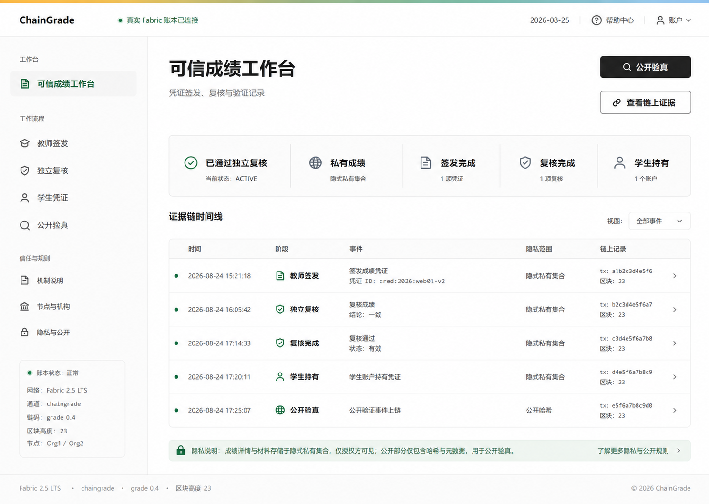

# Iteration 4：可信成绩工作台视觉重设计

日期：2026-08-26

## 1. 目标

在不改变 ChainGrade 业务边界、角色权限和链上行为的前提下，将界面从展示型课程页面升级为可持续使用的可信成绩产品工作台。课程答辩和竞赛仍使用同一个项目，但这些开发背景不进入用户界面。

## 2. 参考原则

视觉方向借鉴 `D:\VegaHub\VEGA-Design-Guidelines` 的设计思想，而不复制 Vega 品牌、Logo 或业务结构：

- 可信优先：状态、隐私范围、机构角色和下一步操作必须清晰。
- 技术清晰：链码版本、通道、区块高度和哈希使用结构化信息表达。
- 克制活泼：只在顶部品牌线和语义状态中使用柔和色彩。
- 运营界面保持低装饰密度，依靠间距、分组、排版和分隔线建立层级。
- 主操作使用深色按钮，卡片和表单使用 8–16 px 圆角与轻量阴影。

## 3. 提示词痕迹清理规则

下列内容不得出现在产品 UI：

- “同一个项目”“课程答辩”“竞赛深化”“大作业”等开发背景。
- “Iteration”“演示账号”“演示凭据”“原型截图”等过程性措辞。
- 为填充界面而虚构的姓名、学号、院系、课程和大规模区块数据。
- 对功能列表的提示词式复述、空泛宣传语和与操作无关的指标。

界面只使用产品原生信息：真实角色、真实 Fabric 配置、现有凭证/申诉记录、隐私范围、状态和操作结果。

## 4. 信息架构

桌面端采用顶部全局导航、左侧工作流导航和主证据区：

1. 顶部显示 ChainGrade、真实账本连接状态和四个核心入口。
2. 左侧按“工作台 / 工作流程 / 信任与规则”分组，并显示当前网络状态。
3. 主区先呈现五项关键信任状态，再展示现有凭证、修订、申诉和公开验真证据。
4. 隐私说明紧邻证据表，明确公共账本与隐式私有集合的边界。
5. 移动端隐藏侧栏，保留折叠菜单、主操作、状态纵列和两列证据摘要。

## 5. 设计 Token

- 页面：`#F5F5F3`；主表面：`#FFFFFF`；正文：`#121212`。
- 可信绿色：`#08724F`；技术蓝：`#255F89`。
- 浅蓝/浅绿表面：`#EEF4FA` / `#E9F5EE`。
- 主要按钮：`#111111`；边框：`#E1E4E1`。
- 控件圆角 8–10 px，主要表面 12–14 px。
- 图标采用官方 [`@phosphor-icons/vue`](https://github.com/phosphor-icons/vue)，避免字符符号或手绘 SVG。

## 6. 视觉目标

实现依据净化后的 1536×1024 设计稿：

