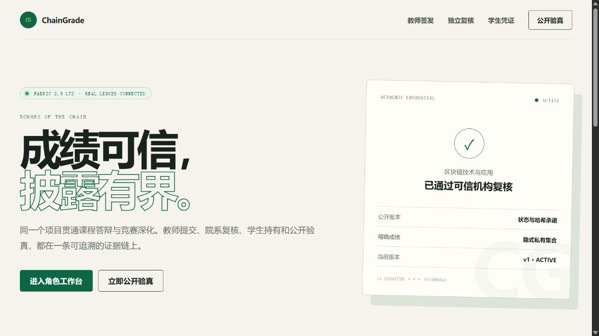
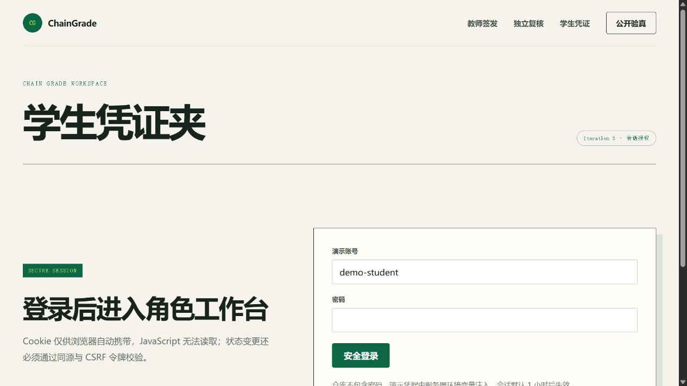
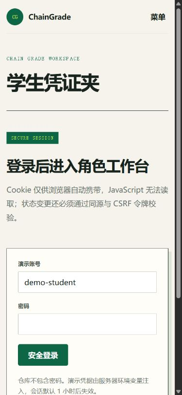
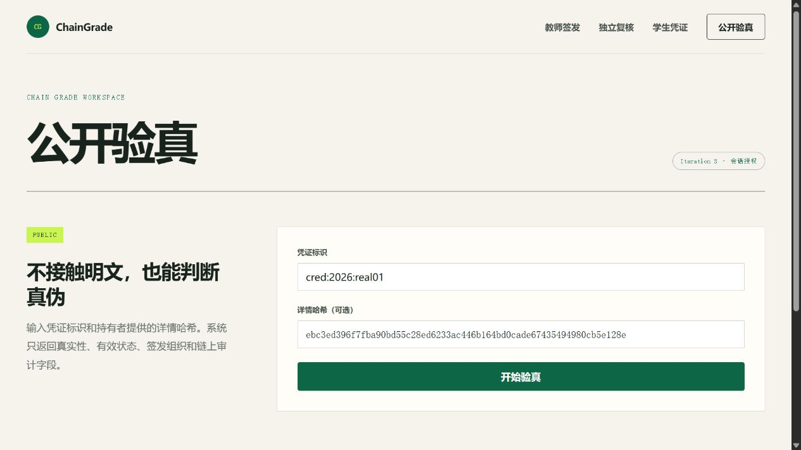

# Iteration 3 阶段实验：会话授权与本人私有披露 E2E

日期：2026-08-25

## 1. 实验目标

验证角色登录、Cookie/CSRF/来源防护、HTTP 与链码双层授权、学生本人私有成绩读取及免登录公开验真，并检查移动端登录门。

## 2. 链码升级

- 升级前：`grade 0.3 / sequence 3`。
- 升级后：`grade 0.4 / sequence 4`。
- 包 ID：`grade_0.4:61f543b34e804323ff674c698967760582afe83d7db0b8d2cfaf99420121b863`。
- 定义提交交易：`a78c012fa34c669bc151ebf7ee2f5fdb785c427da92467209c7cfa597e5d662a`。
- Org1/Org2 均批准，新增学生本人私有凭证读取函数，历史状态未重置。

## 3. 认证与授权结果

| 场景 | 结果 |
| --- | --- |
| 正确 issuer 登录 | 200，角色 issuer |
| Cookie 属性 | HttpOnly、SameSite=Strict、Path=/、Max-Age=3600 |
| issuer 写请求缺失 CSRF | 403 `CSRF_INVALID` |
| student 调用 issuer 写接口 | 403 `ROLE_FORBIDDEN` |
| `Sec-Fetch-Site: cross-site` 登录 | 403 `CSRF_INVALID` |
| issuer 读取学生私有成绩 | 403 `ROLE_FORBIDDEN` |
| student 会话 subjectHash | 与 Fabric 学生证书属性一致 |
| student 读取本人 v2 成绩 | 200，score 95、grade A、课程名称正确 |
| 私有响应缓存策略 | `Cache-Control: no-store` |
| 无会话公开验真 | `authentic=true, valid=true` |

学生读取还实际执行 `ReadPrivateCredential`，因此同时证明链码 student 角色、Org1 MSP 和 subject.hash 校验通过。链码单元测试另验证错误 subjectHash 和 reviewer 证书均被拒绝。

## 4. 会话泄露处置演练

一次诊断命令把临时签名 Cookie 打印到工具输出。发现后立即停止 API，轮换 HMAC 会话密钥并重启；旧 Cookie 随即无法通过签名验证。该过程验证了当前无状态会话的全局应急失效方式。报告不记录任何仍有效的会话令牌或运行密码。

## 5. 浏览器验收

- 未登录访问学生/复核工作台时，业务表单不渲染，只显示安全登录门。
- 公开验真在无 Cookie 条件下正常完成。
- 390×844 登录门宽度正确，无横向溢出。
- 浏览器 console warning/error 为 0。

### 5.1 桌面端首页

1280×720 视口下，品牌区、主导航、价值主张、操作入口和凭证卡片层级清晰；页面宽度为 1265 px（扣除滚动条），没有横向溢出。

### 5.2 学生登录门

未登录访问 `#student` 时，只渲染一个登录表单和一个密码输入框，不渲染学生私有成绩业务表单。桌面端左右信息层级和表单边界正常。

390×844 视口下，导航折叠为“菜单”，登录卡片宽 346.67 px；页面 `innerWidth=390`、`scrollWidth=375`，没有横向溢出，标签、输入框、按钮和安全说明均完整可见。

### 5.3 公开验真

1280×720 视口下，公开验真页面明确说明“不接触明文”，凭证标识、可选哈希与主操作按钮均在首屏内。该入口无需登录，且没有展示学生私有成绩。

## 6. 工程与账本结果

- 类型检查与生产构建通过。
- 自动测试由 25 项增加至 32 项：共享 Schema 2、链码 13、API 17。
- 链码覆盖率：语句/行 91.35%，分支 74.66%，函数 100%。
- 链码生命周期交易后账本高度：23；只读授权实验不增加区块。
- Org1/Org2 的 `grade_0.4` 容器均正常运行。

## 7. 结论与边界

ChainGrade 已从固定演示动作提升为有终端会话、角色守卫、CSRF/来源防护和链码本人属性校验的统一产品。当前演示账号由环境变量提供，尚无学校统一身份、登录限速、MFA、单会话撤销和正式 HTTPS 反向代理，不能宣称为生产认证系统。
