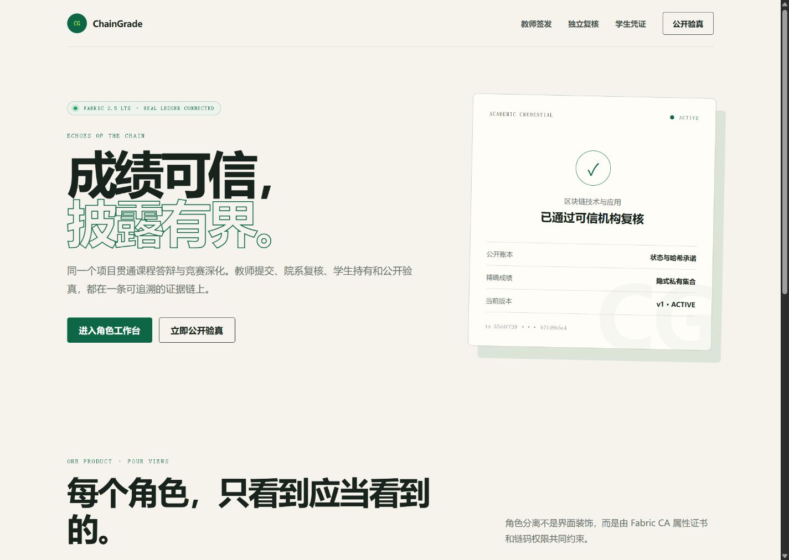
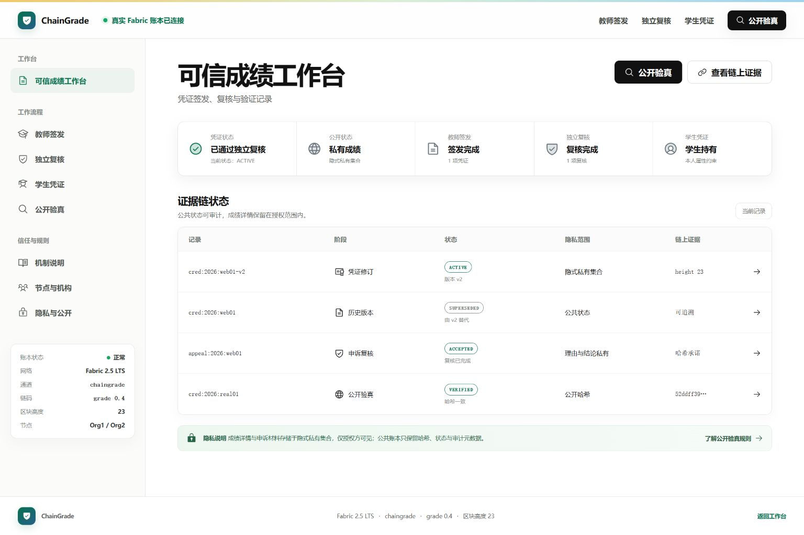
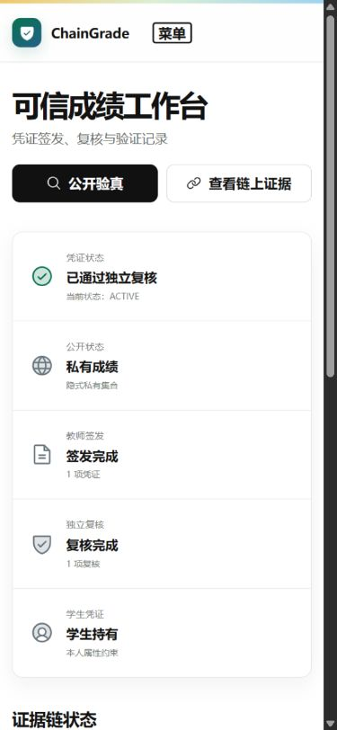
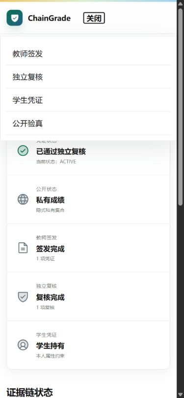
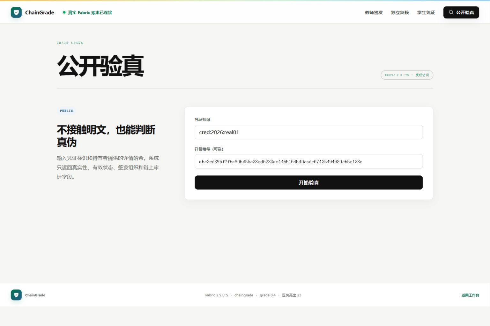
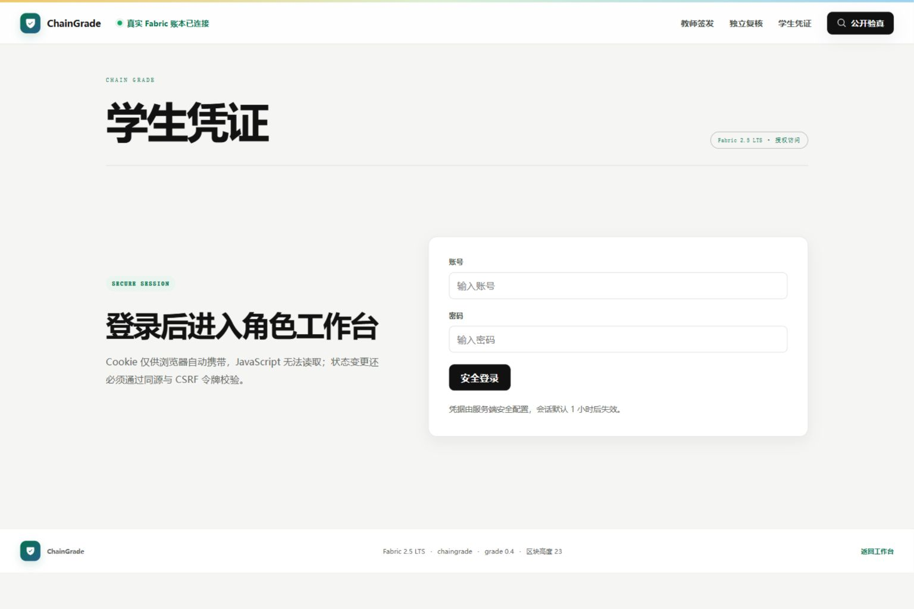

# Iteration 4 阶段实验：可信成绩工作台 UI 重设计与浏览器验收

日期：2026-08-26

## 1. 实验目标

清除产品界面中的提示词、课程开发过程和虚构演示数据痕迹；依据统一设计系统重构首页、全局导航、登录门、表单表面和公开验真界面，并完成桌面端与移动端浏览器视觉验收。

## 2. 实现结果

- 首页从宣传式长页面改为可信成绩工作台。
- 使用现有链上业务状态展示凭证 v2、历史版本、申诉结论和公开验真证据。
- 增加 Fabric 网络、通道、链码、区块高度和组织节点状态区。
- 使用 Phosphor Vue 图标替代文字字符式图标。
- 统一深色主操作、柔和可信状态、圆角、阴影、表单和状态标签。
- 删除 UI 中的课程答辩、竞赛、Iteration、演示账号和虚构人员信息。
- 登录账号不再预填 `demo-*`，改为空输入和产品原生占位提示。

重设计前首页使用超大描边标题、旋转凭证卡和宣传式角色卡，视觉表达强于业务状态，且包含项目开发背景文案：

## 3. 桌面端工作台验收

1536×1024 视口下，顶部导航、左侧工作流、信任摘要、证据表、隐私说明和页脚完整位于首屏；`innerWidth=1536`、`scrollWidth=1536`、`scrollHeight=1024`，不存在横向或纵向意外溢出。

## 4. 移动端工作台验收

390×844 视口下侧栏自动隐藏，顶部导航折叠，两个主操作保持并列，信任摘要转为纵向布局。页面 `innerWidth=390`、`scrollWidth=375`，不存在横向溢出。

折叠菜单能够打开并展示四个核心工作流入口，关闭后恢复工作台内容。

## 5. 关键页面验收

公开验真仍无需登录，凭证标识、可选详情哈希与主操作层级明确；界面不展示成绩明文。

学生工作台未登录时只显示安全会话登录门。账号与密码均为空，不出现 `demo-*` 或演示提示词，也不渲染私有成绩操作区。

## 6. 交互与工程验证

- 从首页点击“公开验真”正确进入 `#verify`。
- 顶部“学生凭证”正确进入 `#student` 登录门。
- 移动菜单可打开和关闭，四个入口均存在。
- 所有验收页面浏览器 console warning/error 为 0。
- Vue 类型检查、32 项自动测试和生产构建均通过。
- 生产构建：CSS 24.08 kB（gzip 5.63 kB），JavaScript 148.72 kB（gzip 48.16 kB）。
- 对 `apps/web/src` 执行提示词痕迹扫描，目标词匹配数为 0。

## 7. 设计 QA

第一轮 1440×1024 实现中，工作台使用 `min-height: calc(100vh - 74px)`，导致页脚落到首屏之外。修正为同时为顶部导航和页脚预留空间后，在与设计稿一致的 1536×1024 视口中完整首屏呈现。

最终同视口比较覆盖整体构图、标题/摘要、证据表、颜色、图标、文案和密度；无 P0/P1/P2 问题，详细记录见根目录 `design-qa.md`。

## 8. 结论

ChainGrade 已形成以可信状态和证据链为核心的产品界面。课程与竞赛背景继续保留在文档和交付流程中，但不会污染真实用户看到的产品文案。
