# Iteration 5 阶段实验：完整角色界面重构与二维码验真

日期：2026-08-26

## 1. 实验目标

将可信成绩工作台的视觉品质扩展至教师、复核员、学生、公开验证者及登录/权限界面；为大型标题加入具有学术与凭证气质的展示字形；完成真实 Fabric 数据状态、桌面端和移动端浏览器验收。在视觉重构完成后，继续实现二维码验真入口。

## 2. 主要实现

- 自托管 Noto Serif SC Variable，用于大型中文标题和结果标题；正文继续使用高可读无衬线字体。
- 新增章节编号、流程导航、角色说明卡、统一内容列、空状态引导和最小披露原则栏。
- 修复复核详情、学生凭证在旧网格中自动落入左侧窄栏的问题。
- 统一长表单、查询面板、复核记录、凭证卡、私有成绩、申诉和验真结果的视觉结构。
- 学生端生成真实二维码验真 URL；扫码后自动进入公开验真并恢复凭证标识与详情哈希。
- 二维码不携带成绩、盐值、学生身份或申诉正文。

## 3. 总工作台

总工作台继续保持证据链、状态和隐私边界的信息结构，大标题改为新的展示字体，与角色页面形成一致品牌语言。

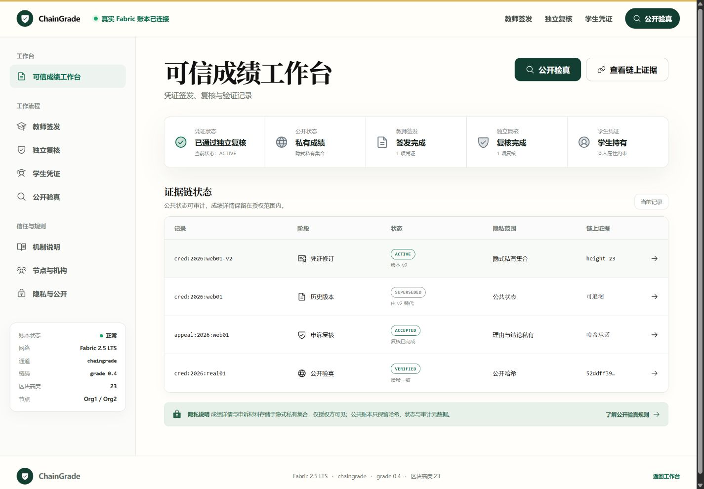

## 4. 教师签发

教师页面使用章节式标题和角色说明列，成绩草稿表单与后续修订处于同一宽内容列，长哈希字段不再压缩。

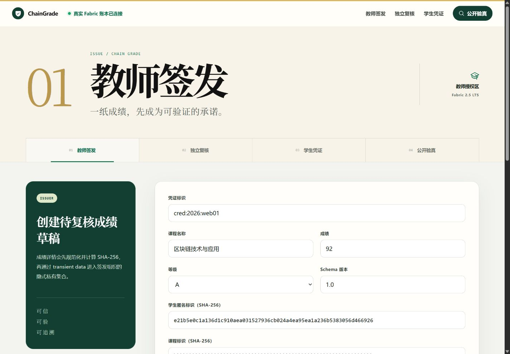

## 5. 独立复核与申诉

浏览器通过学校服务器上的真实 Fabric Gateway 查询 `cred:2026:real01`，得到 `ACTIVE / v1 / Org1MSP`；同时读取 `appeal:2026:web01`，得到 `RESOLVED_ACCEPTED`。复核页只展示公共承诺和审计字段。

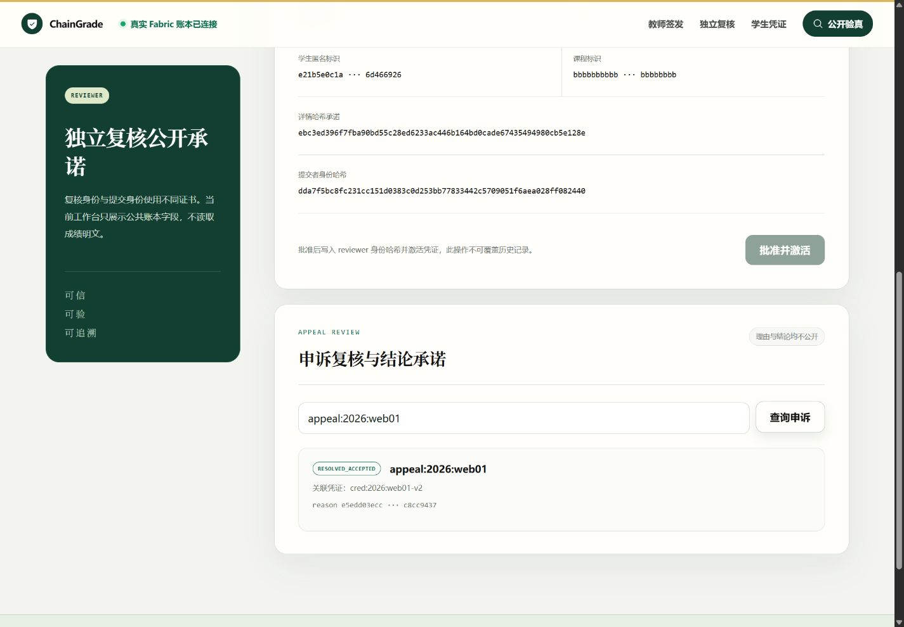

## 6. 学生本人私有披露

学生端打开真实凭证后，由学生属性证书完成 `subject.hash` 校验，并读取私有成绩 `Blockchain Systems / 92 / A`。盐值始终以遮罩显示，响应保持 `Cache-Control: no-store`。

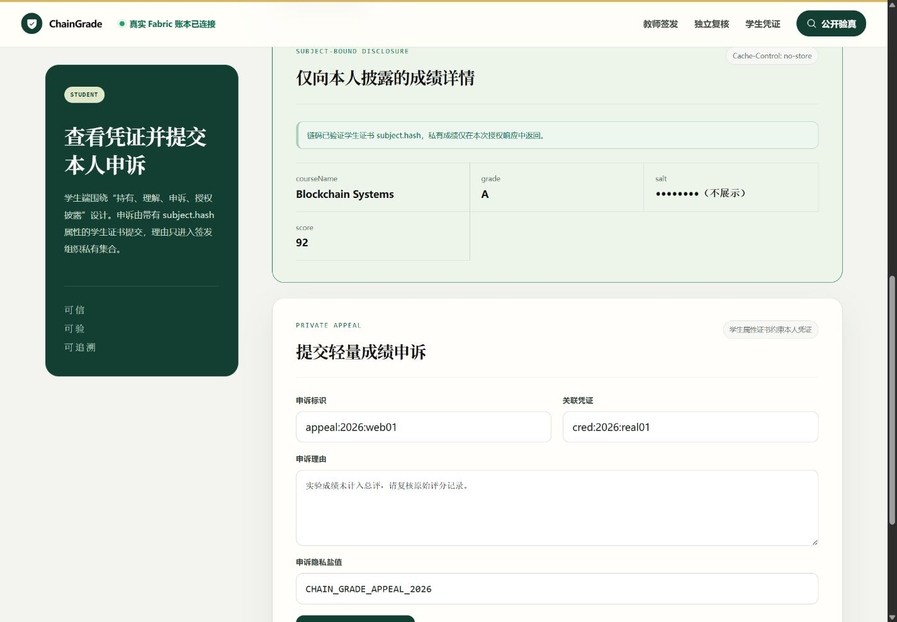

## 7. 公开验真正反状态

正确详情哈希返回“凭证真实且当前有效”；错误详情哈希返回明确警告，同时保留签发组织、版本和审计交易信息。

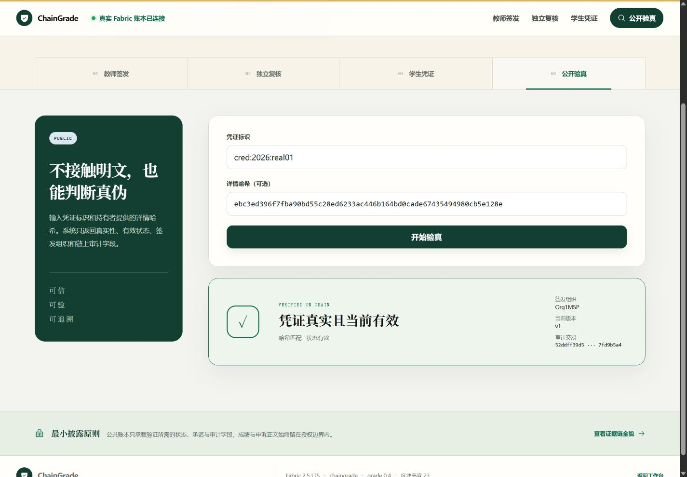

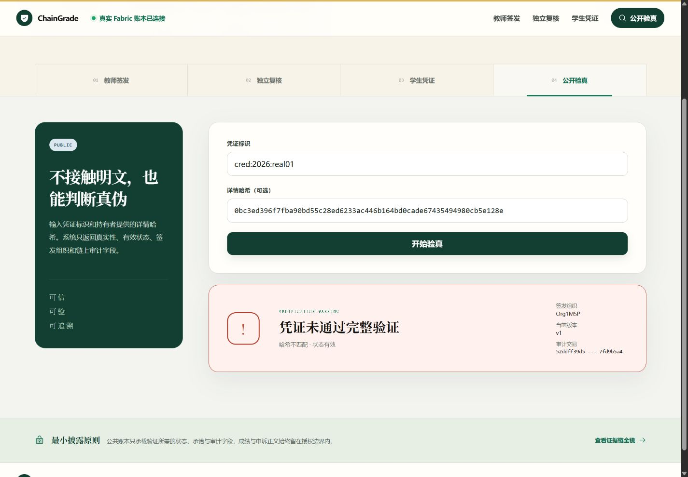

## 8. 二维码验真入口

学生可生成携带凭证标识和详情哈希的二维码与链接。浏览器验证直接打开该 URL 后，页面进入 `#verify`，两个验真字段均正确恢复；随后可完成真实链上查询。

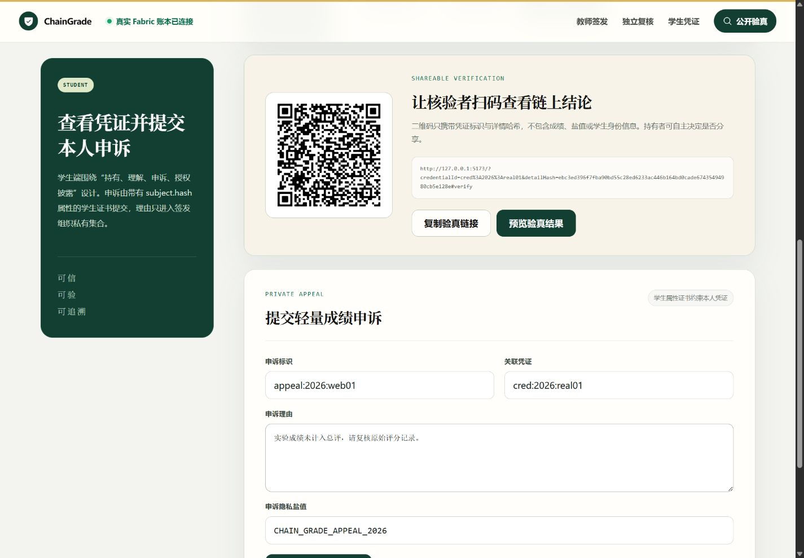

## 9. 登录与角色隔离

登录门与业务页面使用相同章节标题和字体体系，账号、密码保持空白，不包含演示账号提示。已登录角色进入不匹配工作台时，界面明确显示当前角色、目标角色和安全替换会话说明。

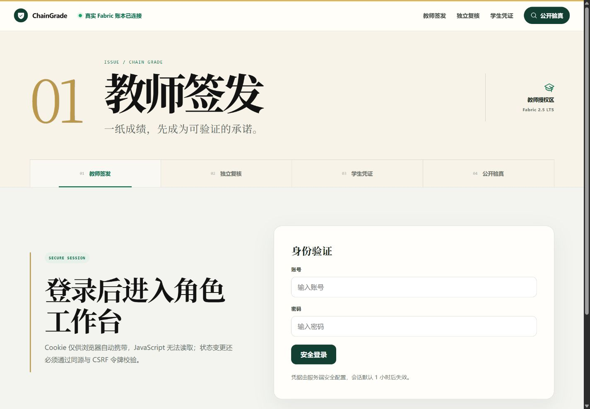

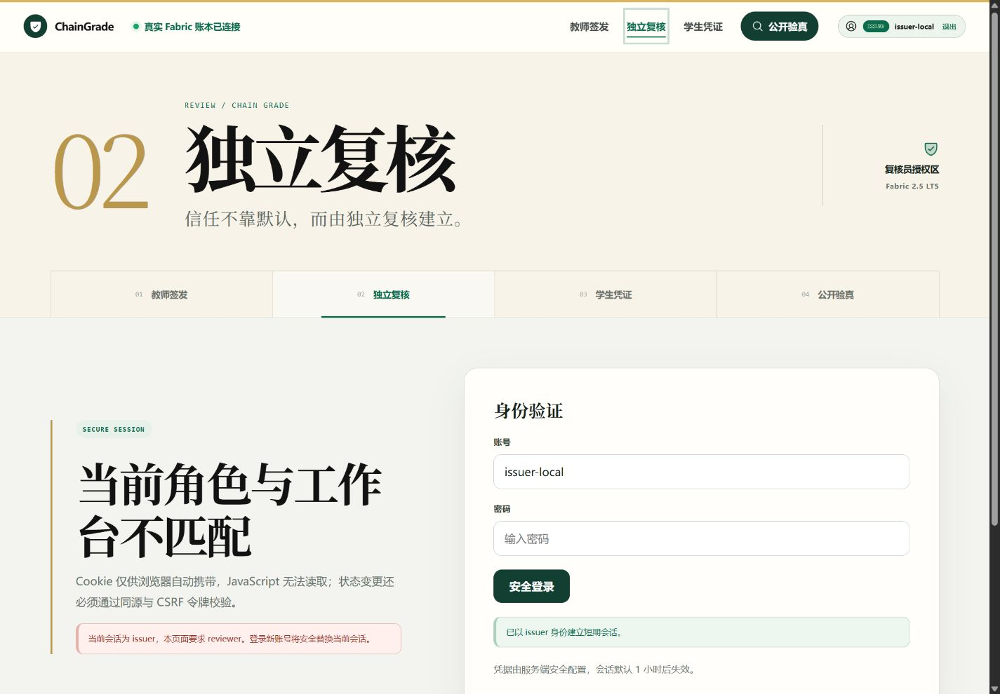

## 10. 移动端验收

390×844 视口下，艺术标题、四阶段导航、角色说明、表单和结果卡均转为单列。`innerWidth=390`、页面 `scrollWidth=375`，阶段导航 `clientWidth=375`、`scrollWidth=375`，不存在横向溢出。

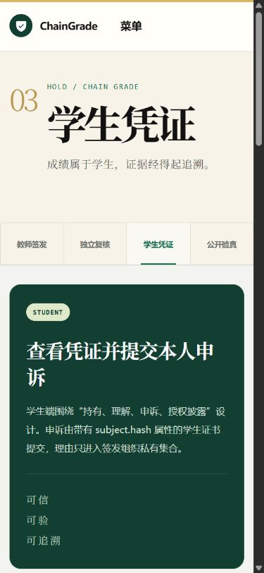

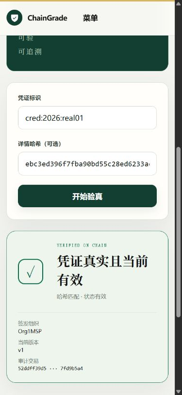

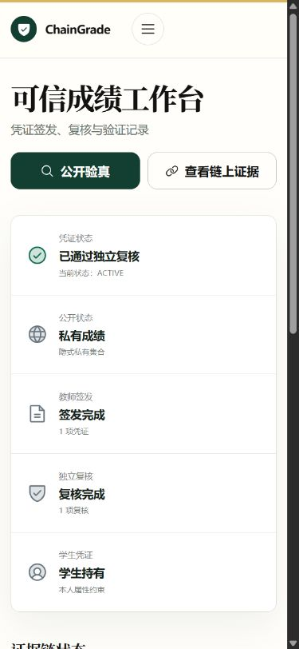

## 11. 交互与工程验证

- 真实 Fabric 查询：凭证、申诉、学生本人私有成绩、正确哈希和错误哈希全部完成。
- 登录门、角色不匹配、移动菜单、空状态、成功状态和警告状态均完成浏览器检查。
- 二维码分享按钮正常生成 QR，预览按钮正确传递验真字段，带查询参数的 URL 可恢复字段。
- 浏览器 console warning/error 为 0。
- Vue/TypeScript 类型检查、全部自动测试和生产构建通过。
- Design QA 比较证据：`qa-comparison-home.png` 与 `qa-comparison-title.png`。

## 12. 结论

ChainGrade 已从“一个精致首页加若干普通表单”升级为覆盖完整可信成绩流程的统一产品界面。新的展示字体只用于大型标题与关键结果，不牺牲正文、表单和账本数据的可读性；二维码验真进一步补齐了竞赛展示中的现场核验路径。
