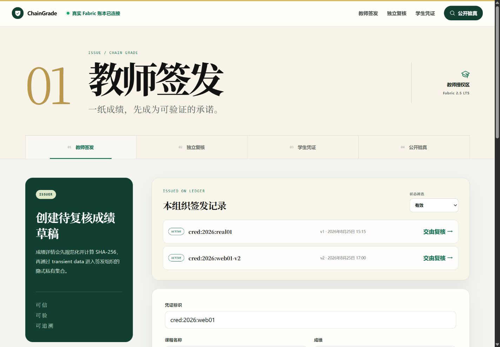
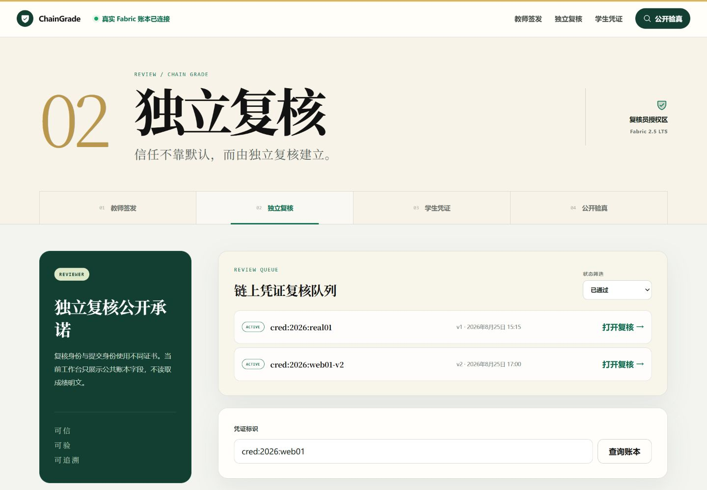
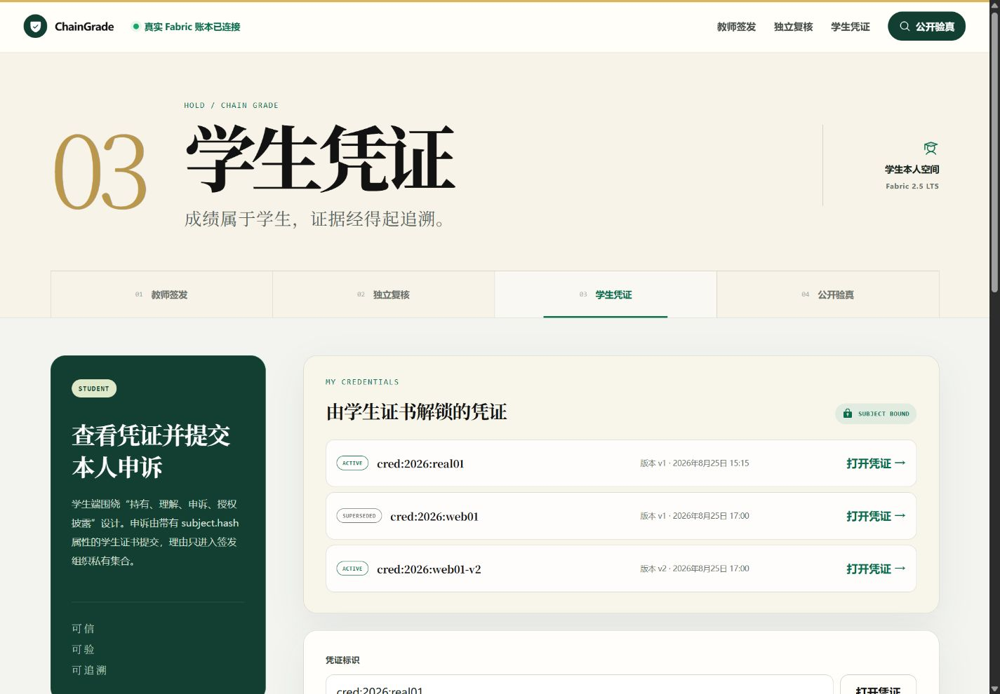
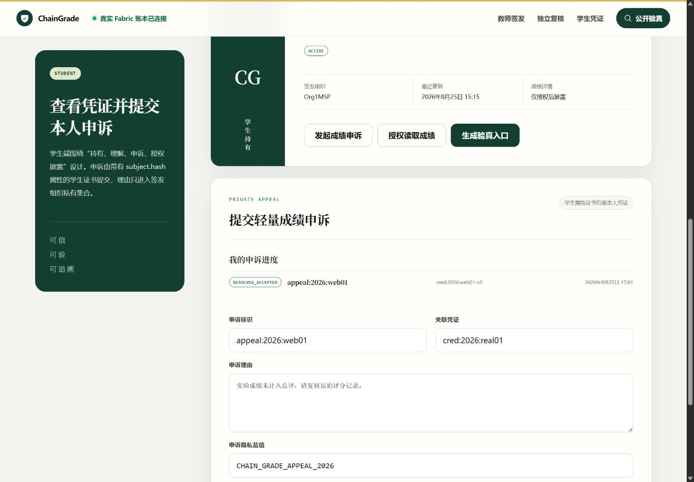
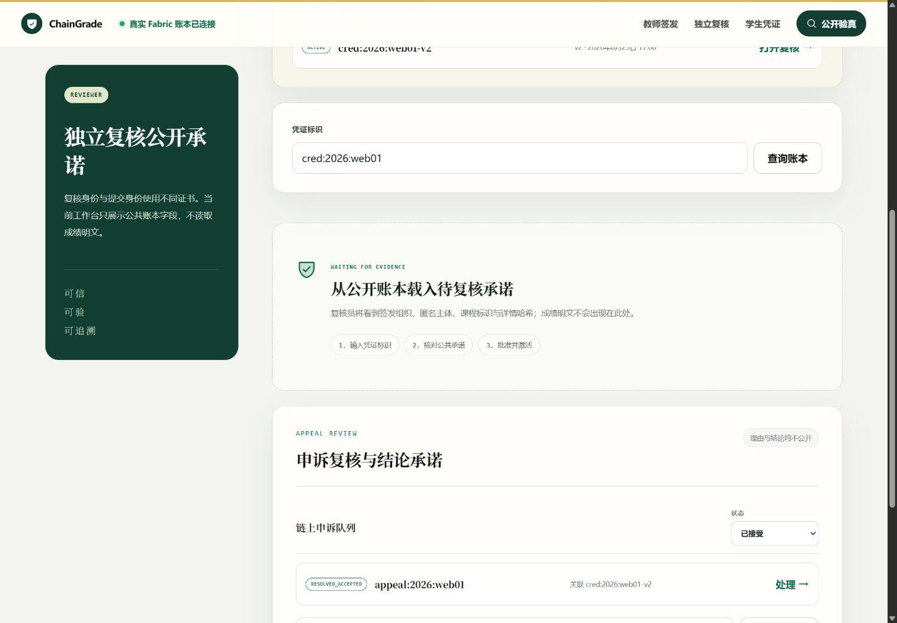
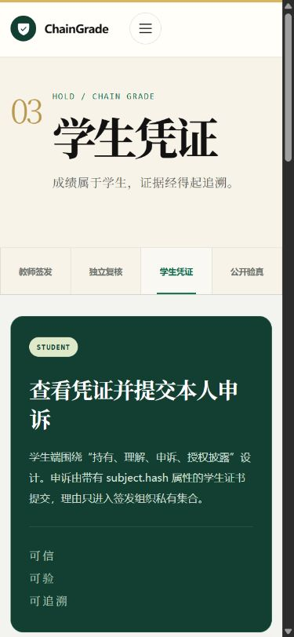
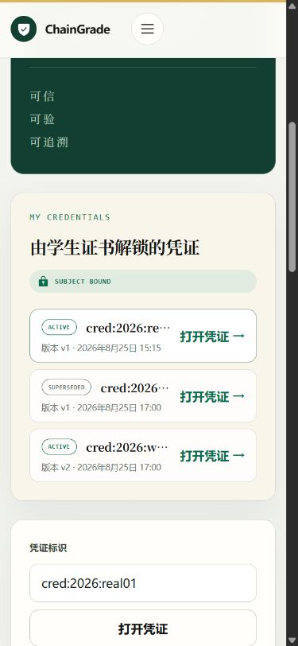

# Iteration 6 阶段实验：角色化链上任务队列

日期：2026-08-26

## 1. 实验目标

将凭证与申诉从“已知标识后的单条查询”升级为可实际工作的链上任务列表：教师查看本组织签发记录，复核员查看凭证和申诉队列，学生查看由证书属性约束的本人凭证与申诉进度。列表必须来源于学校服务器真实 Fabric，而不是前端样例或 API 内存数组。

## 2. 实现范围

- Fabric 复合键索引：`credential~status`、`credential~subject`、`appeal~status`、`appeal~subject`。
- 凭证批准、驳回、撤销、版本替代以及申诉处理时，在同一交易内删除旧状态索引并写入新索引。
- 五个角色化链码查询入口，并由 X.509 证书 `app.role`、MSP 和 `subject.hash` 约束数据范围。
- 统一分页响应 `{ items, bookmark, fetchedRecordsCount }`，每页限制 1–50 条。
- API 增加教师、复核员和学生的列表路由；前端增加状态筛选、载入更多、空态和列表直接进入处理上下文。
- `RebuildIndexes` 仅允许 reviewer 证书执行，用于为升级前记录建立索引并补齐旧申诉的 `issuerMspId`。

详细设计见 `design/12_role_scoped_ledger_queries.md`。

## 3. 自动验证

本机验证结果：

- shared schema：2/2；
- grade chaincode：15/15；
- API：19/19；
- 总计：36/36；
- TypeScript/Vue 全仓静态检查通过；
- Web 生产构建通过，1,527 个模块成功转换。

服务器并行测试第一次受到节点资源争用影响，4 个 Fastify 首请求超过 Vitest 默认 5 秒，但没有业务断言失败。改为单 worker、120 秒超时后 API 19/19 全部通过；其余 shared 2/2 和 chaincode 15/15 已在服务器通过。

## 4. Fabric lifecycle 与真实迁移

首次升级提交 `grade 0.5 / sequence 5`，包 ID：

`grade_0.5:b78986e295bfd8c88269d2377c4ee67acf065bd4a8a074e644016bff5388bb95`

Org1/Org2 均安装和批准，定义提交交易：

`cc56292a8bd739a50b1c42304a3ce62c8c1f2b0cdfd22596e8674f783d310271`

随后用 `ChaingradeReviewer` 证书执行索引迁移，交易：

`7bfe621766d727d15434dcbe691248a41742f48d36bd58c5d3dbfae3c6006b86`

交易状态 `VALID`，结果为 `credentials=3, appeals=1`。

真实 LevelDB 查询进一步发现 Fabric 2.5.8 Node shim 在该分页调用路径没有返回类型声明中的 metadata。修复为链码基于复合键末项生成 Base64URL 游标后，升级为 `grade 0.6 / sequence 6`，包 ID：

`grade_0.6:577f808b41dea1040ecb4975f97d6228fdc65c0a1c03f72096558fdde1ad8113`

Org1/Org2 的 sequence 6 定义提交交易为：

`6eb1b99babb16d3611ce4a725644d89aabbae0fc60c20fded05d0eade39dd5ca`

两个 peer 最终均查询到 `Version: 0.6, Sequence: 6, Approvals: [Org1MSP: true, Org2MSP: true]`。

## 5. 真实链上数据与权限结果

- reviewer 的 ACTIVE 队列读取 2 条：`cred:2026:real01`、`cred:2026:web01-v2`；
- reviewer 的 PENDING_REVIEW 与 OPEN appeal 队列当前均为空，符合现有账本状态；
- student 证书读取 3 条本人凭证，包括 ACTIVE、SUPERSEDED 和 v2 ACTIVE；
- `pageSize=1` 真实分页首条为 `cred:2026:real01`、游标长度 147；携带该游标续读得到 `cred:2026:web01` 和下一游标，证明不是一次性全量响应；
- student 证书读取 1 条本人申诉：`appeal:2026:web01 / RESOLVED_ACCEPTED`；
- 旧申诉经迁移后包含 `issuerMspId=Org1MSP`；
- student 证书尝试调用 reviewer 队列，被链码拒绝：`FORBIDDEN: transaction requires reviewer role`。

## 6. 桌面端 UI 验收

教师端按 ACTIVE 筛选读取 2 条本组织签发记录，任务行保留状态、版本、更新时间和主操作。

复核端按 ACTIVE 筛选读取同一组真实公共记录，点击“打开复核”会直接把记录带入复核上下文。

学生端由 `subject.hash` 证书属性解锁 3 条本人凭证，旧版本以 SUPERSEDED 状态保留。

学生申诉区域同时展示历史申诉进度与新申诉表单；已处理申诉的关联凭证、状态和更新时间可见，理由正文仍未进入列表。

复核员切换为“已接受”后读取 1 条申诉结论，公共列表只展示申诉标识、关联凭证和状态。

## 7. 移动端 UI 验收

390×844 视口下，章节标题、角色说明和任务列表保持单列结构。

列表区域三条任务行均为 297 px，文档 `scrollWidth=375`、视口 `innerWidth=390`，不存在横向溢出；长凭证标识使用省略号，状态与主操作始终可见。

## 8. 三端同步

- 本机与 GitHub 当前实现提交：`0f49e6f`；
- 学校服务器仓库已快进至同一提交；
- 服务器 Fabric 当前运行 `grade 0.6 / sequence 6`；
- 浏览器通过本机 Vite、SSH 端口转发和服务器 Fabric Gateway 完成上述验收。

## 9. 结论

ChainGrade 已形成可操作的真实成绩工作流：用户无需预先知道凭证或申诉标识，就能在证书权限范围内看到自己的任务与历史。复合键索引、状态原子迁移、链上权限和响应式列表均通过真实 LevelDB/Fabric 验证；过程中发现并修复了 mock 环境无法暴露的 shim metadata 差异。
