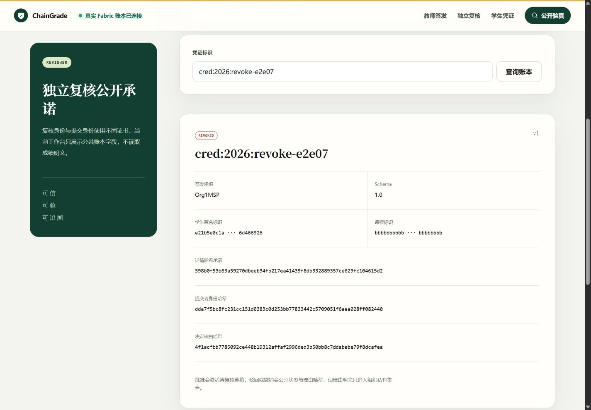
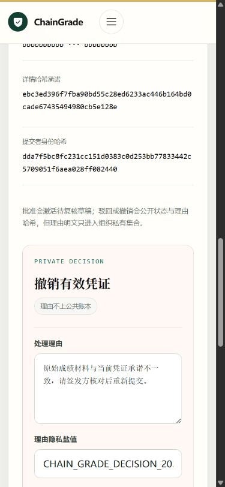

# Iteration 7 阶段实验：私有驳回与撤销闭环

日期：2026-08-26

## 1. 实验目标

在不公开复核理由明文的前提下，补齐成绩凭证从待复核到驳回、从生效到撤销的完整状态机。课程答辩和竞赛展示继续使用同一套 ChainGrade 项目、同一条 Fabric 账本和同一组角色工作台，不建立独立演示分支。

## 2. 隐私与审计设计

复核员提交 `{ reason, salt }` 后，API 先进行统一规范化并计算 SHA-256。Gateway 只把 `reasonHash` 作为普通链码参数，把规范化后的决定正文放入 `credentialDecision` transient field。链码在背书节点内再次计算哈希并比对：

- 哈希不一致时整笔交易失败；
- 公共世界状态只记录 `status`、`reasonHash`、更新者与时间等审计字段；
- 决定正文写入 `_implicit_org_<MSP>` 隐式私有集合；
- 私有键为 `credential:<credentialId>:decision`；
- 凭证状态与复合键索引在同一交易中原子迁移。

因此公开验证者可以确认“为何项决定的承诺”和当前状态，但无法从公共账本读取理由明文。详细设计见 `design/13_private_credential_decisions.md`。

## 3. 实现范围

- shared 增加决定请求校验：理由 10–2000 字符、盐值 16–256 字符；
- API 增加 `POST /api/v1/credentials/:credentialId/reject` 与 `/revoke`，均要求 reviewer 会话、同源与 CSRF；
- Fabric Gateway 为两类交易设置 transient data；
- 链码 `RejectCredential`、`RevokeCredential` 校验 transient 哈希并写入组织隐式私有集合；
- 复核工作台增加待复核驳回表单和有效凭证撤销表单；
- 已驳回、已撤销详情展示公开 `reasonHash`，不展示理由明文；
- UI 对高风险操作使用克制的暖红边界、明确动词和隐私说明。

## 4. 自动验证

本机验证结果：

- shared schema：2/2；
- grade chaincode：15/15；
- API：20/20；
- 总计：37/37；
- TypeScript/Vue 全仓静态检查通过；
- Web 生产构建通过，1,527 个模块成功转换。

测试覆盖理由规范化、API 哈希与 transient 映射、链码私有写入、状态转换以及重复撤销冲突。

## 5. Fabric lifecycle

学校服务器真实 Fabric 已升级为 `grade 0.7 / sequence 7`，包 ID：

`grade_0.7:d387a6e5d2b65cf75c000a8dc4b1dedd59643fd4bad6d0b1e347f5133ec014e7`

Org1/Org2 均完成安装和批准，定义提交交易：

`9f5f9ca1f67e020d54773f2bbbc26c2ffa6273870b9b90d9ff47e45eaa8ce10d`

两个 peer 最终均查询到 `Version: 0.7, Sequence: 7, Approvals: [Org1MSP: true, Org2MSP: true]`，原有凭证和申诉状态连续保留。

## 6. 真实链上闭环

### 6.1 驳回

- 创建凭证：`cred:2026:reject-e2e07`；
- reviewer 执行驳回后状态为 `REJECTED`；
- 公共理由哈希为 `e6d28940a351652d3c73fb88c7adc1e7a391352c6b0f3a9862134d462ca94e01`；
- 公共 JSON 搜索不到提交的中文理由明文。

### 6.2 撤销

- 创建凭证：`cred:2026:revoke-e2e07`；
- 依次完成 `PENDING_REVIEW → ACTIVE → REVOKED`；
- 公共理由哈希为 `4f1acfbb7785092ce448b19312affaf2996ded3b50bb8c7ddabebe79f8dcafea`；
- 对同一凭证重复撤销稳定返回 HTTP 409，证明状态机拒绝非法重复转换。

首次批准请求恰逢升级后 Gateway/链码容器冷启动，返回一次通用内部错误；账本没有产生半完成状态，复查仍为 `PENDING_REVIEW`，重试后正常激活。该现象记录为后续部署阶段增加启动探针与 Gateway 重试策略的依据，而不是隐藏测试波动。

## 7. 桌面端 UI 验收

有效凭证详情提供独立撤销操作区，复核员可以看到公共承诺、处理理由、盐值与明确的危险操作按钮；截图未包含真实成绩或会话凭据。

已驳回凭证不再出现可执行表单，只保留状态和决定理由哈希，形成可公开核验的审计视图。

已撤销凭证同样显示最终状态与理由哈希，并保持原始凭证承诺可追溯。

## 8. 移动端 UI 验收

390×844 视口下，凭证审计字段、隐私提示与撤销表单保持单列，长哈希自动换行，输入控件不越界。

测得文档 `scrollWidth=375`、视口 `innerWidth=390`、表单宽度 297 px，不存在横向溢出。桌面与移动验收全过程浏览器 console warning/error 均为 0。长页面全页截图曾触发浏览器分段合成伪影，因此最终报告采用经人工视觉复查的可视窗口分镜图，页面语义 DOM 中各区域均只有一份。

## 9. 三端同步

- 功能实现基线提交：`c809b6a`；
- GitHub 与学校服务器已同步该功能实现；
- 学校服务器 Fabric 当前运行 `grade 0.7 / sequence 7`；
- 本机通过 Vite、SSH 端口转发、服务器 Fastify/Fabric Gateway 完成真实浏览器验收；
- 本报告与最终截图随本阶段收尾提交再次同步三端。

## 10. 结论

ChainGrade 的凭证复核已经从单一“批准”扩展为可审计的批准、驳回与撤销闭环。系统同时满足状态公开、理由可承诺、明文不公开和非法转换可拒绝四个目标；真实 Fabric、API、桌面端和移动端均已验证，能够作为课程答辩与竞赛演示中的同一条可信成绩生命周期主线。
