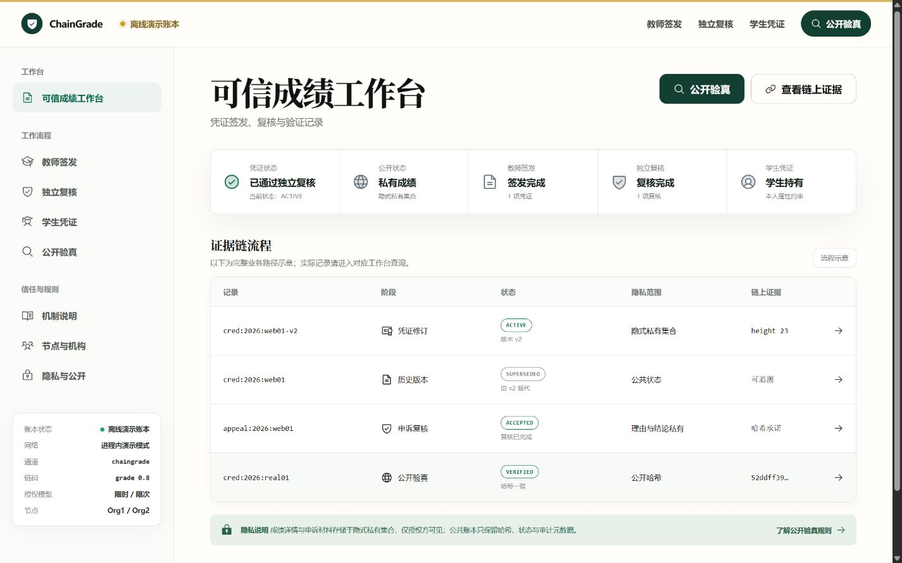
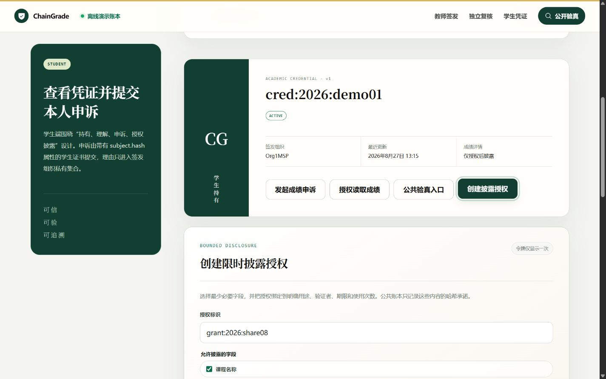
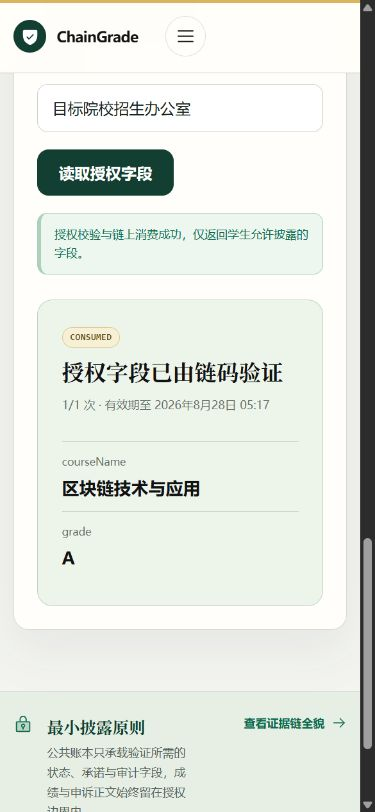

# Iteration 8：限时最小字段披露与可信运行模式验收

日期：2026-08-27

## 1. 本阶段目标与范围校准

本阶段围绕学生对本人有效成绩凭证的可控披露展开，继续服务同一个课程大作业与竞赛项目。目标是让学生选择最少必要字段，并把访问绑定到用途、验证者、期限和次数；不引入第二套产品，也不把普通哈希验真夸大为零知识选择性披露。

本阶段明确不声称：匿名验证者密码学证明、BBS+ 可派生凭证、零知识范围证明、跨校联盟互认。当前实现是由受控 reviewer Gateway 身份代为访问 Fabric 的 bearer capability，适合课程与竞赛原型演示，但不是最终匿名凭证协议。

详细设计与防跑偏记录见 `design/14_scope_alignment_and_disclosure_grants.md`。

## 2. 实现结果

### 2.1 链码

- `CreateDisclosureGrant`：仅学生本人可为自己的 `ACTIVE` 凭证创建授权；字段限于 `courseName`、`score`、`grade`，有效期最长 30 天，使用次数为 1–10。
- `EvaluateDisclosureGrant`：从 transient data 读取 token、用途和验证者，哈希匹配后才读取隐式私有集合，并只组装被选择字段。
- `ConsumeDisclosureGrant`：再次校验授权并原子递增 `usedCount`，达到上限后转为 `CONSUMED`。
- `RevokeDisclosureGrant`、`ReadDisclosureGrant`、`ListMyDisclosureGrants`：支持学生撤销、读取公共授权状态和查看本人授权历史。
- 公共授权记录不包含 token、用途、验证者和成绩明文，只包含 SHA-256 承诺、字段名、期限、次数和审计身份哈希。

### 2.2 API 与前端

- 新增授权创建、本人列表、撤销和公开消费路由；创建与消费响应均设置 `Cache-Control: no-store`。
- token 使用 32 字节安全随机数并以 Base64URL 返回，只在创建响应中出现一次。
- API 先 evaluate 得到候选字段，再提交计数交易；只有计数交易成功才向调用方返回披露结果，避免并发失败请求获得数据。
- 学生端区分“公共验真入口”和“创建披露授权”；公开端令牌使用密码输入框，不在截图中显示明文。

### 2.3 可信运行模式

浏览器验收发现旧 UI 即使没有 Fabric 连接也显示“真实 Fabric 账本已连接”。本阶段增加后端 `ledgerMode`，前端明确展示：

- `fabric`：Fabric 真实账本已连接；
- `demo`：离线演示账本；
- `unavailable`：账本服务未连接。

演示账本仅在显式设置 `DEMO_ENABLED=true` 时启用，进程退出即清空，不产生 Fabric 证据。首页静态表格也由“当前记录”改为“流程示意”。

## 3. 自动化与 HTTP 验收

执行命令：

```text
pnpm check
pnpm test
pnpm build
git diff --check
```

结果：

- shared：4/4；
- chaincode：18/18；
- API：24/24；
- 合计：46/46；
- TypeScript/Vue 类型检查通过；
- Web 生产构建通过，Vite 转换 1527 个模块；
- `git diff --check` 通过。

真实 HTTP 负向用例（离线演示账本）：

| 用例               | 结果                                     |
| ------------------ | ---------------------------------------- |
| 错误验证者消费授权 | HTTP 403                                 |
| 第一次正确消费     | 只返回 `courseName, grade`，不含 `score` |
| 第二次正确消费     | `usedCount=2`，状态 `CONSUMED`           |
| 第三次超次消费     | HTTP 409                                 |
| 公共授权记录检索   | 不包含用途、验证者、token 明文           |

## 4. 浏览器 UI 验收

验收视口为 1440×900 桌面端和 390×844 移动端。首页、教师签发、独立复核、学生凭证、公开验真五个页面均检查；移动端各页 `scrollWidth <= innerWidth`，console warning/error 为 0。

### 4.1 运行模式与总览



### 4.2 学生创建最小披露授权

界面把凭证状态、字段选择、用途、验证者、期限和次数集中在同一任务流中。截图拍摄于创建前，不包含 bearer token 或二维码。



### 4.3 验证者获得最小字段

授权令牌保持掩码；成功后只显示学生允许的 `courseName` 和 `grade`，不出现分数、盐值或完整私有详情。




教师和复核员界面截图同时保存在：

- `assets/iteration-8/issuer-desktop.png`
- `assets/iteration-8/reviewer-desktop.png`

## 5. 服务器环境事件

学校服务器在本阶段开始前已重启。仓库与项目身份目录保留，但 Docker 容器、命名卷和镜像运行态均不存在，旧开发账本因此不可恢复。重新拉取固定版本镜像时，Docker 守护进程持续返回：

```text
Error response from daemon: layer does not exist
```

同一错误同时影响 `docker image inspect`、容器运行和 `docker system df`，说明问题位于共享 Docker 元数据，而非本项目链码。为避免影响服务器其他用户，本阶段没有执行全局 prune、删除 Docker 根目录或重启系统服务。

因此本报告严格区分：

- 已通过：本地自动测试、构建、真实 HTTP 业务流、桌面/移动 UI；
- 待补验：服务器 `grade 0.8 / sequence 1` 的新网络部署、双 peer committed definition 和真实 Fabric 交易 ID。

旧版本 0.7 的历史报告仍是当时有效的验收证据，但不能被表述为本次 0.8 部署结果。

## 6. 阶段结论与下一步

有限披露闭环、失败边界和 UI 已完成，且运行模式不再产生误导性表述。项目仍保持在“成绩可信存证与查询”的课程主线内，同时形成了可用于竞赛讲解的学生数据主权亮点。

服务器管理员修复 Docker 后，下一步只需按固定版本脚本重建网络，以 `CHAINCODE_VERSION=0.8 CHAINCODE_SEQUENCE=1` 部署并重复同一组创建、错误验证者、限次消费和撤销用例；在此之前不进入跨校互认或重型密码学扩展。
