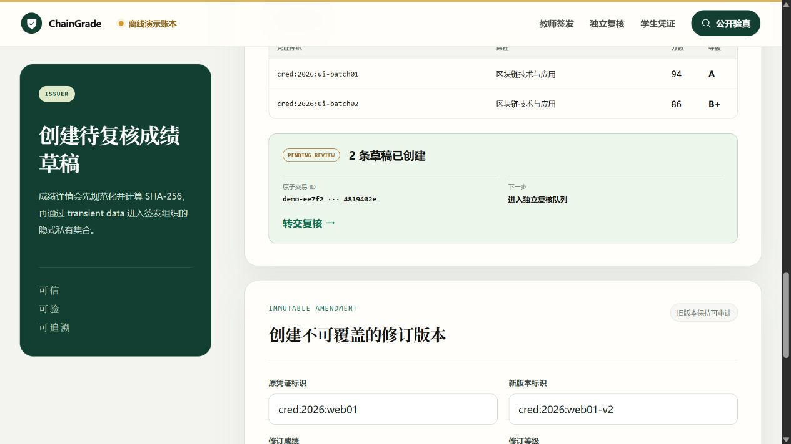
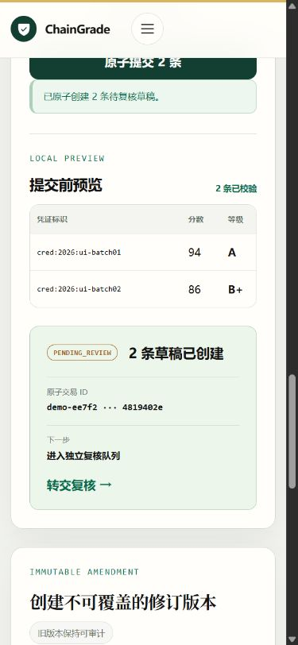
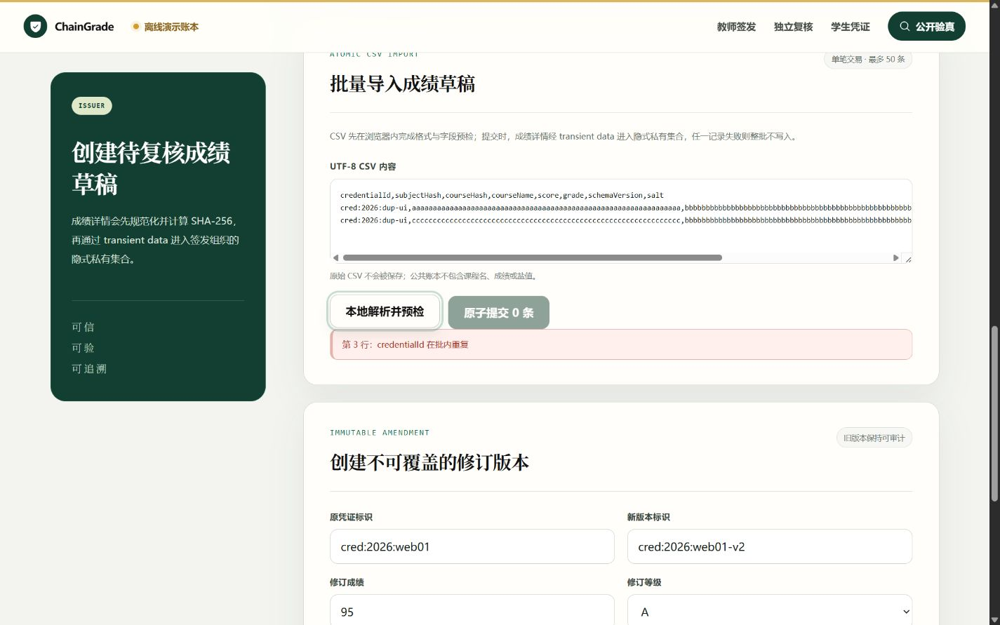

# Iteration 9 阶段实验：原子 CSV 成绩批量导入

日期：2026-08-27

## 1. 阶段目标与范围校准

本阶段把教师端从“逐条创建成绩草稿”推进到“按教学班批量导入”，但仍沿用同一个 ChainGrade 产品、仓库、链码状态机和四角色业务闭环。课程答辩可展示批量管理效率与 Fabric 交易原子性，竞赛提交则在同一成果上强调隐私边界和工程可信性，不形成第二套项目。

防跑偏检查结论：

- 能力直接服务学生成绩存证、查询、复核与后续申诉，不扩展到无关教务模块；
- 批处理由一笔链码交易实现，不用 API 循环伪装原子写入；
- 本阶段不提前进入 BBS+、零知识范围证明或跨校联盟互认；
- UI 不出现小组成员、课程答辩、竞赛或开发阶段等过程提示词。

## 2. 实现结果

### 2.1 CSV 与共享校验

固定 UTF-8 表头为：

```text
credentialId,subjectHash,courseHash,courseName,score,grade,schemaVersion,salt
```

共享解析器支持 BOM、CRLF、空行、双引号字段和 `""` 转义。浏览器在提交前检查 1–50 条上限、字段格式、分数范围、盐值长度和批内凭证标识重复；API 使用同源 Schema 再校验一次，浏览器校验不能替代服务端信任边界。

### 2.2 Fabric 原子交易

链码新增 `CreateCredentialBatch`：公开参数只包含凭证标识、匿名学生/课程哈希、详情承诺和 Schema 版本；成绩详情按凭证标识编码在 transient `gradeBatch` 中。链码在任何写操作前完成角色、数量、重复标识、既有账本记录、Base64 编码、额外私有条目和详情 SHA-256 的整批校验。

校验全部通过后，链码才写入公共凭证、状态/学生索引和签发组织隐式私有集合。每条返回记录共享同一个 transaction ID；任一错误使整笔 Fabric 交易失效。

### 2.3 Gateway、API 与界面

- `POST /api/v1/credentials/imports` 仅允许 issuer 会话，并要求同源与 CSRF；
- Gateway 只调用一次 `CreateCredentialBatch`，不回传 CSV、课程名、分数或盐值；
- 成功响应只包含公共记录、导入数量和同一原子交易 ID，并设置 `Cache-Control: no-store`；
- 教师工作台提供本地解析、提交前预览、原子提交和结果卡；错误时显示具体行号并禁用提交。

## 3. 自动化与 HTTP 验收

执行命令：

```text
pnpm check
pnpm test
pnpm build
pnpm test:coverage
git diff --check
```

结果：

- shared：6/6；
- chaincode：20/20；
- API：26/26；
- 合计：52/52；
- TypeScript 与 Vue 类型检查通过；
- Web 生产构建通过，Vite 转换 1610 个模块；
- 链码语句覆盖率 85.91%、分支覆盖率 75.38%、函数覆盖率 95.52%、行覆盖率 85.98%；
- `git diff --check` 通过。

首次开发浏览器加载暴露了共享包 `dist` 仍是旧版本的问题，页面因缺少新导出而空白。根构建脚本原先使用递归并行构建，无法保证应用读取到最新 shared 产物；现已改为 shared → chaincode → API → Web 的显式依赖顺序。重新构建并打开新页面后，空白页和模块导出错误均未复现。

离线演示账本真实 HTTP 流程结果：

| 用例                     | 结果                                |
| ------------------------ | ----------------------------------- |
| 两条合法成绩批量提交     | HTTP 201，`importedCount=2`         |
| 成功批次交易一致性       | 两条记录的 transaction ID 相同      |
| 响应隐私扫描             | 不包含课程名、分数、盐值或 CSV 原文 |
| 新凭证与既有凭证混合提交 | HTTP 409                            |
| 失败后查询批内新凭证     | HTTP 404，证明无部分写入            |

## 4. 浏览器 UI 验收

浏览器使用 1440×900 桌面视口与 390×844 移动视口。对批量导入的合法预览、成功结果、重复凭证错误态和移动布局逐项操作；首页、教师签发、独立复核、学生凭证、公开验真五页在移动视口下均满足 `scrollWidth <= innerWidth`。移动导航可展开并暴露全部四个角色入口。浏览器 console warning/error 为 0，只有 Vite 开发连接调试日志。

### 4.1 本地预检

两条合成数据完成本地解析后，预览表只展示提交确认所需的凭证标识、课程、分数和等级；原始 CSV 不会被保存。


### 4.2 原子提交成功

成功卡明确显示“2 条草稿已创建”、单个交易 ID 缩略值和下一步复核入口。截图使用离线演示账本生成的合成 transaction ID，不能作为真实 Fabric 交易证据。



移动端预览表与结果卡转为单列，没有横向溢出，交易 ID 保持可读且不撑破卡片。



### 4.3 错误阻断

重复的 `credentialId` 被定位到第 3 行，提交按钮变为禁用且预览、成功结果被清空。



## 5. 服务器环境与证据边界

学校服务器的项目目录与身份材料仍保留，但服务器重启后的共享 Docker 元数据故障尚未被管理员修复，守护进程此前持续返回 `layer does not exist`。该问题影响镜像 inspect、容器运行和 `docker system df`，超出本项目目录权限边界；本阶段没有执行全局 prune、删除 Docker 根目录或重启共享服务。

因此本阶段严格区分：

- 已完成：本地类型检查、52 项测试、生产构建、覆盖率、真实 HTTP 原子失败边界、桌面/移动 UI 验收；
- 待补验：服务器 `grade 0.9 / sequence 1` 部署、Org1/Org2 双 peer committed definition 和真实 Fabric 批量 transaction ID。

历史真实 Fabric 报告仍能证明旧版本链路在当时成立，但不能被表述为本次 0.9 的部署结果。

## 6. 阶段结论与下一步

ChainGrade 现在同时具备单条签发和教学班级别批量录入，批量记录继续进入独立复核、学生查询、修订/申诉和授权披露的同一状态机。该能力提高了课程大作业的管理应用完整度，也形成了竞赛演示中可量化的“单笔原子写入 + 明文不上公共账本”工程亮点。

服务器 Docker 恢复后，应优先部署 0.9 并复跑本报告的成功批次与混合冲突批次。完成真实 Fabric 补验前，不把演示账本 synthetic transaction ID 宣称为链上证据；随后再评估同一项目内的可验证凭证导出或轻量密码学增强。
