# Iteration 11 阶段实验：原生 Fabric 可恢复运行与鉴权 UI 复验

日期：2026-08-27

## 1. 阶段结论

ChainGrade 的无 Docker Fabric 路径已从“能够运行”升级为“能够无损重启、冷备份、校验、恢复并重复准备答辩数据”。真实 Fabric 鉴权模式下，教师、复核员、学生和公开验证四类界面均完成桌面/移动浏览器复验。课程答辩与竞赛继续使用同一个仓库、链码、API、Web 和账本。

## 2. 幂等启动与无损重启

重复执行 `deploy-chaincode.sh deploy` 时，脚本识别 `grade 0.9 / sequence 1` 已提交，输出 `skipping lifecycle commit`，没有生成新区块。完整执行链码停止、网络停止、网络启动、链码启动后，两个 Peer 的账本状态保持：

| 节点 | Height | Current block hash                             | Previous block hash                            |
| ---- | -----: | ---------------------------------------------- | ---------------------------------------------- |
| Org1 |      9 | `8Z+CBx1ohkXkCoe9eNnaSsm3nx+qxCBQgr4t6h+M22A=` | `5e9bw7rivpuIP8ZQ5ptUXuSqIaymjW7SwZBGCM72RK4=` |
| Org2 |      9 | `8Z+CBx1ohkXkCoe9eNnaSsm3nx+qxCBQgr4t6h+M22A=` | `5e9bw7rivpuIP8ZQ5ptUXuSqIaymjW7SwZBGCM72RK4=` |

首次 LevelDB 重新加载约需几十秒，端口监听和链码查询最终均成功；没有重新加入通道或覆盖通道区块。

## 3. 冷备份与实际恢复演练

归档：

```text
/mnt/localDisk3/weizian/chaingrade-backups/native-ledger-20260827T131517Z.tar.gz
```

证据：

- 归档大小 220,885 bytes，权限 `0600`；
- SHA-256 为 `fd243e8a78a834ba2d05f0e669c5372c2a63f0767ca0b3a8f6d4df1b9b892403`；
- sidecar 校验、gzip/tar 完整性和归档路径范围检查通过；
- 无确认参数时恢复脚本返回用法，不停止服务；
- 显式确认后完成一次真实恢复，恢复后双 Peer 仍为高度 9 且哈希完全一致；
- 恢复前目录保留为 `.runtime/native-fabric.pre-restore-20260827T132003Z`，服务器检查确认仍存在；
- Orderer、Org1 Peer、Org2 Peer 和外部链码最终均为 RUNNING。

## 4. 可重复演示数据

首次播种产生三笔业务交易：创建凭证、独立批准、提交轻量申诉，账本高度从 9 增至 12。结果：

```json
{
  "credentialId": "cred:demo:blockchain-2026",
  "credentialStatus": "ACTIVE",
  "credentialCreated": true,
  "credentialApproved": true,
  "appealId": "appeal:demo:blockchain-2026",
  "appealStatus": "OPEN",
  "appealCreated": true,
  "authentic": true,
  "valid": true,
  "privateDetailsReadable": true
}
```

第二次运行返回所有创建标志为 `false`。运行前后两个 Peer 都是高度 12，current block hash 均为 `NjkF6W8PoFdnkASNDRLM/zGeKPZ4ZztJf/JZSabf3PE=`，证明重复准备不会污染演示账本。

## 5. HTTP 鉴权负向验收

API 以真实 Fabric 与短期会话模式运行，测试服务只监听服务器 localhost，并经 SSH 隧道访问。临时密钥和口令没有写入报告、截图或仓库。

| 用例                       | 结果 |
| -------------------------- | ---: |
| 未登录读取教师签发队列     |  401 |
| 恶意 Origin 登录           |  403 |
| 正确 issuer 登录           |  200 |
| issuer 读取 reviewer 队列  |  403 |
| 缺少 CSRF token 的状态变更 |  403 |
| issuer 读取本人签发队列    |  200 |

## 6. 浏览器 UI 验收

验收环境为真实 `ledgerMode=fabric`，桌面视口 1280×720，移动视口 390×844。检查了登录门、角色不匹配、三类角色工作台、学生私有成绩、公开验真、移动导航与横向溢出；浏览器 console warning/error 为 0。超长移动全页图可能产生浏览器拼接伪影，因此移动证据采用实际单视口截图。

### 6.1 桌面端

真实账本首页：

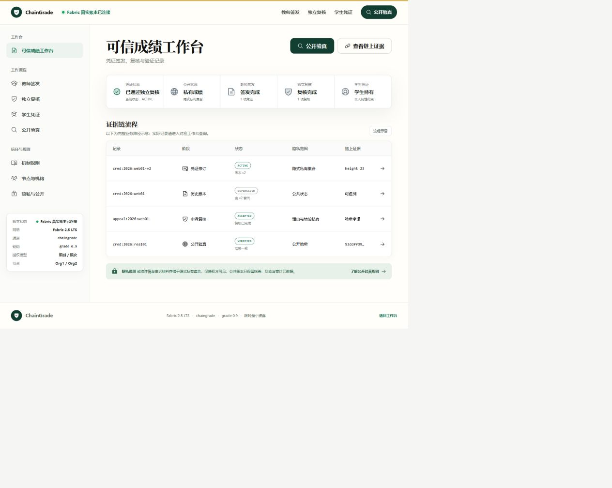

教师签发工作台与真实链上待复核队列：

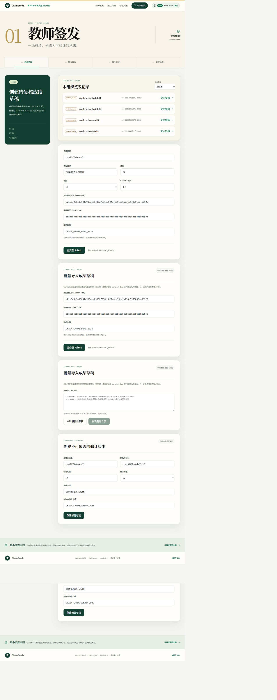

issuer 访问 reviewer 页面时显示明确角色不匹配门禁：

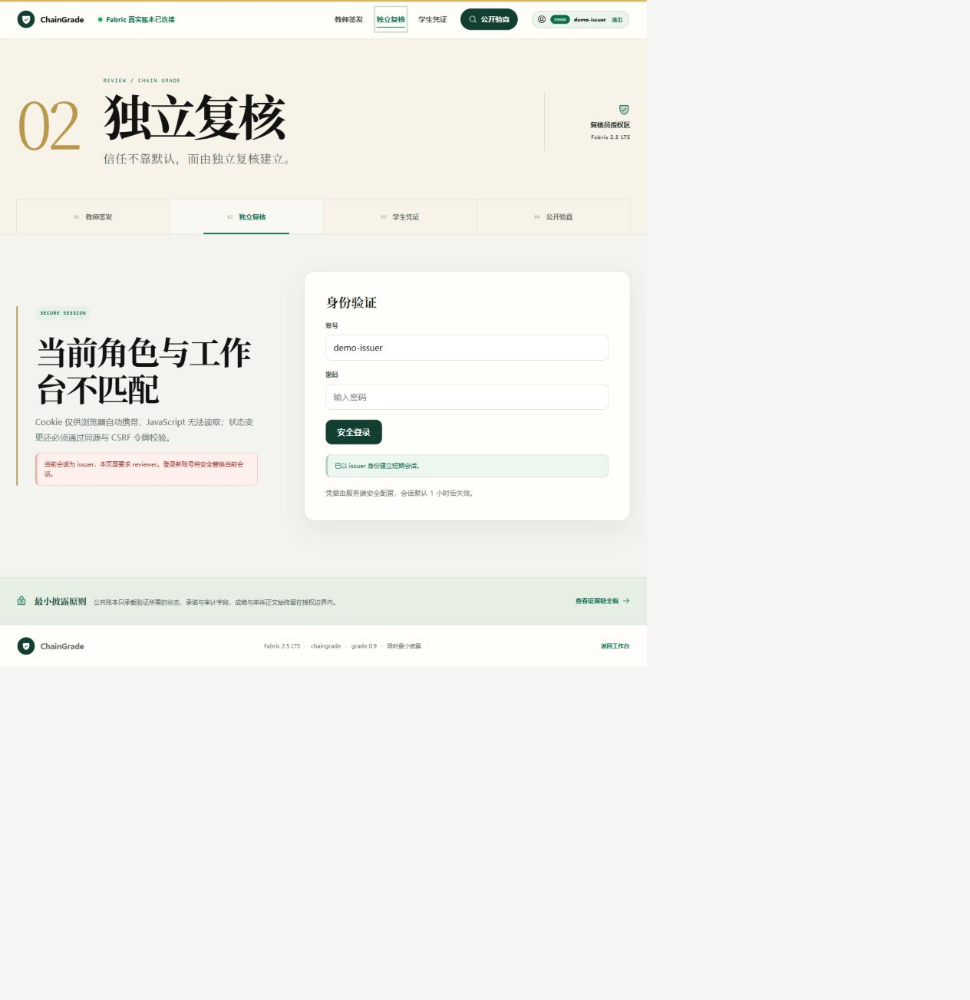

独立复核工作台只展示公开承诺与真实链上队列：

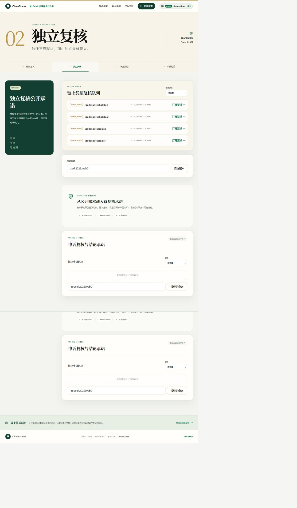

学生工作台由学生属性证书列出本人凭证：

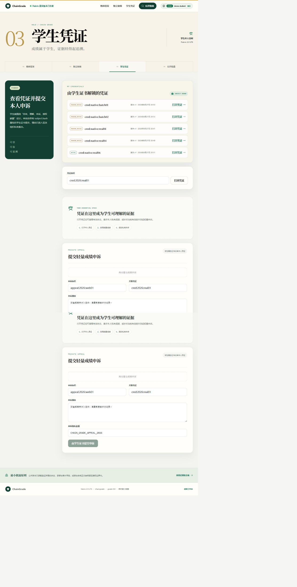

学生本人授权读取 `cred:native:real06` 后，成绩为 93/A，盐值仍以掩码展示：


公开验真对真实链上凭证返回“凭证真实且当前有效”，展示的是签发组织、版本与截断审计交易，不展示成绩：


### 6.2 移动端

390×844 下公开验真结果卡无横向溢出：

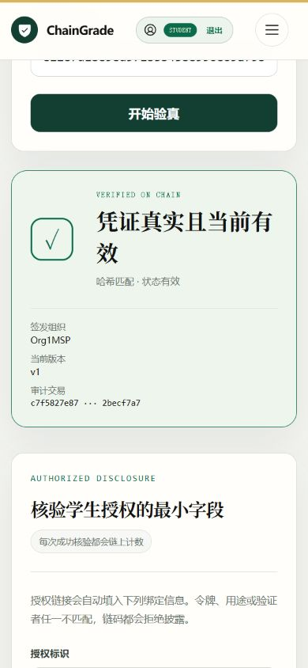

学生工作台大型展示字、角色状态和主内容在窄屏保持层级：

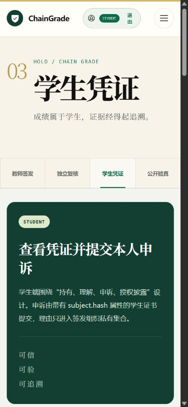

折叠菜单完整展示四个角色入口，关闭按钮和当前会话状态可见：

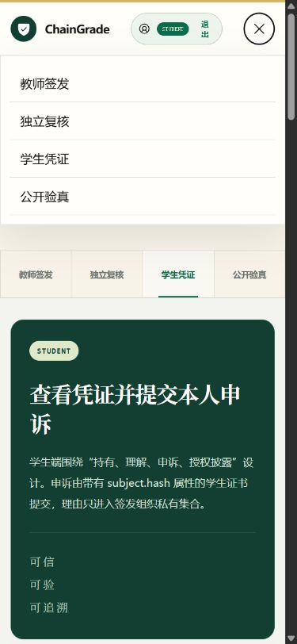

移动登录门保留大型标题、流程标签和安全说明，390×844 下无横向溢出：

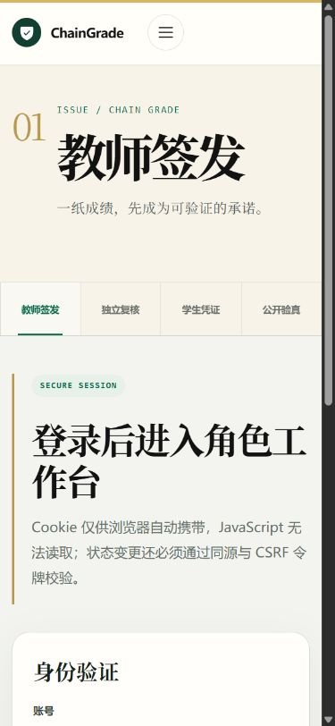

教师移动工作台的标题、角色状态、说明卡与链上签发内容保持清晰层级：

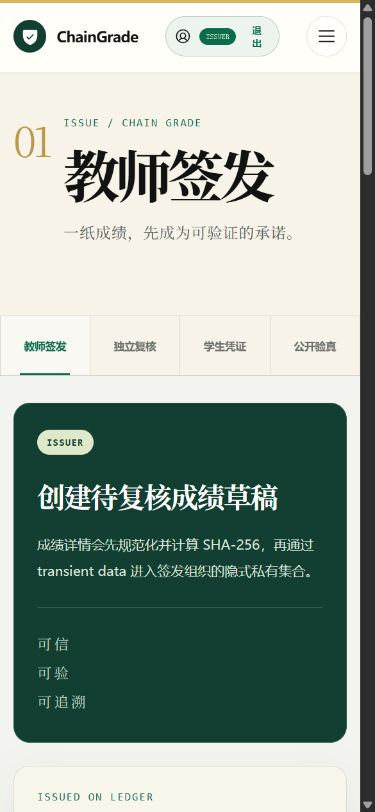

复核员移动工作台的链上凭证队列使用单列卡片，状态、标识和操作按钮均可读：

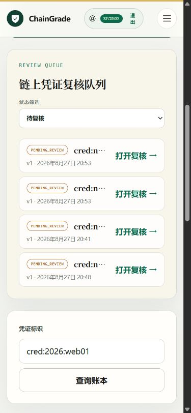

确定性播种产生的 `appeal:demo:blockchain-2026` 在移动申诉队列中显示为 `OPEN`，关联凭证信息可见而理由正文不公开：

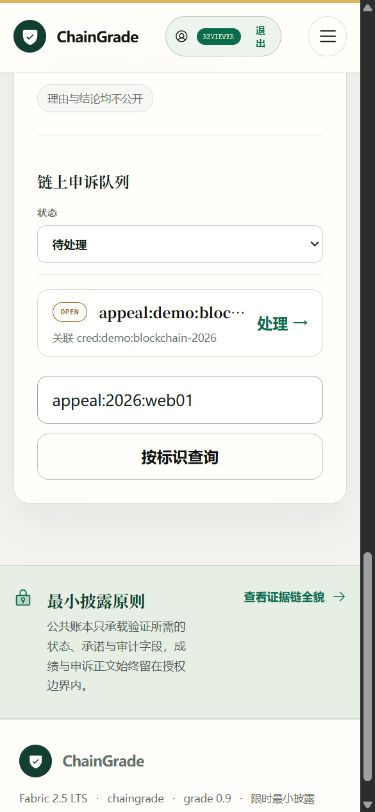

issuer 访问 reviewer 页面时，移动端同样明确显示角色不匹配，不渲染受保护工作台：

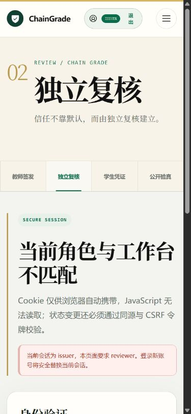

## 7. 环境事件

学校服务器全局 inotify watcher 额度已满，Vite 初次返回 `ENOSPC: System limit for number of file watchers reached`。本阶段未修改共享内核参数，而是仅对项目 Vite 进程启用 polling，成功完成验收。该事件与 Docker `layer does not exist` 是两个独立的共享环境问题。

2026-08-28 收尾时再次执行只读 Docker 检查：client/server 28.1.1 均可连接，data-root 仍为 `/mnt/localDisk3/docker-data`，daemon 报告 0 个容器和 0 个镜像；对 `hyperledger/fabric-peer:2.5.16` 执行 inspect 仍返回 `layer does not exist`。因此 Docker 故障尚未恢复，本阶段没有执行 Docker 清理、拉取或重建。

## 8. 结论与下一步

本阶段已经关闭原生网络的重启、备份、恢复、演示数据和鉴权 UI 复验风险。下一阶段可进入答辩级演示脚本、运行手册与竞赛材料骨架，同时继续保持课程功能与竞赛创新叙事为同一个 ChainGrade 项目。
