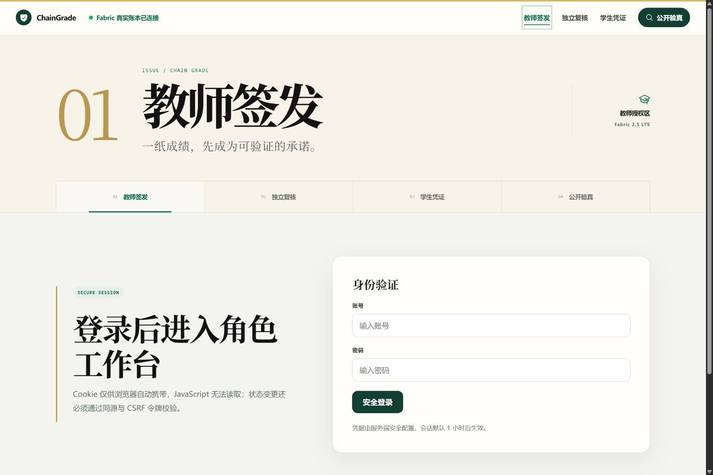
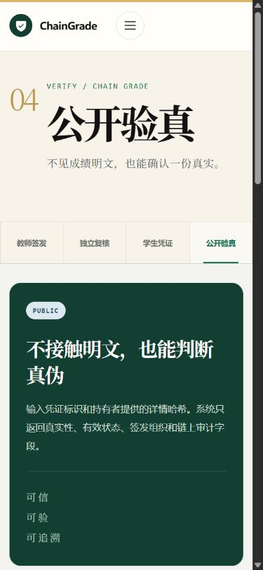

# Iteration 12 阶段实验：统一交付与答辩彩排

日期：2026-08-28

## 1. 阶段结论

本阶段把同一个 ChainGrade 项目的课程与竞赛交付从零散阶段证据整理为可运行、可计时、可匿名审查的体系。没有建立课程版或竞赛版代码分支，也没有增加与成绩存证、查询、修订/申诉无关的功能。

真实服务器完成了“Fabric 预检—生产构建—鉴权 API/Web 启动—三角色登录—浏览器 UI—受保护停止”的完整彩排。Docker 故障仍存在，但原生 Fabric 路径健康，已不构成交付阻塞。

## 2. 要求覆盖审计

课程侧已经覆盖 Hyperledger Fabric、B/S 应用、完整业务闭环、美观响应式界面、实际成绩管理价值与创新性；本阶段补齐 7 分钟答辩故事线、运行手册、材料清单和成员贡献底稿。

竞赛侧按照匿名函评的设计报告、测试报告和其他文件建立材料骨架，所有结论引用共同证据索引。当前匿名工作区自动扫描通过；高级匿名凭证、跨机构互认和性能基准仍如实标记为后续工作。

## 3. Docker 与真实 Fabric 状态

只读 Docker 复查：

- client/server 版本均为 28.1.1；
- data root 为 `/mnt/localDisk3/docker-data`；
- daemon 报告 0 个容器、0 个镜像；
- inspect `hyperledger/fabric-peer:2.5.16` 仍返回 `layer does not exist`。

因此 Docker 尚未恢复，本阶段未执行 pull、prune、重建或修改共享目录。替代路径保持：orderer、Org1/Org2 Peer 与外部链码均为 RUNNING，`grade 0.9 / sequence 1` 在两组织批准状态为 true。

彩排前后 `ledger-info.sh` 输出完全一致；两个 Peer 都保持高度 12：

```text
current  NjkF6W8PoFdnkASNDRLM/zGeKPZ4ZztJf/JZSabf3PE=
previous 7g7mqwbr0zKYIPwcyYy/o4v+2yxFZp2n9ymorUSTGUg=
```

这证明前后端启停与材料验收没有产生链上写入或污染确定性演示状态。

## 4. 一键工具实跑与问题修正

新增 `infra/demo/preview.sh`：

- `check` 验证固定 Node/Corepack、原生节点、链码和端口；
- `start` 从权限为 600/400 的 Git 外文件加载认证环境，逐包生产构建并启动 API/Web；
- `status` 返回受管理 PID 和 `/api/v1/meta`；
- `stop` 同时验证 PID 存活与命令行项目归属，不结束同机其他用户进程；
- `logs` 只读取项目私有运行目录中的日志。

真实彩排发现并修正三项问题：服务器没有全局 `pnpm` shim、共享负载可能令健康启动超过 60 秒、初版健康 URL 少了 `/v1`。最终从 API/Web 已停止状态执行生产构建和启动耗时 **12.50 秒**，元数据返回 `ledgerMode=fabric`、`phase=iteration-12`；issuer、reviewer、student 三种角色登录均为 `authenticated=true`。

认证会话密钥与口令没有进入 Git、截图或报告。测试用私有环境仅位于服务器 `.runtime/private/preview.env`，权限为 `0600`。

## 5. 统一材料与匿名安全门

`deliverables/common/evidence-index.md` 把功能映射到实现、自动/链上证据、UI 截图及完成边界。课程目录包含 7 分钟脚本和贡献评分底稿；竞赛目录包含匿名设计/测试报告骨架。两者引用同一事实层，因此材料差异不会演变为两个产品。

`pnpm delivery:check-anonymity` 会扫描竞赛文本中的学校、成员、个人仓库、个人邮箱等身份线索。本次扫描结果为 PASS。最终 PDF 作者属性、图片 EXIF、视频属性、压缩包清单和源码 Git 历史仍必须人工复核，自动文本检查不能替代最终匿名审查。

## 6. 浏览器 UI 验收

环境为服务器真实 `ledgerMode=fabric`，经 localhost SSH 隧道访问。桌面视口为 1536×1024，移动视口为 390×844；所有被验收页面 `scrollWidth === clientWidth`，浏览器 console warning/error 为 0。

桌面首页的真实 Fabric 状态、主导航、证据链流程与隐私说明保持完整层级：


教师端未登录时只出现空白账号/密码登录门，不泄漏演示账号或凭据：



移动首页在 390×844 下保留大型展示字、关键操作与五项状态卡，无横向溢出：


移动公开验真保持艺术标题、信息说明与后续表单的单列层级：



本阶段未修改业务界面，已登录的三角色完整工作台视觉证据继续引用 Iteration 11 的真实 Fabric 截图；本轮通过真实 HTTP 三角色登录验证会话配置，而没有重复生成含私有成绩的截图。

## 7. 自动验证

| 检查 | 结果 |
| --- | --- |
| TypeScript / Vue 类型检查 | PASS |
| 自动测试 | 52/52 PASS |
| Web/API/链码生产构建 | PASS |
| 竞赛文本匿名扫描 | PASS |
| Bash 语法与服务器实际执行 | PASS |
| 三角色真实 HTTP 登录 | PASS |
| 彩排前后账本一致 | PASS |
| 桌面/移动 UI、overflow、console | PASS |

## 8. 当前人工决策点与下一步

不阻塞当前开发但不能由工具代填的事项：指导教师信息、三名成员最终贡献比例、最终参赛作品名与报名信息。下一阶段优先生成课程项目介绍文档与 PPT 初稿、匿名竞赛设计/测试报告初稿，并建立可重复性能基准；所有成品继续引用同一证据索引和同一 ChainGrade 项目。
