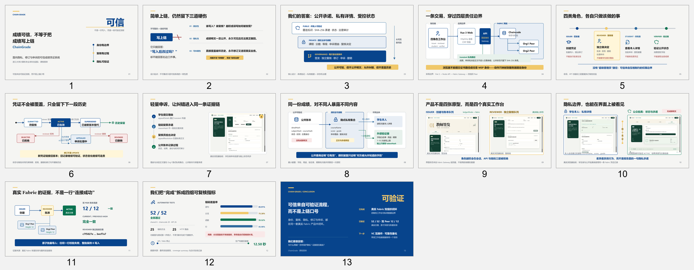
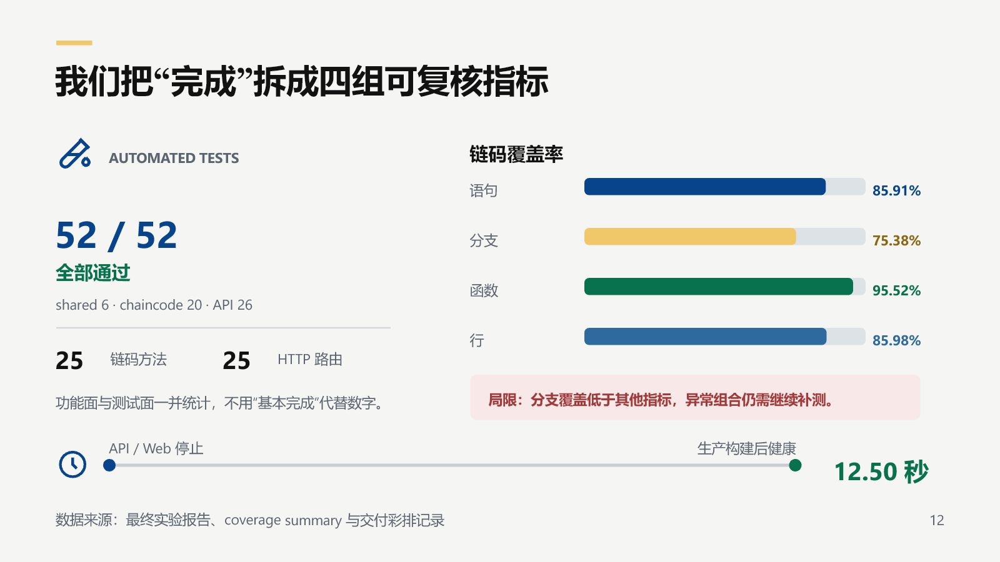

# 课程答辩 PPT 重制与逐页验收报告

日期：2026-08-29

## 1. 产物

- 13 页可编辑 PowerPoint：`deliverables/course/ChainGrade_课程答辩_重制版.pptx`；
- 13 页完整讲稿：`deliverables/course/ChainGrade_答辩讲稿_重制版.md`；
- 设计说明：`design/23_course_defense_deck_remake.md`。

原 9 页答辩稿保持不变，因此课程提交可以回退，重制过程不会丢失旧版本。

## 2. 生成与结构检查

PPTX 由 13 张完整 SVG 页面转换为原生 DrawingML：

| 检查项 | 结果 |
| --- | ---: |
| 页面数 | 13 |
| 演讲备注 | 13/13 |
| 图标嵌入 | 17 |
| 截图嵌入 | 5 |
| 跳过元素 | 0 |
| SVG 质量门 | 0 error |
| PPTX 包级后检 | passed-with-warnings |
| 画布溢出检测 | No overflow detected |

包级后检的两条提示来自 P05 和 P08 的并列字段被检查器识别为“可能拆开的段落”。这些文字本来就是不同权限项和不同数据字段，不是需要合并的连续句子；逐页渲染确认没有裁切或语义混淆。

## 3. 数据图校验

P12 覆盖率条使用同一条 360 px 轨道：

| 指标 | 比例 | 理论长度 | SVG 长度 |
| --- | ---: | ---: | ---: |
| 语句 | 85.91% | 309.28 px | 309 px |
| 分支 | 75.38% | 271.37 px | 271 px |
| 函数 | 95.52% | 343.87 px | 344 px |
| 行 | 85.98% | 309.53 px | 310 px |

首轮全尺寸验收发现函数覆盖率绿色条末端压住数值标签。修正方式是把统一轨道从 400 px 调整为 360 px，并重新按比例计算全部四条，而不是只移动单个标签。修正后重新执行 SVG 质量门、PPTX 导出、全页渲染和溢出检测，全部通过。

## 4. 逐页 UI / 视觉验收

13 页均从最终 PPTX 重新渲染为 PNG 后逐页查看，检查范围包括：

- 标题是否换行、被裁切或发生字体替换；
- 架构、状态机和隐私路径是否穿过节点或标签；
- 五张真实 UI 截图是否变形、裁切或模糊；
- 页脚、页码、强调条是否一致；
- 数据条长度、标签与结论是否互相遮挡；
- 封面和结尾是否保留足够投影留白。

结果：除 P12 首轮重叠外，没有发现非预期遮挡、越界、截图变形、空白占位符或断裂连接器；P12 修复后的二次全尺寸检查通过。

P12 修复后结果：

## 5. 防跑偏检查

- 答辩稿仍介绍同一个 ChainGrade 产品，没有建立课程版或竞赛版代码；
- 所有已完成结论都能在最终实验报告、自动测试、真实 Fabric 彩排或浏览器验收中找到证据；
- VC 互操作和可靠性量化只写为下一阶段，未伪装为当前成果；
- 页面去除了工具、小组内部工作台和生成提示词痕迹；
- 报告与截图均保存在项目目录，后续可从本文件恢复本阶段判断和进度。

