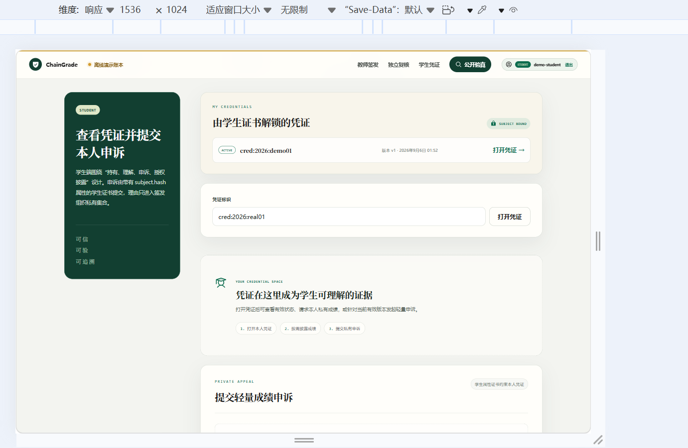
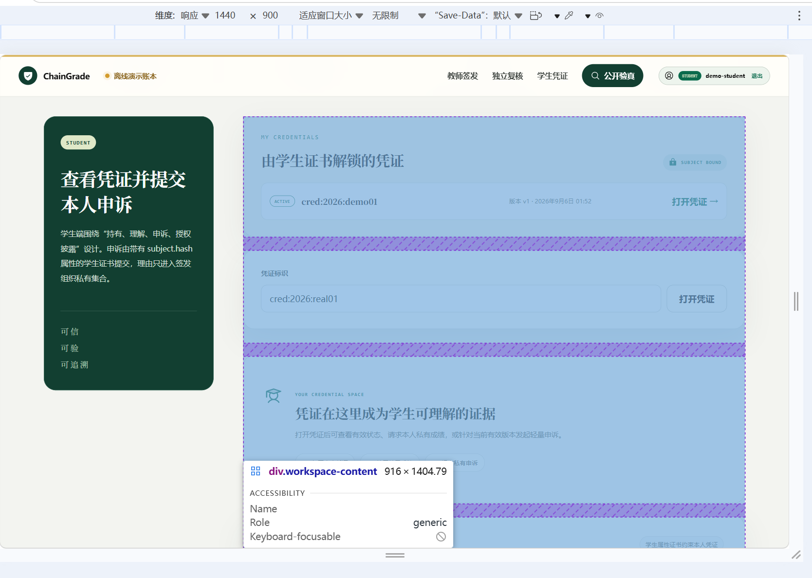
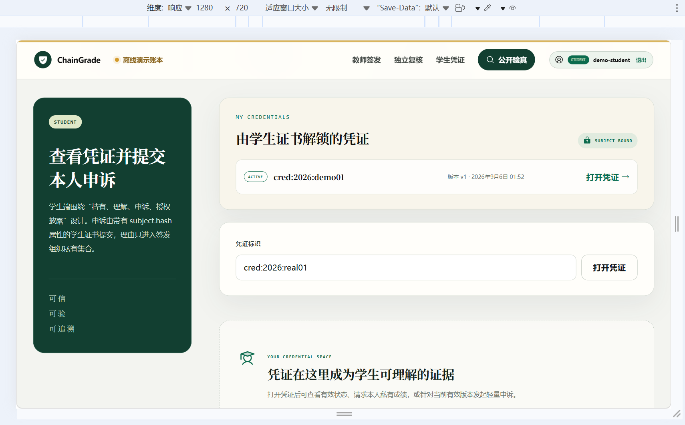
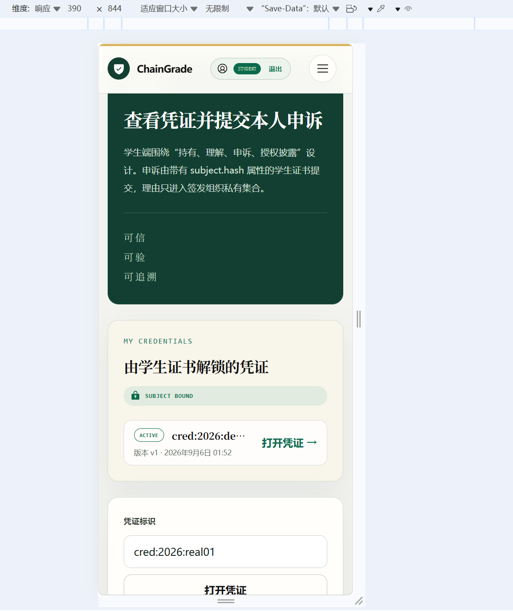
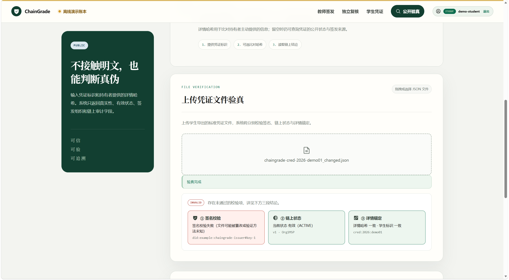
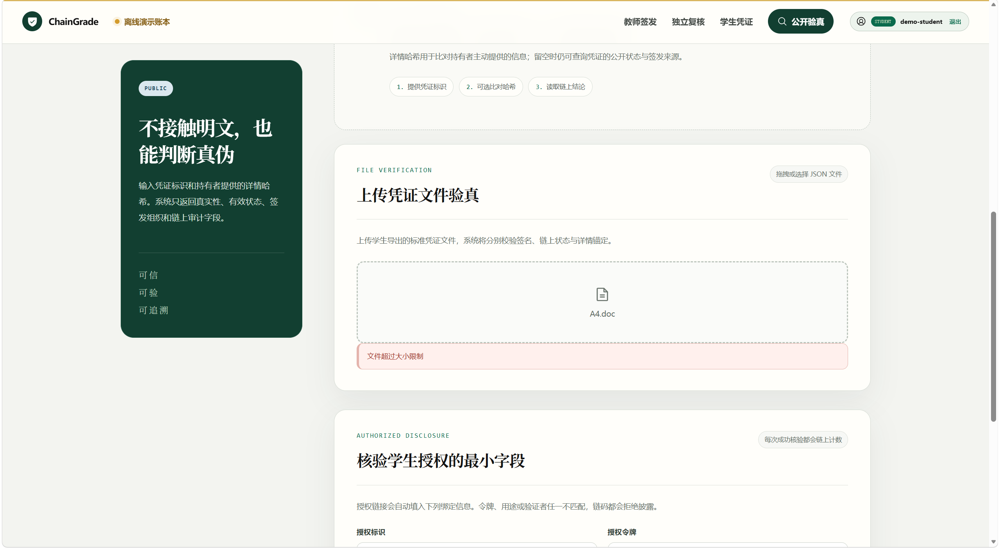

# 工作包 A：标准凭证互操作与验证体验 —— Q7 验收报告

负责人：强璞
日期：2026-09-05
阶段：Iteration 14（VC 互操作）
状态：已验收

## 1. 验收目标

在四视口下验收「学生导出标准凭证」与「公开文件验证」的完整体验，核对 Definition of Done，并把截图存档到 `reports/assets/iteration-14-vc/`。

## 2. Definition of Done 核对表

- [x] 新功能无需演示账号硬编码，签发私钥只从受保护的运行时环境读取，不进入仓库
- [x] 原有测试全部通过；最终项目测试为 shared 33、chaincode 20、API 67，共 120 项
- [x] 一个 ACTIVE 凭证可导出、下载、重新导入并通过签名、状态和锚定校验
- [x] 同一文件任意受保护字段被修改后验证失败
- [x] 撤销或取代后重新验证给出正确非有效结论
- [x] 四视口浏览器验收与报告齐全
- [x] 代码、设计、测试和截图由负责人强璞提交，原始作者信息保留在 Git 历史和 PR #2 中

## 3. 验收环境（演示运行手册）

1. 生成/加载演示密钥并设置环境变量（`VC_ISSUER_PRIVATE_KEY` / `VC_ISSUER_PUBLIC_KEY`，见 `.env`，已 gitignore）；
2. `DEMO_ENABLED=true` + `AUTH_ENABLED=true`（演示账本 + 演示会话）；
3. 启动后端：`pnpm dev:api`；启动前端：`pnpm dev:web`；
4. 登录学生账号（`demo-student`），演示凭证 `cred:2026:demo01`（ACTIVE）。

## 4. 四视口验收数据表

| 视口 | `scrollWidth === clientWidth` | console warning/error | 截图 |
| --- | --- | --- | --- |
| 1536×1024 | true | 0 |  |
| 1440×900 | true | 0 |  |
| 1280×720 | true | 0 |  |
| 390×844 | true | 0 |  |

## 5. UI 验收要点

- [x] 学生导出前字段预览和隐私说明可见
- [x] 未选择字段时不能生成空凭证
- [x] 公开验证结果分别展示「签名、链上状态、详情锚定」（非单一绿灯）
- [x] 文件解析失败、网络失败、已撤销、已取代、篡改各有不同说明

## 6. 负向验证结果表

| 场景 | 预期 | 实际 | 截图 |
| --- | --- | --- | --- |
| 篡改 courseName / score / detailHash | 签名段失败，结论 invalid | ✅ 浏览器验收通过 |  |
| 链上 REVOKED | 结论 invalid（非「当前有效」） | ✅ 单元测试通过 | 单元测试（见 8.1） |
| 链上 SUPERSEDED | 结论 invalid | ✅ 单元测试通过 | 单元测试（见 8.1） |
| 错误锚定（detailHash 不一致） | 锚定段失败 | ✅ 单元测试通过 | 单元测试（见 8.1） |
| 上传非 JSON / 重复键 / 缺字段 | 400 解析失败 | ✅ 浏览器验收通过 |  |
| 上传超限 | 413 | ✅ 浏览器验收通过 |  |

## 7. 截图清单

截图统一存放于 `reports/assets/iteration-14-vc/`，命名如下：

**四视口（4 张）**
- `viewport-1536x1024.png`
- `viewport-1440x900.png`
- `viewport-1280x720.png`
- `viewport-390x844.png`

**负向验证（3 张截图 + 3 项单元测试佐证）**
- `negative-tampered.png`（篡改 → 签名段失败）
- `negative-parse-error.png`（非 JSON / 重复键 / 缺字段）
- `negative-oversize.png`（超限）
- 撤销 / 取代 / 锚定不一致 → 单元测试佐证（见 8.1），无需截图

**UI 验收要点（2 张，补充第 5 节）**
- `ui-student-export-preview.png`（学生导出面板：字段预览 + 隐私说明）
- `ui-student-export-empty-disabled.png`（未选字段禁用导出）

## 8. 说明

- 演示账本 `demo-ledger.ts` 的种子凭证 `cred:2026:demo01` 的 `subjectHash`（`sha256('demo-student')`）与 `.env.example` 的 `AUTH_STUDENT_SUBJECT_HASH` 不一致，但演示账本不做 subjectHash 作用域过滤，故不影响导出→验证闭环（属既有小瑕疵，非阻塞）。

### 8.1 撤销 / 取代 / 锚定不一致的单元测试佐证

这三个负向态在演示环境中**默认不存在**：演示账本只种子一条 `ACTIVE` 凭证 `cred:2026:demo01`，且没有撤销/取代的状态转换入口；锚定不一致也需要人为制造「账本 detailHash 与凭证文件 evidence.detailHash」的差异。浏览器验收无法直接截取这三种状态，故以单元测试 `apps/api/src/vc/verifier.test.ts` 的通过结果作为佐证（替代截图）：

| 负向态 | 单元测试用例 | 结果 |
| --- | --- | --- |
| 撤销（REVOKED） | `keeps the signature valid but concludes invalid for a REVOKED credential` | ✅ 通过 |
| 取代（SUPERSEDED） | `concludes invalid for a SUPERSEDED credential` | ✅ 通过 |
| 锚定不一致（detailHash） | `flags a detailHash anchor mismatch while the signature stays valid` | ✅ 通过 |
| 锚定不一致（subjectHash） | `flags a subjectHash anchor mismatch` | ✅ 通过 |

运行命令：`pnpm --filter @chaingrade/api exec vitest run src/vc/verifier.test.ts`（8/8 通过）。
