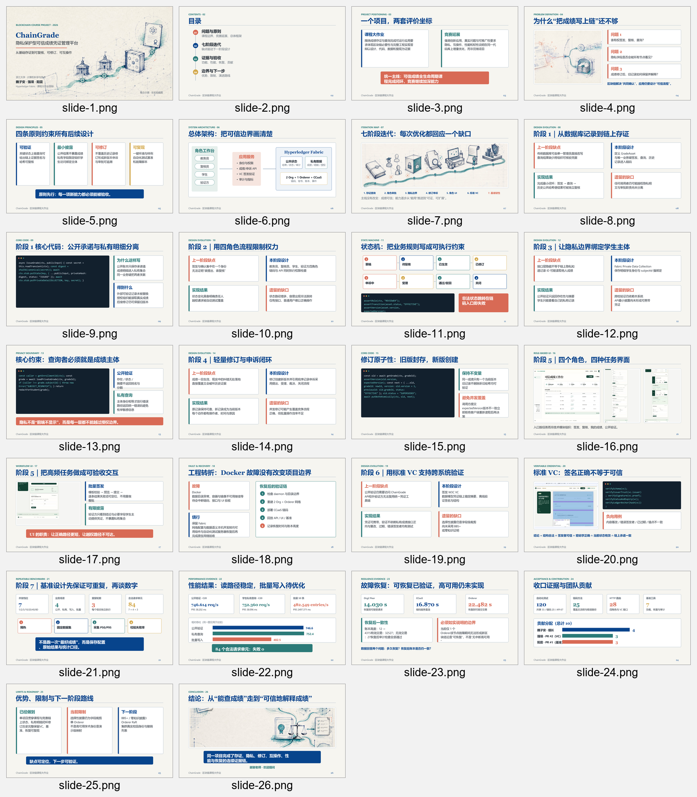

# 课程答辩 PPT V3 制作与验收报告

## 1. 本阶段结果

课程答辩 PPT 已从 13 页重构为 26 页，覆盖目录、总体设计、七阶段演进、核心代码、真实 UI、性能、故障恢复、验收与贡献。课程提交清单已删除演示视频要求；课程与竞赛继续使用同一个 ChainGrade 项目。

## 2. 设计原因与实际形式

旧稿能够完成短时概览，但对“为什么下一阶段要这样改”解释不足，标准 VC 与基准韧性也只能作为后续计划。两项组员 PR 合并后，这些能力已经有代码、测试和数据，因此新版按真实开发次序重新组织。

第 8、10、12、14、19 页统一采用四块结构展示上一阶段缺点、本阶段设计、实现结果和遗留缺口；第 9、11、13、15、20 页选择影响可信边界的核心代码或状态约束；第 21–24 页集中摆明基准配置、吞吐、P95、恢复时间、测试数量和贡献比例。这样可以从页面直接追溯“问题—设计—证据”，而不是依赖术语说明。

## 3. 量化结果

| 项目 | 结果 |
|---|---:|
| PPT 页数 | 26 |
| 演讲备注 | 26/26 |
| SVG 质量门 | 26 页无错误 |
| PPTX 越界测试 | 通过，0 overflow |
| 自动测试展示口径 | 120 项 |
| 链码方法 / HTTP 路由 | 25 / 28 |
| 正式负载单元 | 84，合法请求失败 0 |
| C20 公开验证 | 746.614 req/s，P95 38.202 ms |
| C20 学生私有查询 | 752.360 req/s，P95 38.096 ms |
| 批量 50 条 | 482.549 entries/s，P95 2497.371 ms |
| Peer / CCaaS / Orderer 恢复 | 14.030 / 16.870 / 22.482 s |

## 4. 视觉验收

PPTX 导出后以 1600×900 分辨率重新渲染 26 页，自动越界检查通过。随后检查整套联系图和两组放大联系图，确认标题未截断、代码块未越界、截图没有破损、指标与单位可辨认、颜色语义一致。

## 5. 边界与现场建议

26 页适合完整答辩和追问。若课程现场时间短，可把第 9、11、13、15、20 页核心代码作为追问备用，主讲保留问题、架构、七阶段主线、工程转折、数据、贡献、限制和结论。演示视频不是课程必交材料，不应进入最终压缩包。
