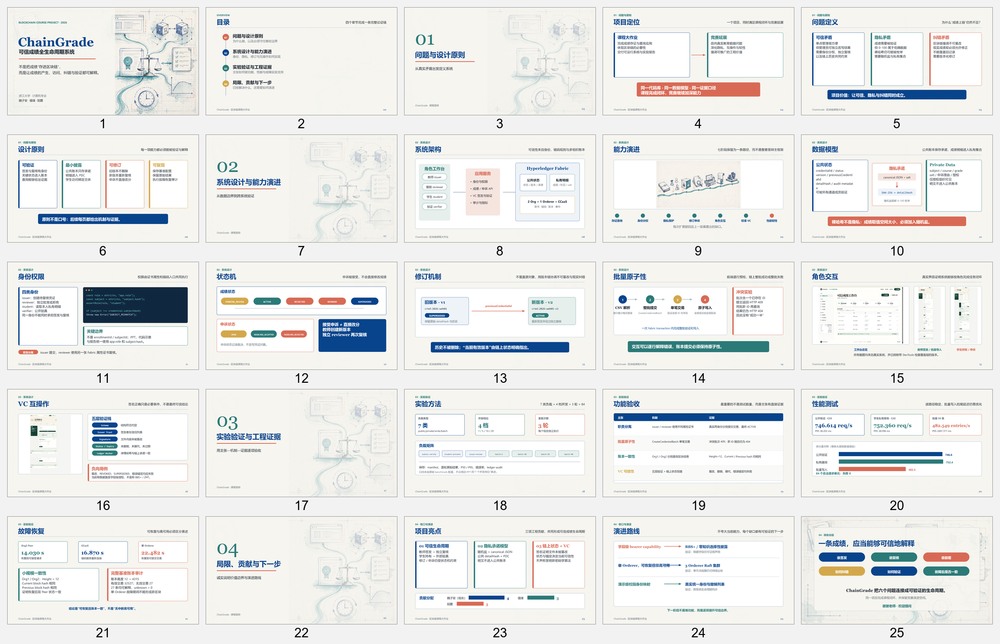

# 课程答辩 PPT V4 制作与验收报告

## 1. 阶段结果

课程答辩 PPT 已按实验报告真实实现重构为 25 页。全稿包含目录、四张独立章节封面、七阶段能力演进总览、八页系统设计、四页工程证据、贡献与局限，并与 25 页 Speaker Notes 一一对应。

## 2. 口径修正

本轮逐项核查并修正了旧稿与项目证据的差异：

- 隐私实现归入“数据模型”，不再称为阶段一核心代码。
- 成绩状态统一为 `PENDING_REVIEW / ACTIVE / REJECTED / REVOKED / SUPERSEDED`；申诉状态统一为 `OPEN / RESOLVED_ACCEPTED / RESOLVED_REJECTED`。
- 明确“申诉接受不直接修改成绩”，修订仍需教师创建新版本并由独立 reviewer 复核。
- 学生身份绑定统一使用 `app.role=student` 与 `subject.hash`。
- CSV 前端逐行预检与链上 `CreateCredentialBatch` 整批原子提交分开表述。
- benchmark 依据原始 manifest 统一为 7 类负载 × 4 档并发 × 3 轮 = 84。
- 故障恢复页保留可追溯的恢复时间和 ledger audit 数据，并明确单 Orderer 不是高可用。

## 3. 验收结果

| 检查项 | 结果 |
|---|---:|
| PPT 页数 | 25 |
| 独立章节封面 | 4 |
| Speaker Notes | 25 / 25 |
| SVG 质量门 | 25 页、0 error |
| PPTX 越界测试 | 通过，0 overflow |
| 视觉复核 | 25 页总览 + 关键页原尺寸检查 |
| DevTools 覆盖截图 | 0 |

自动检查后又以 1600 × 900 渲染全部页面，重点放大复核了身份权限、批量原子性、VC、故障恢复和项目亮点页。发现并修正了 VC 负向用例行首标点以及项目亮点页 PDC 自动断行，重新导出后再次通过越界测试。

## 4. 证据表达

实验验证部分不再以测试、方法和路由数量代替质量结论，而采用“主张—机制—证据”：不同属性证书证明职责分离；冲突批次返回 409 且新 ID 查询仍为 404 证明批量原子性；Org1 与 Org2 的高度及区块哈希一致证明账本一致；VC 五层验证与负向用例证明系统并非只检查签名。

## 5. 使用建议

25 页适合完整课程答辩。时间紧张时可压缩能力演进和角色界面两页的口头说明，但建议保留问题定义、架构、状态机、批量原子性、VC、性能、故障恢复、贡献与总结，保证论证链不断裂。课程提交不需要演示视频。
